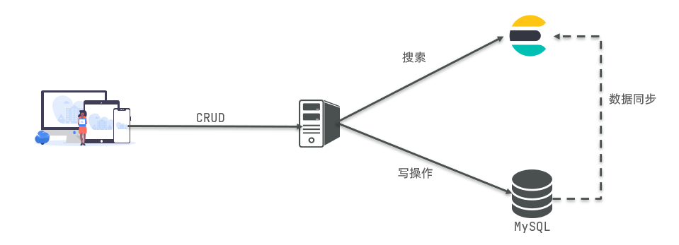

!> 注意： 在没有创建库的时候搜索，ES会创建一个库并自动创建该字段并且设置为String类型也就是text

## 首先了解一下ES和MySQL的概念区别：

> **MySQL是关系型数据库，而Elasticsearch是非关系型数据库**。
>
> 各自长处：
>
> - `Mysql`：擅长事务类型操作，可以确保数据的安全和一致性
>
> - `Elasticsearch`：擅长海量数据的搜索、分析、计算

| MySQL  | Elasticsearch |                                         说明                                          |
| :----: | :-----------: | :-----------------------------------------------------------------------------------: |
| Table  |     Index     |              索引(index)，就是**文档的集合**，类似**数据库的表**(table)               |
|  Row   |   Document    | 文档（Document），就是一条条的数据，类似**数据库中的行**（Row），**文档都是JSON格式** |
| Column |     Field     |        字段（Field），就是**JSON文档中的字段**，类似**数据库中的列**（Column）        |
| Schema |    Mapping    | Mapping（映射）是索引中文档的约束，例如字段类型约束。类似**数据库的表结构**（Schema） |
|  SQL   |      DSL      |      DSL是elasticsearch提供的JSON风格的请求语句，用来操作elasticsearch，实现CRUD      |

所以我们需要两者结合使用

## Mapping映射属性

> 索引库就类似数据库表，mapping映射就类似表的结构。

我们要向es中存储数据，必须先创建“库”和“表”。

mapping是对索引库中文档的约束，常见的mapping属性包括：

- type：字段数据类型，常见的简单类型有：
  - 字符串：text（可分词的文本）、keyword（精确值，例如：品牌、国家、ip地址）
  > keyword类型只能整体搜索，不支持搜索部分内容
  - 数值：long、integer、short、byte、double、float、
  - 布尔：boolean
  - 日期：date
  - 对象：object
- index：是否创建索引，默认为true
- analyzer：使用哪种分词器
- properties：该字段的子字段

