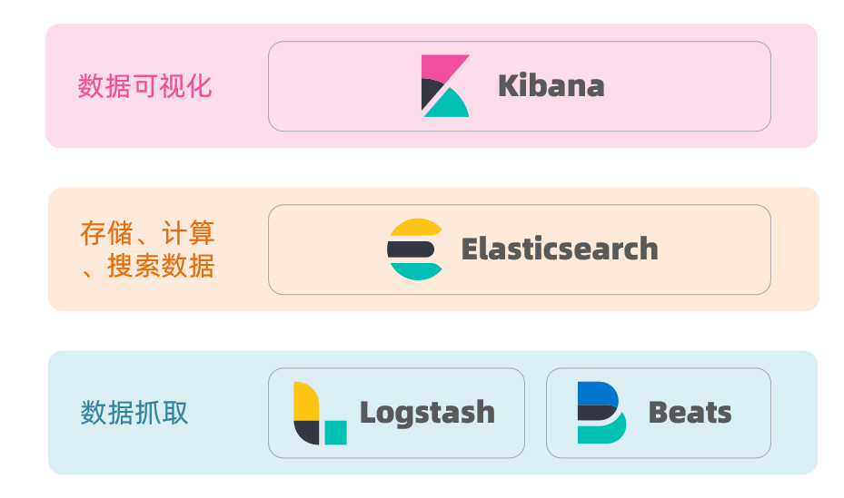

?> `ELK`是`Elasticsearch`、`Logstash`、`Kibana`的简称，这三者是核心套件实现`日志采集`、`分析`、`展示`，但并非全部。


- `Elasticsearch`是`实时全文搜索和分析引擎，提供搜集、分析、存储数据三大功能`；是一套开放REST和JAVA API等结构提供高效搜索功能，可扩展的分布式系统。它构建于Apache Lucene搜索引擎库之上。

- `Logstash`是一个用来`搜集、分析、过滤日志的工具`。它支持几乎任何类型的日志，包括系统日志、错误日志和自定义应用程序日志。它可以从许多来源接收日志，这些来源包括 syslog、消息传递（例如 RabbitMQ）和JMX，它能够以多种方式输出数据，包括电子邮件、websockets和Elasticsearch。

- ` Kibana`是一个基于Web的图形界面，用于`搜索、分析和可视化存储在 Elasticsearch指标中的日志数据`。它利用Elasticsearch的REST接口来检索数据，不仅允许用户创建他们自己的数据的定制仪表板视图，还允许他们以特殊的方式查询和过滤数据。

- `filebeat` 是一个轻量级的日志采集工具，可以采集日志，并实时写入到 Elasticsearch 中。



### 安装

```bash
docker pull elasticsearch:7.1.1
docker pull kibana:7.1.1
docker pull logstash:7.1.1


docker run -d --restart=always --name es7 -p 9200:9200 -p 9300:9300 -e "discovery.type=single-node" elasticsearch:7.6.0
docker run -di --name kibana -p 5601:5601 kibana:7.6.0
```

### 操作示例

- [go操作es](/golang/third_libraries/go_elasticsearch.md)
- [php操作es](/php/demo/laravel-es.md)