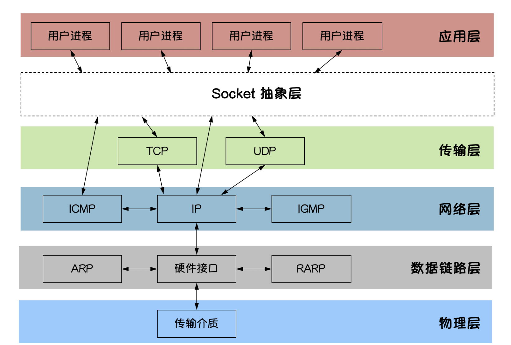

?> `Socket`是`BSD UNIX`的进程通信机制，通常也称作”`套接字`”，用于描述`IP地址`和`端口`，是一个通信链的句柄。`Socket`可以理解为`TCP/IP`网络的API，它定义了许多函数或例程，程序员可以用它们来开发`TCP/IP`网络上的应用程序。电脑上运行的应用程序通常通过”`套接字`”向网络发出请求或者应答网络请求。

## socket图解

`Socket`是`应用层`与`TCP/IP`协议族通信的中间软件`抽象层`。在`设计模式`中，`Socket`其实就是一个门面模式，它把复杂的TCP/IP协议族隐藏在Socket后面，对用户来说只需要调用Socket规定的相关函数，让Socket去组织符合指定的协议数据然后进行通信。



- Socket又称“套接字”，应用程序通常通过“套接字”向网络发出请求或者应答网络请求
- 常用的Socket类型有两种：`流式Socket`和`数据报式Socket`;
    - 流式是一种面向连接的Socket，针对于面向连接的TCP服务应用
    - 数据报式Socket是一种无连接的Socket，针对于无连接的UDP服务应用
- TCP：比较靠谱，面向连接，比较慢
- UDP：不是太靠谱，比较快

#### 举个例子：

TCP就像货到付款的快递，送到家还必须见到你人才算一整套流程。

UDP就像某快递快递柜一扔就走管你收到收不到，一般直播用UDP。

## TCP编程

### TCP协议

TCP/IP(Transmission Control Protocol/Internet Protocol) 即传输控制协议/网际协议，是一种面向连接（连接导向）的、可靠的、基于字节流的传输层（Transport layer）通信协议，因为是面向连接的协议，数据像水流一样传输，会存在`黏包`问题。

### TCP服务端

一个TCP服务端可以同时连接很多个客户端，例如世界各地的用户使用自己电脑上的浏览器访问淘宝网。因为Go语言中创建多个`goroutine`实现并发非常方便和高效，所以我们可以每建立一次链接就创建一个`goroutine`去处理。

TCP服务端程序的处理流程：

- 1.监听端口
- 2.接收客户端请求建立链接
- 3.创建goroutine处理链接。

```go
// tcp/server/main.go

// TCP server端

// 处理函数
func process(conn net.Conn) {
    defer conn.Close() // 关闭连接
    for {
        reader := bufio.NewReader(conn)
        var buf [128]byte
        n, err := reader.Read(buf[:]) // 读取数据
        if err != nil {
            fmt.Println("read from client failed, err:", err)
            break
        }
        recvStr := string(buf[:n])
        fmt.Println("收到client端发来的数据：", recvStr)
        conn.Write([]byte(recvStr)) // 发送数据
    }
}

func main() {
    listen, err := net.Listen("tcp", "127.0.0.1:20000")
    if err != nil {
        fmt.Println("listen failed, err:", err)
        return
    }
    for {
        conn, err := listen.Accept() // 建立连接
        if err != nil {
            fmt.Println("accept failed, err:", err)
            continue
        }
        go process(conn) // 启动一个goroutine处理连接
    }
}   
```
将上面的代码保存之后编译成server或server.exe可执行文件。

### TCP客户端

一个TCP客户端进行TCP通信的流程如下：

- 1.建立与服务端的链接
- 2.进行数据收发
- 3.关闭链接   

使用Go语言的net包实现的TCP客户端代码如下：

```go
// tcp/client/main.go

// 客户端
func main() {
    conn, err := net.Dial("tcp", "127.0.0.1:20000")
    if err != nil {
        fmt.Println("err :", err)
        return
    }
    defer conn.Close() // 关闭连接
    inputReader := bufio.NewReader(os.Stdin)
    for {
        input, _ := inputReader.ReadString('\n') // 读取用户输入
        inputInfo := strings.Trim(input, "\r\n")
        if strings.ToUpper(inputInfo) == "Q" { // 如果输入q就退出
            return
        }
        _, err = conn.Write([]byte(inputInfo)) // 发送数据
        if err != nil {
            return
        }
        buf := [512]byte{}
        n, err := conn.Read(buf[:])
        if err != nil {
            fmt.Println("recv failed, err:", err)
            return
        }
        fmt.Println(string(buf[:n]))
    }
}   
```

将上面的代码编译成client或client.exe可执行文件，先启动server端再启动client端，在client端输入任意内容回车之后就能够在server端看到client端发送的数据，从而实现TCP通信。


## UDP编程

### UDP协议

UDP协议（User Datagram Protocol）中文名称是用户数据报协议，是OSI（Open System Interconnection，开放式系统互联）参考模型中一种无连接的传输层协议，不需要建立连接就能直接进行数据发送和接收，属于不可靠的、没有时序的通信，但是UDP协议的实时性比较好，通常用于视频直播相关领域。

### UDP服务端

使用Go语言的net包实现的UDP服务端代码如下：

```go
// UDP/server/main.go

// UDP server端
func main() {
    listen, err := net.ListenUDP("udp", &net.UDPAddr{
        IP:   net.IPv4(0, 0, 0, 0),
        Port: 30000,
    })
    if err != nil {
        fmt.Println("listen failed, err:", err)
        return
    }
    defer listen.Close()
    for {
        var data [1024]byte
        n, addr, err := listen.ReadFromUDP(data[:]) // 接收数据
        if err != nil {
            fmt.Println("read udp failed, err:", err)
            continue
        }
        fmt.Printf("data:%v addr:%v count:%v\n", string(data[:n]), addr, n)
        _, err = listen.WriteToUDP(data[:n], addr) // 发送数据
        if err != nil {
            fmt.Println("write to udp failed, err:", err)
            continue
        }
    }
}   
```

### UDP客户端

使用Go语言的net包实现的UDP客户端代码如下：

```go
// UDP 客户端
func main() {
    socket, err := net.DialUDP("udp", nil, &net.UDPAddr{
        IP:   net.IPv4(0, 0, 0, 0),
        Port: 30000,
    })
    if err != nil {
        fmt.Println("连接服务端失败，err:", err)
        return
    }
    defer socket.Close()
    sendData := []byte("Hello server")
    _, err = socket.Write(sendData) // 发送数据
    if err != nil {
        fmt.Println("发送数据失败，err:", err)
        return
    }
    data := make([]byte, 4096)
    n, remoteAddr, err := socket.ReadFromUDP(data) // 接收数据
    if err != nil {
        fmt.Println("接收数据失败，err:", err)
        return
    }
    fmt.Printf("recv:%v addr:%v count:%v\n", string(data[:n]), remoteAddr, n)
}  

```

## TCP黏包

服务端代码如下：

```go
// socket_stick/server/main.go

func process(conn net.Conn) {
    defer conn.Close()
    reader := bufio.NewReader(conn)
    var buf [1024]byte
    for {
        n, err := reader.Read(buf[:])
        if err == io.EOF {
            break
        }
        if err != nil {
            fmt.Println("read from client failed, err:", err)
            break
        }
        recvStr := string(buf[:n])
        fmt.Println("收到client发来的数据：", recvStr)
    }
}

func main() {

    listen, err := net.Listen("tcp", "127.0.0.1:30000")
    if err != nil {
        fmt.Println("listen failed, err:", err)
        return
    }
    defer listen.Close()
    for {
        conn, err := listen.Accept()
        if err != nil {
            fmt.Println("accept failed, err:", err)
            continue
        }
        go process(conn)
    }
}
```

客户端代码如下：


```go
// socket_stick/client/main.go

func main() {
    conn, err := net.Dial("tcp", "127.0.0.1:30000")
    if err != nil {
        fmt.Println("dial failed, err", err)
        return
    }
    defer conn.Close()
    for i := 0; i < 20; i++ {
        msg := `Hello, Hello. How are you?`
        conn.Write([]byte(msg))
    }
}  
```

将上面的代码保存后，分别编译。先启动服务端再启动客户端，可以看到服务端输出结果如下：

```
收到client发来的数据： Hello, Hello. How are you?Hello, Hello. How are you?Hello, Hello. How are you?Hello, Hello. How are you?Hello, Hello. How are you?
收到client发来的数据： Hello, Hello. How are you?Hello, Hello. How are you?Hello, Hello. How are you?Hello, Hello. How are you?Hello, Hello. How are you?Hello, Hello. How are you?Hello, Hello. How are you?Hello, Hello. How are you?
收到client发来的数据： Hello, Hello. How are you?Hello, Hello. How are you?
收到client发来的数据： Hello, Hello. How are you?Hello, Hello. How are you?Hello, Hello. How are you?
收到client发来的数据： Hello, Hello. How are you?Hello, Hello. How are you? 
```

客户端分10次发送的数据，在服务端并没有成功的输出10次，而是多条数据“粘”到了一起。

### 为什么会出现粘包

主要原因就是tcp数据传递模式是流模式，在保持长连接的时候可以进行多次的收和发。

“粘包”可发生在发送端也可发生在接收端

- 1.由Nagle算法造成的发送端的粘包：Nagle算法是一种改善网络传输效率的算法。简单来说就是当我们提交一段数据给TCP发送时，TCP并不立刻发送此段数据，而是等待一小段时间看看在等待期间是否还有要发送的数据，若有则会一次把这两段数据发送出去。
- 2.接收端接收不及时造成的接收端粘包：TCP会把接收到的数据存在自己的缓冲区中，然后通知应用层取数据。当应用层由于某些原因不能及时的把TCP的数据取出来，就会造成TCP缓冲区中存放了几段数据。 


### 解决办法

出现”粘包”的关键在于接收方不确定将要传输的数据包的大小，因此我们可以对数据包进行封包和拆包的操作。

封包：封包就是给一段数据加上包头，这样一来数据包就分为包头和包体两部分内容了(过滤非法包时封包会加入”包尾”内容)。包头部分的长度是固定的，并且它存储了包体的长度，根据包头长度固定以及包头中含有包体长度的变量就能正确的拆分出一个完整的数据包。

我们可以自己定义一个协议，比如数据包的前4个字节为包头，里面存储的是发送的数据的长度。

```go
// socket_stick/proto/proto.go
package proto

import (
    "bufio"
    "bytes"
    "encoding/binary"
)

// Encode 将消息编码
func Encode(message string) ([]byte, error) {
    // 读取消息的长度，转换成int32类型（占4个字节）
    var length = int32(len(message))
    var pkg = new(bytes.Buffer)
    // 写入消息头
    err := binary.Write(pkg, binary.LittleEndian, length)
    if err != nil {
        return nil, err
    }
    // 写入消息实体
    err = binary.Write(pkg, binary.LittleEndian, []byte(message))
    if err != nil {
        return nil, err
    }
    return pkg.Bytes(), nil
}

// Decode 解码消息
func Decode(reader *bufio.Reader) (string, error) {
    // 读取消息的长度
    lengthByte, _ := reader.Peek(4) // 读取前4个字节的数据
    lengthBuff := bytes.NewBuffer(lengthByte)
    var length int32
    err := binary.Read(lengthBuff, binary.LittleEndian, &length)
    if err != nil {
        return "", err
    }
    // Buffered返回缓冲中现有的可读取的字节数。
    if int32(reader.Buffered()) < length+4 {
        return "", err
    }

    // 读取真正的消息数据
    pack := make([]byte, int(4+length))
    _, err = reader.Read(pack)
    if err != nil {
        return "", err
    }
    return string(pack[4:]), nil
}  
```


接下来在服务端和客户端分别使用上面定义的proto包的Decode和Encode函数处理数据。

服务端代码如下：

```go
// socket_stick/server2/main.go

func process(conn net.Conn) {
    defer conn.Close()
    reader := bufio.NewReader(conn)
    for {
        msg, err := proto.Decode(reader)
        if err == io.EOF {
            return
        }
        if err != nil {
            fmt.Println("decode msg failed, err:", err)
            return
        }
        fmt.Println("收到client发来的数据：", msg)
    }
}

func main() {

    listen, err := net.Listen("tcp", "127.0.0.1:30000")
    if err != nil {
        fmt.Println("listen failed, err:", err)
        return
    }
    defer listen.Close()
    for {
        conn, err := listen.Accept()
        if err != nil {
            fmt.Println("accept failed, err:", err)
            continue
        }
        go process(conn)
    }
}
```

客户端代码如下：


```go
// socket_stick/client2/main.go

func main() {
    conn, err := net.Dial("tcp", "127.0.0.1:30000")
    if err != nil {
        fmt.Println("dial failed, err", err)
        return
    }
    defer conn.Close()
    for i := 0; i < 20; i++ {
        msg := `Hello, Hello. How are you?`
        data, err := proto.Encode(msg)
        if err != nil {
            fmt.Println("encode msg failed, err:", err)
            return
        }
        conn.Write(data)
    }
}  

```
