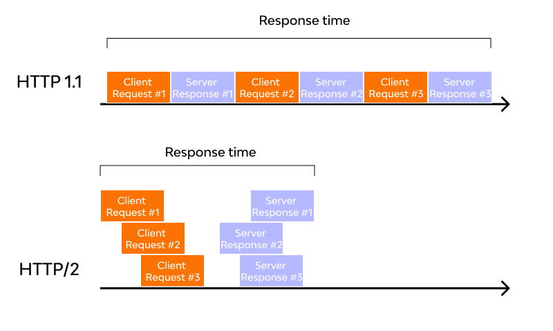

### HTTP2

HTTP/2（超文本传输协议第2版，最初命名为HTTP 2.0），简称为h2（基于TLS/1.2或以上版本的加密连接）或h2c（非加密连接）， HTTP/2 是 HTTP 协议的第二个主要版本，用于在 Web 服务器和客户端之间传输数据。

HTTP/2 是 HTTP 协议自 1999 年 HTTP 1.1 的改进版 RFC 发布后的首个更新，主要基于 SPDY 协议。

多数主流浏览器已经在 2015 年底支持了该协议。

HTTP/2是一种网络协议，是HTTP/1.1的升级版，由IETF在2015年发布。HTTP/2旨在提高Web性能，减少延迟，增加安全性，使Web应用更加快速、高效和可靠。

### HTTP/2 特点

下面是 HTTP/2 的一些特点和改进之处：

- `多路复用`：HTTP/2 允许同时发送多个请求和响应，而不是像 HTTP/1.1 一样只能一个一个地处理。这样可以减少延迟，提高效率，提高网络吞吐量。
- `二进制传输`：HTTP/2 使用二进制协议，与 HTTP/1.1 使用的文本协议不同。二进制协议可以更快地解析，更有效地传输数据，减少了传输过程中的开销和延迟。
- `头部压缩`：HTTP/2 使用 HPACK 算法对 HTTP 头部进行压缩，减少了头部传输的数据量，从而减少了网络延迟。
- `服务器推送`：HTTP/2 支持服务器推送，允许服务器在客户端请求之前推送资源，以提高性能。
- `安全性`：HTTP/2 默认使用 TLS（Transport Layer Security）加密传输数据，提高了安全性。
- `兼容 HTTP/1.1`：HTTP/2 可以与 HTTP/1.1 共存，服务器可以同时支持 HTTP/1.1 和 HTTP/2。如果客户端不支持 HTTP/2，服务器可以回退到 HTTP/1.1。

总的来说，HTTP/2在性能、安全性和可用性方面都有显著的改进，可以使 Web 应用更加快速、高效和可靠。

对数据传输采用多路复用，让多个请求合并在同一 TCP 连接内，如下图所示：

HTTP/2 减少网络延迟，提高浏览器的页面加载速度：

HTTP/2 使用二进制格式来传输数据，而不是像 HTTP/1.1 一样使用文本格式。这提高了效率并降低了数据传输的延迟。

HTTP/2 使用头部压缩来减少传输数据的大小。这有助于减少网络带宽的使用量，并提高页面加载速度。

HTTP/2 允许服务器在不被请求的情况下主动向客户端发送数据。这有助于减少请求延迟，并提高页面加载速度。

