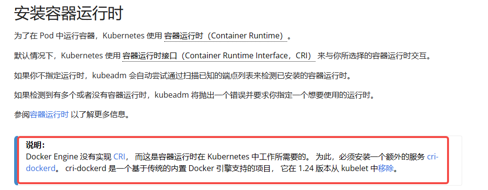

##  1. 服务器基本环境 

首先准备3台机器，我这里是 `ubuntu20.04` 版本

| hosts          | 节点     |
| :------------- | -------- |
| 192.168.124.4  | `master` |
| 192.168.124.11 | `node1`  |
| 192.168.124.12 | `node2`  |

#### 1.1 安装基本命令工具

```bash
## 安装
sudo apt-get install -y ssh net-tools 
```

#### 1.2 查看`IP`

```bash
ifconfig
```

#### 1.3 开启 `root` 用户

```bash
# 使用普通用户登录后切换root
sudo -i
# 修改root的密码
echo root:123456 |sudo chpasswd root
# 开启root登录
sudo sed -i 's/^#\?PermitRootLogin.*/PermitRootLogin yes/g' /etc/ssh/sshd_config
# 开启密码验证
sudo sed -i 's/^#\?PasswordAuthentication.*/PasswordAuthentication yes/g' /etc/ssh/sshd_config
# 重启ssh服务
service sshd restart
```

> 然后通过 `xshell` 等工具连接这三台服务器的root用户

#### 1.4 关闭防火墙

```bash
ufw disable
```

#### 1.5 关闭 `swap` 分区

> 关闭 `Linux` 的 `swap` 分区，提升 `Kubernetes` 的性能。

```bash
# 临时关闭
sudo swapoff -a
# 永久关闭：注释 swap 挂载，给 swap 这行开头加一下 "#" 注释
sudo sed -ri '/\sswap\s/s/^#?/#/' /etc/fstab 
```

#### 1.6 同步服务器时间

```bash
#查看时区，时间
date
#先查看时区是否正常，不正确则替换为上海时区
timedatectl set-timezone Asia/Shanghai
#安装chrony，联网同步时间
apt install chrony -y && systemctl enable --now chronyd
```

#### 1.7 更新 `hosts` 和 `hostname` 配置信息

> `Kubernetes` 使用主机名来区分集群里的节点，所以每个节点的 `hostname` 必须不能重名。

```bash
# 每个节点分别设置对应主机名
hostnamectl set-hostname k8s-master
hostnamectl set-hostname k8s-node1
hostnamectl set-hostname k8s-node2
```

修改`hosts`

```bash
cat << EOF >> /etc/hosts
192.168.124.4 k8s-master
192.168.124.11 k8s-node1
192.168.124.12 k8s-node2
EOF
```

> 修改完 `hostname` 后，重新登录，当前命令行界面连接 `hostname` 才会更新。

#### 1.7 安装 `docker`

```bash
sudo sed -i "s@http://.*archive.ubuntu.com@http://mirrors.aliyun.com@g" /etc/apt/sources.list
sudo sed -i "s@http://.*security.ubuntu.com@http://mirrors.aliyun.com@g" /etc/apt/sources.list
sudo apt-get update
```


```shell
# 安装Docker Engine
sudo apt-get install -y docker.io 
# 启动docker服务
sudo service docker start 
```

操作 `Docker` 必须要有 `root` 权限，直接使用 `root` 用户不够安全，加入 `Docker` 用户组是一个比较好的选择。

如果你没有使用 `root` 账号，则需要将当前用户加入 `Docker` 的用户组：

```bash
# 当前用户加入docker组
sudo usermod -aG docker ${USER} 
```

修改用户组之后，需要退出系统，重新登录 `usermod` 才能生效

```bash
# 输出Docker客户端和服务器各自的版本信息
docker version 
```

##### 1.7.1 配置 `docker`

需要将 `dockeer` 的驱动程序改为 `systemd`，配置代理镜像源，然后重启 `Docker` 的守护进程。

获取阿里云加速地址：https://cr.console.aliyun.com/cn-hangzhou/instances/mirrors

```bash
cat <<EOF | sudo tee /etc/docker/daemon.json
{
	"registry-mirrors": ["https://zfwsle5k.mirror.aliyuncs.com"],
    "exec-opts": ["native.cgroupdriver=systemd"]
}
EOF

#"exec-opts": ["native.cgroupdriver=systemd"]为docker使用cgroup的方式，k8s使用方式也是systemd，两边要一致
#重启docker
systemctl restart docker
```


```bash
# 配置Docker为开机自启动
sudo systemctl enable docker
# 重新加载服务的配置文件
sudo systemctl daemon-reload	 
# 重启Docker
sudo systemctl restart docker  
```

#### 1.8 将桥接的 `IPv4` 流量传递到 `iptables` 的链

有一些 `ipv4` 的流量不能走 `iptables` 链，因为 `linux` 内核的一个过滤器，每个流量都会经过他，然后再匹配是否可进入当前应用进程去处理，所以会导致流量丢失），配置 `k8s.conf` 文件（`k8s.conf` 文件原来不存在，需要自己创建的）

```bash
touch /etc/sysctl.d/k8s.conf
cat >> /etc/sysctl.d/k8s.conf <<EOF
net.bridge.bridge-nf-call-ip6tables=1
net.bridge.bridge-nf-call-iptables=1
net.ipv4.ip_forward=1
vm.swappiness=0
EOF
sysctl --system
```

#### 1.9 设置服务器之间免密登陆(3台彼此之间均设置)

```bash
# master 节点
ssh-keygen -t rsa
ssh-copy-id -i /root/.ssh/id_rsa.pub root@192.168.124.11
ssh-copy-id -i /root/.ssh/id_rsa.pub root@192.168.124.12
# node1 节点
ssh-keygen -t rsa
ssh-copy-id -i /root/.ssh/id_rsa.pub root@192.168.124.4
ssh-copy-id -i /root/.ssh/id_rsa.pub root@192.168.124.12
# node2 节点
ssh-keygen -t rsa
ssh-copy-id -i /root/.ssh/id_rsa.pub root@192.168.124.4
ssh-copy-id -i /root/.ssh/id_rsa.pub root@192.168.124.11


## 可以在每台机器内测试连接其他两台
ssh k8s-master
ssh k8s-node1
ssh k8s-node2
```


## 2. 安装 `k8s`

#### 2.0 安装 `cri-dockerd` (所有节点)

Kubernetes自v1.24移除了对docker-shim的支持，而Docker Engine默认又不支持CRI规范，因而二者将无法直接完成整合。

为此，Mirantis和Docker联合创建了cri-dockerd项目，用于为Docker Engine提供一个能够支持到CRI规范的垫片，从而能够让Kubernetes基于CRI控制Docker 。

项目地址：https://github.com/Mirantis/cri-dockerd

cri-dockerd项目提供了安装包




> Ubuntu有三个版本，分别是bionic、focal、jammy
>
> 分别代表不同的大版本
>
> - 22.04：jammy
> - 20.04：focal
> - 18.04：bionic
> - 16.04：xenial
> - 14.04：trusty


这里我们是20.04版本，所以选择focal

```bash
wget https://github.com/Mirantis/cri-dockerd/releases/download/v0.3.7/cri-dockerd_0.3.7.3-0.ubuntu-focal_amd64.deb
# 安装
dpkg -i ./cri-dockerd_0.3.7.3-0.ubuntu-focal_amd64.deb

# 从国内 cri-dockerd 服务无法下载 k8s.gcr.io上面相关镜像,导致无法启动,所以需要修改cri-dockerd 使用国内镜像源
# 修改配置文件，设置国内镜像源
sed -ri 's@^(.*fd://).*$@\1 --pod-infra-container-image registry.aliyuncs.com/google_containers/pause@' /usr/lib/systemd/system/cri-docker.service
#重启
systemctl daemon-reload && systemctl restart cri-docker
```


#### 2.1 安装 `kubeadm`、`kubelet` 和 `kubectl`

##### 2.1.1 更新使用阿里云镜像源

```bash
sudo apt install -y apt-transport-https ca-certificates curl

curl https://mirrors.aliyun.com/kubernetes/apt/doc/apt-key.gpg | sudo apt-key add -

cat <<EOF | sudo tee /etc/apt/sources.list.d/kubernetes.list
deb https://mirrors.aliyun.com/kubernetes/apt/ kubernetes-xenial main
EOF

sudo apt update
```

`apt` 默认会下载最新版本，也可以指定版本号。

```bash
sudo apt-get install -y kubeadm=1.23.3-00 kubelet=1.23.3-00 kubectl=1.23.3-00
sudo apt-get install -y kubeadm=1.28.2-00 kubelet=1.28.2-00 kubectl=1.28.2-00
```

安装完成之后，可以用 `kubeadm version`、`kubectl version` 来验证版本是否正确。

```bash
# 配置kubelet为开机自启动
systemctl enable kubelet.service 
```

> 也可以锁定这三个软件的版本，避免意外升级导致版本错误

```bash
# 加锁
sudo apt-mark hold kubeadm kubelet kubectl
# 解锁
sudo apt-mark unhold kubeadm kubelet kubectl
# 查看锁状态
sudo apt-mark showhold
```


```bash
# master节点执行
sudo kubeadm init \
    --apiserver-advertise-address=192.168.124.4 \
    --control-plane-endpoint=192.168.124.4 \
    --cri-socket unix:///run/cri-dockerd.sock \
    --image-repository registry.cn-hangzhou.aliyuncs.com/google_containers \
    --service-cidr=10.10.0.0/16 \
    --pod-network-cidr=10.244.0.0/16 \
    --kubernetes-version=v1.28.2

# --apiserver-advertise-address: 指定master服务发布的ip地址
# --control-plane-endpoint: 可用于为所有控制平面节点设置共享端点，允许IP地址和可以映射到IP地址的DNS名称，例如 192.168.77.100 master
# --image-repository: 指定镜像源
# --service-cidr: 指定service网络的IP地址范围
# --pod-network-cidr: 指定pod网络的IP地址范围
# --kubernetes-version: 指定k8s版本


## -------------------------------------------------------------------- start
## 成功之后会输出以下类似信息 

# 您的 Kubernetes 控制平面已成功初始化！
Your Kubernetes control-plane has initialized successfully!

# 要开始使用集群，您需要以普通用户身份运行以下命令
To start using your cluster, you need to run the following as a regular user:

  mkdir -p $HOME/.kube
  sudo cp -i /etc/kubernetes/admin.conf $HOME/.kube/config
  sudo chown $(id -u):$(id -g) $HOME/.kube/config

# 或者，如果您是 root 用户，可以运行
Alternatively, if you are the root user, you can run:

  export KUBECONFIG=/etc/kubernetes/admin.conf

# 现在，您应该为群集部署一个 pod 网络。
You should now deploy a pod network to the cluster.

# 使用下列选项之一运行 "kubectl apply -f [podnetwork].yaml
Run "kubectl apply -f [podnetwork].yaml" with one of the options listed at:
  https://kubernetes.io/docs/concepts/cluster-administration/addons/
 
# 现在，您可以在每个节点上复制证书授权和服务帐户密钥，然后以根用户身份运行
# 和服务帐户密钥，然后以根用户身份运行以下程序，即可加入任意数量的控制平面节点：
 You can now join any number of control-plane nodes by copying certificate authorities
and service account keys on each node and then running the following as root:

  kubeadm join 192.168.124.4:6443 --token 0ktglw.mmp2aj5xq5jr495r \
	--discovery-token-ca-cert-hash sha256:250ff1aed217758deb69fe8215db29cfdc52fccd03ec199781519961dc2bbb80 \
	--control-plane 

# 然后，以根用户身份在每个工作节点上运行以下程序，即可加入任意数量的工作节点：
Then you can join any number of worker nodes by running the following on each as root:

kubeadm join 192.168.124.4:6443 --token 0ktglw.mmp2aj5xq5jr495r \
	--discovery-token-ca-cert-hash sha256:250ff1aed217758deb69fe8215db29cfdc52fccd03ec199781519961dc2bbb80 
  
  
# 然后，您可以通过以 root 身份在每个节点上运行以下命令来加入任意数量的工作器节点：
Then you can join any number of worker nodes by running the following on each as root:

kubeadm join 192.168.124.4:6443 --token kv8ghf.jtfedu88hpbjdr4a \
	--discovery-token-ca-cert-hash sha256:425431e5bf88bfdff8f3fcc5c0dd268b2dd57aca3dbe8f08dd390fe3501186d3
## -------------------------------------------------------------------- end

# 如果你是普通用户请运行
  mkdir -p $HOME/.kube
  sudo cp -i /etc/kubernetes/admin.conf $HOME/.kube/config
  sudo chown $(id -u):$(id -g) $HOME/.kube/config
  
# 如果你是root用户请运行
export KUBECONFIG=/etc/kubernetes/admin.conf

# node节点分别执行
scp root@192.168.124.4:/etc/kubernetes/admin.conf /etc/kubernetes/
echo "export KUBECONFIG=/etc/kubernetes/admin.conf" >> ~/.bash_profile
source ~/.bash_profile


# 然后将node节点加入到master中(在两个node节点中分别运行)
## 这段kubeamd join命令的token只有24h，24h就过期，需要执行kubeadm token create --print-join-command 重新生成。
## 初始化的时候kubeadm init有添加cri-socket 则需要在后边加--cri-socket unix:///run/cri-dockerd.sock
kubeadm join 192.168.124.4:6443 --token 0ktglw.mmp2aj5xq5jr495r --discovery-token-ca-cert-hash sha256:250ff1aed217758deb69fe8215db29cfdc52fccd03ec199781519961dc2bbb80 --cri-socket unix:///run/cri-dockerd.sock
	
```

上述 `master` 节点初始化后，可以使用 `kubectl get node` 来检查 `kubernetes` 集群节点状态，当前 `master` 节点的状态为 `NotReady`，这是由于缺少网络插件，集群的内部网络还没有正常运作

```bash
root@k8s-master:~# kubectl get nodes
NAME         STATUS     ROLES                  AGE     VERSION
k8s-master   NotReady   control-plane,master   7m58s   v1.23.3
k8s-node1    NotReady   <none>                 63s     v1.23.3
k8s-node2    NotReady   <none>                 63s     v1.23.3
```


> ***重点***: `calico`  和 `flannel` 二选一即可， 前者功能更加完善且复杂

!> ***镜像替换地址***：https://docker.aityp.com/

```bash
wget https://raw.githubusercontent.com/coreos/flannel/master/Documentation/kube-flannel.yml

# 可以提前拉取镜像
docker pull swr.cn-north-4.myhuaweicloud.com/ddn-k8s/docker.io/flannel/flannel-cni-plugin:v1.5.1-flannel1
docker pull swr.cn-north-4.myhuaweicloud.com/ddn-k8s/docker.io/flannel/flannel:v0.25.4

# 将kube-flannel.yml里面的镜像地址也一并替换

# master节点
kubectl apply -f kube-flannel.yml
```


可以在 `Calico` 的网站（https://www.tigera.io/project-calico/）上找到它的安装方式，需要注意 `Calico` 版本支持适配的 `kubernets` 版本。

| Kubernetes 版本           | Calico 版本                                                  |                       Calico YAML文件                        |
| :------------------------ | ------------------------------------------------------------ | :----------------------------------------------------------: |
| 1.18、1.19、1.20 3.18     | https://projectcalico.docs.tigera.io/archive/v3.18/getting-started/kubernetes/requirements | https://projectcalico.docs.tigera.io/archive/v3.18/manifests/calico.yaml |
| 1.19、1.20、1.21 3.19     | https://projectcalico.docs.tigera.io/archive/v3.19/getting-started/kubernetes/requirements | https://projectcalico.docs.tigera.io/archive/v3.19/manifests/calico.yaml |
| 1.19、1.20、1.21 3.20     | https://projectcalico.docs.tigera.io/archive/v3.20/getting-started/kubernetes/requirements | https://projectcalico.docs.tigera.io/archive/v3.20/manifests/calico.yaml |
| 1.20、1.21、1.22 3.21     | https://projectcalico.docs.tigera.io/archive/v3.21/getting-started/kubernetes/requirements | https://projectcalico.docs.tigera.io/archive/v3.21/manifests/calico.yaml |
| 1.21、1.22、1.23 3.22     | https://projectcalico.docs.tigera.io/archive/v3.22/getting-started/kubernetes/requirements | https://projectcalico.docs.tigera.io/archive/v3.22/manifests/calico.yaml |
| 1.21、1.22、1.23 3.23     | https://projectcalico.docs.tigera.io/archive/v3.23/getting-started/kubernetes/requirements | https://projectcalico.docs.tigera.io/archive/v3.23/manifests/calico.yaml |
| 1.22、1.23、1.24 3.24     | https://projectcalico.docs.tigera.io/archive/v3.24/getting-started/kubernetes/requirements | https://projectcalico.docs.tigera.io/archive/v3.24/manifests/calico.yaml |
| 1.27 、1.28 、1.29 、1.30 | https://docs.tigera.io/calico/3.28/getting-started/kubernetes/requirements | https://raw.githubusercontent.com/projectcalico/calico/v3.28.0/manifests/tigera-operator.yaml |

```bash
wget https://projectcalico.docs.tigera.io/archive/v3.24/manifests/calico.yaml
```

`Calico` 使用的镜像较大，如果安装超时，可以考虑在每个节点上预先使用 `docker pull` 拉取镜像：

```bash
# 从calico.yaml文件中，找到需要下载的镜像源
docker pull docker.io/calico/kube-controllers:v3.24.5
docker pull docker.io/calico/node:v3.24.5
docker pull docker.io/calico/pod2daemon-flexvol:v3.24.5
docker pull docker.io/calico/cni:v3.24.5
```

如果 `docker pull` 失败可以尝试直接下载对应的压缩包 https://github.com/projectcalico/calico/releases

```bash
# 下载镜像压缩包
wget https://github.com/projectcalico/calico/releases/download/v3.24.5/release-v3.24.5.tgz
# 镜像载入
tar -xzf release-v3.24.5.tgz
tar -xzf release-v3.24.5.tgz -O | docker load
# 或者
docker load -i release-v3.24.5.tar
```


`Calico` 安装使用 `kubectl apply`即可：

```bash
kubectl create -f calico.yaml
```

在 `master` 节点上 `kubectl get node`可以看到各个节点状态变为 `Ready`：

```
root@k8s-master:~# kubectl get nodes
NAME         STATUS     ROLES                  AGE     VERSION
k8s-master   Ready   control-plane,master   7m58s   v1.23.3
k8s-node1    Ready   <none>                 63s     v1.23.3
k8s-node2    Ready   <none>                 63s     v1.23.3
```


## 3. 其他

#### 3.1 配置 `kubectl` 命令自动补全

```bash
# kubectl 配置命令自动补全,master节点配置即可
apt install -y bash-completion
echo 'source /usr/share/bash-completion/bash_completion' >> ~/.bashrc
echo 'source  <(kubectl completion bash)' >> ~/.bashrc
source ~/.bashrc
kubectl describe nodes
```


##  4. 测试示例

- nginx-deployment.yml

```yaml
apiVersion: apps/v1
kind: Deployment
metadata:
  name: nginx-deployment
  namespace: ng3
spec:
  selector:
    matchLabels:
      app: nginx
  replicas: 3
  template:
    metadata:
      labels:
        app: nginx
    spec:
      containers:
      - name: nginx
        image: nginx:alpine
        ports:
        - containerPort: 80
```

- nginx-service.yml

```yaml
apiVersion: apps/v1
kind: Deployment
metadata:
  name: nginx-deployment
  namespace: ng3
spec:
  selector:
    matchLabels:
      app: nginx
  replicas: 3
  template:
    metadata:
      labels:
        app: nginx
    spec:
      containers:
      - name: nginx
        image: nginx:alpine
        ports:
        - containerPort: 80

root@k8s-node1:~/data/ng-3# cat nginx-service.yaml 
apiVersion: v1
kind: Service
metadata:
  name: nginx-service
  namespace: ng3
spec:
  selector:
    app: nginx
  ports:
  - protocol: TCP
    port: 80
    targetPort: 80
    nodePort: 30080  # 指定固定的 NodePort
  type: NodePort
```


#### 启动服务

```bash
# 我们上面使用了命名空间 所以需要提前创建好一个
kubectl create namespace ng3

# 启动服务
kubectl apply -f nginx-deployment.yml
kubectl apply -f nginx-service.yml
```


 #### 查看服务状态 kubectl get svc,pod,deploy  -n ng3

```bash
kubectl get svc,pod,deploy  -n ng3
NAME                    TYPE       CLUSTER-IP     EXTERNAL-IP   PORT(S)        AGE
service/nginx-service   NodePort   10.10.95.189   <none>        80:30080/TCP   20m

NAME                                   READY   STATUS    RESTARTS   AGE
pod/nginx-deployment-f7f5c78c5-hw5t6   1/1     Running   0          20m
pod/nginx-deployment-f7f5c78c5-nhjgm   1/1     Running   0          20m
pod/nginx-deployment-f7f5c78c5-v8v58   1/1     Running   0          20m

NAME                               READY   UP-TO-DATE   AVAILABLE   AGE
deployment.apps/nginx-deployment   3/3     3            3           20m

# 访问 这几个服务都是正常的说明成功
http://192.168.124.4:30080/
http://192.168.124.11:30080/
http://192.168.124.12:30080/

```

