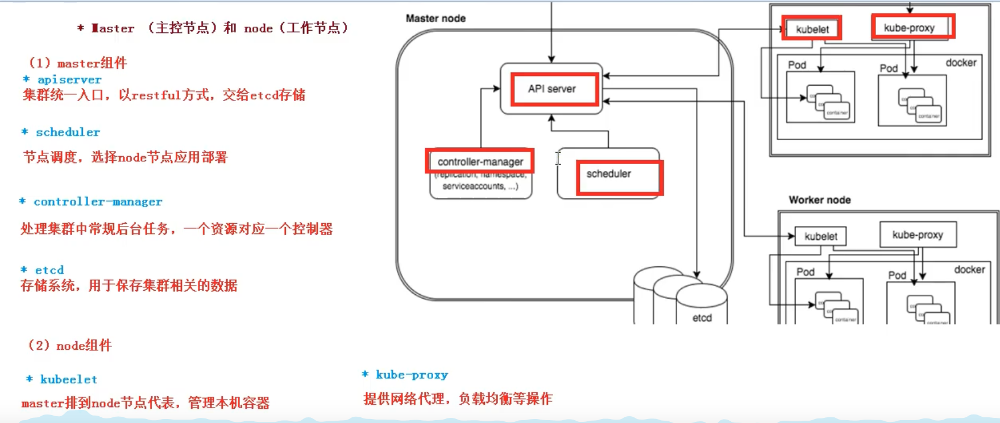
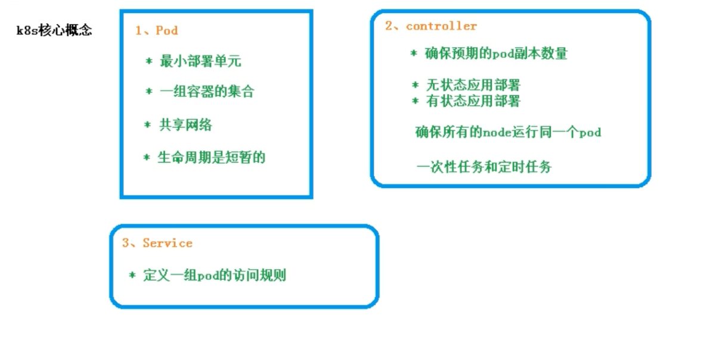

## 一、Kubernetes 入门
Kubernetes是一个可移植的、可扩展的开源平台，用于管理容器化的工作负载和服务，可促进声明式配置和自动化。Kubernetes拥有一个庞大且快速增长的生态系统。Kubernetes的服务、支持和工具广泛可用。

## 二、Kubernetes简介
Kubernetes是一个全新的基于容器技术的分布式领先方案。简称：k8s。它是Google开源的容器集群管理系统，它的设计灵感来自于Google内部的一个叫做Borg的容器管理系统。继承了Google十余年的容器集群使用经验，它为容器化的应用提供了部署运行、资源调度、服务发现和动态伸缩等一系列完整功能，极大的提高了大规模容器集群管理的便捷性。
Kubernetes是一个完备的分布式系统支撑平台，具有完备的集群管理能力，多扩多层次的安全防护和准入机制、多租户应用支撑能力、透明的服务注册和发现机制、內建智能负载均衡器、强大的故障发现和自我修复能力、服务滚动升级和在线扩容能力、可扩展的资源自动调度机制以及多粒度的资源配额管理能力。
在集群管理方面，Kubernetes将集群中的机器划分为一个 Master 节点和一群工作节点 Node，其中，在 Master节点运行着集群管理相关的一组进程 kube-apiserver、kube-controller-manager 和 kube-scheduler，这些进程实现了整个集群的资源管理、Pod 调度、弹性伸缩、安全控制、系统监控和纠错等管理能力，并且都是全自动完成的。Node 作为集群中的工作节点，运行真正的应用程序，在 Node 上 Kubernetes 管理的最小运行单元是 Pod。Node 上运行着 Kubernetes 的kubelet、kube-proxy 服务进程，这些服务进程负责 Pod 的创建、启动、监控、重启、销毁以及实现软件模式的负载均衡器。
在 Kubernetes 集群中，它解决了传统 IT 系统中服务扩容和升级的两大难题。如果今天的软件并不是特别复杂并且需要承载的峰值流量不是特别多，那么后端项目的部署其实也只需要在虚拟机上安装一些简单的依赖，将需要部署的项目编译后运行就可以了。但是随着软件变得越来越复杂，一个完整的后端服务不再是单体服务，而是由多个职责和功能不同的服务组成，服务之间复杂的拓扑关系以及单机已经无法满足的性能需求使得软件的部署和运维工作变得非常复杂，这也就使得部署和运维大型集群变成了非常迫切的需求。
Kubernetes 的出现不仅主宰了容器编排的市场，更改变了过去的运维方式，不仅将开发与运维之间边界变得更加模糊，而且让 DevOps 这一角色变得更加清晰，每一个软件工程师都可以通过 Kubernetes 来定义服务之间的拓扑关系、线上的节点个数、资源使用量并且能够快速实现水平扩容、蓝绿部署等在过去复杂的运维操作

### Kubernetes优势

- 自动装箱,水平扩展,自我修复
- 服务发现和负载均衡
- 自动发布(默认滚动发布模式)和回滚
- 集中化配置管理和密钥管理
- 存储编排
- 任务批处理运行

### Pod

- Pod是K8S里能够被运行的最小的逻辑单元(原子单元)
- 1个Pod里面可以运行多个容器,它们共享UTS+NET +IPC名称空间
- 可以把Pod理解成豌豆荚,而同- -Pod内的每个容器是一 颗颗豌豆
- 一个Pod里运行多个容器,又叫:边车(SideCar)模式

### Pod控制器

- Pod控制器是Pod启动的一-种模板,用来保证在K8S里启动的Pod
- 应始终按照人们的预期运行(副本数、生命周期、健康状态检查... )
- K8S内提供了众多的Pod控制器,常用的有以下几种:
    - Deployment
    - DaemonSet （每个节点起一份）
    - ReplicaSet （Deployment管 ReplicaSet，ReplicaSet管pod）
    - StatefulSet （管理有状态应用的）
    - Job
    - Cronjob

### Name

- 由于K8S内部,使用“资源”来定义每一种逻辑概念(功能)故每种"资源”, 都应该有自己的"名称”
- "资源”有api版本( apiVersion )类别( kind )、元数据( metadata)、定义清单( spec)、状态( status )等配置信息
- "名称”通常定义在"资源”的"元数据”信息里

### Namespace

- 随着项目增多、人员增加、集群规模的扩大,需要- -种能够隔离K8S内各种"资源”的方法，这就是名称空间
- 名称空间可以理解为K8S内部的虚拟集群组
- 不同名称空间内的"资源”名称可以相同,相同名称空间内的同种“资源”，”名称” 不能相同
- 合理的使用K8S的名称空间,使得集群管理员能够更好的对交付到K8S里的服务进行分类管理和浏览
- K8S里默认存在的名称空间有: default、 kube-system、 kube-public
- 查询K8S里特定“资源”要带上相应的名称空间

### Label

- 标签是k8s特色的管理方式,便于分类管理资源对象。
- 一个标签可以对应多个资源，-个资源也可以有多个标签,它们是多对多的关系。
- 一个资源拥有多个标签,可以实现不同维度的管理。
- 标签的组成: key=value(值不能多余64个字节字母数字开头 中间只能是 - _ .）
- 与标签类似的,还有一种“注解” ( annotations )

### Label选择器

- 给资源打上标签后,可以使用标签选择器过滤指定的标签
- 标签选择器目前有两个:基于等值关系(等于、不等于)和基于集合关系(属于、不属于、存在)
- 许多资源支持内嵌标签选择器字段
    - matchl _abels
    - matchExpressions

### Service

- 在K8S的世界里,虽然每个Pod都会被分配一个单独的IP地址,但这个IP地址会随着Pod的销毁而消失
- Service (服务)就是用来解决这个问题的核心概念
- 一个Service可以看作- -组提供相同服务的Pod的对外访问接口
- Service作用于哪些Pod是通过标签选择器来定义的

### Ingress

- Ingress是K8S集群里工作在OSI网络参考模型下,第7层的应用,对外暴露的接口
- Service只能进行L4流量调度,表现形式是ip+port
- Ingress则可以调度不同业务域、 不同URL访问路径的业务流量

## 三、架构

Kubernetes 遵循非常传统的客户端服务端架构，客户端通过 RESTful 接口或者直接使用 kubectl 与Kubernetes 集群进行通信，这两者在实际上并没有太多的区别，后者也只是对 Kubernetes 提供的 RESTfulAPI 进行封装并提供出来。每一个 Kubernetes 集群都由一组 Master 节点和一系列的 Worker 节点组成，其中 Master 节点主要负责存储集群的状态并为 Kubernetes 对象分配和调度资源。

### 1.Master（主要用来管理集群）

它主要负责接受客户端的请求，安排容器的执行并且运行控制循环，将集群的状态向目标状态进行迁移，Master节点内部由7个组件构成：

```
#1.APIServer（kube-apiserver ： 中央管理器，调度管理集群）
负责处理来自用户的请求，其主要作用就是对外提供RESTful的接口
包括用于查看集群状态的读请求以及改变集群状态的写请求，也是唯一一个于etcd集群通信的组件。

#2.Controller（kube-controller-manager ：控制器： 管理容器，监控容器）
管理器运行了一系列的控制器进程，这些进程会按照用户的期望状态在后台不断地调节整个集群中的对象，需要有高可用机制
当服务的状态发生改变，控制器就会发现这个改变并且开始向目标状态迁移。
由一系列控制器组成,通过apiserver监控整个集群的状态,并确保集群处于预期的工作状态
Node Controller       #节点控制器
Deployment Controller   #pod控制器
Service Controller    #服务控制器
Volume Controller      #存储卷控制器
Endpoint Controller    #接入点控制器
Garbage Controller    #垃圾回收控制器
Namespace Controller    #名称空间控制器
Job Controller       #任务控制器
Resource quta Controller    #资源配额控制器

#3.Scheduler（kube-scheduler：调度器：调度容器）
调度器其实为kubernetes中运行的Pod选择部署的Worker节点
它会根据用户的需要选择最能满足请求的节点来运行Pod，它会在每次需要调度Pod时执行。
主要功能是接收调度pod到适合的运算节点上
预选策略( predict )
优选策略( priorities )

#4.Flannel(提供集群间网络)

#5.Etcd(数据库)

#6.kubelet(部署容器，监控容器)

#7.kube-proxy(提供容器间的网络)
```

### 2.Node(主要用来部署应用)

```
#1.kube-kubelet(部署容器，监控容器)
kubelet是一个节点上的主要服务，他周期性的从APIServer接受新的或者修改的pod规范并且保证节点上的pod和其容器的正常运行
还会保证节点会向目标状态迁移，该节点仍然会向Master节点发送宿主机的健康状态。
简单地说, kubelet的主要功能就是定时从某个地方获取节点上pod的期望状态(运行什么容器、运行的副本数量、网络或者存储如何配置等等) ,并调用对应的容器平台接口达到这个状态
定时汇报当前节点的状态给apiserver,以供调度的时候使用
镜像和容器的清理工作，保证节点上镜像不会占满磁盘空间，退出的容器不会占用太多资源

#2.kube-proxy(提供容器间的网络)
负责宿主机的子网管理，同时也能将服务暴露给外部
其原理就是在多个隔离的网络中把请求转发给正确的Pod或者容器。
是K8S在每个节点 上运行网络代理, service资源的载体
建立了pod网络和集群网络的关系( clusterip >podip )
常用三种流量调度模式
Userspace (废弃)
Iptables (濒临废弃)（绝大部分公司在用）
Ipvs(推荐)
负责建立和删除包括更新调度规则、通知apiserver自己的更新,或者从apiserver哪里获取其他kube- proxy的调度规则变化来更新自己的
```

### 3.Kubernetes架构图






```
# 在架构图中，我们把服务分为运行在工作节点上的服务和组成在集群级别控制板的服务
Kubernetes主要由以下几个核心组件组成：

 1. etcd保存整个集群的状态
 2. apiserver提供了资源的唯一入口，并提供认证、授权、访问控制、API注册和发现等
 3. controller manager负责维护集群的状态，比如故障检测、自动扩展、滚动更新等
 4. scheduler负责资源的调度，按照预定的调度策略将Pod调度到相应的机器上
 5. kubelet负责维护容器的生命周期，同时也负责Volume(CVI)和网络（CNI）的管理
 6. Container runtime负责镜像的管理以及Pod和容器的真正运行(CRI)
 7. kube-poxy负责为Service提供cluster内部的服务发现和负载均衡
 
除了核心组件，还有一些推荐的组件：

 8. kube-dns负责为整个集群提供DNS服务
 9. Ingress Controller 为服务提供外网入口
 10. Heapster提供资源监控
 11. Dashboard提供GUIFederation提供跨可用区的集群
 12. Fluentd-elasticsearch提供集群日志采集，存储与查询
 ```