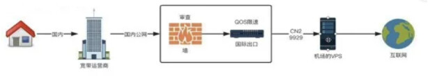
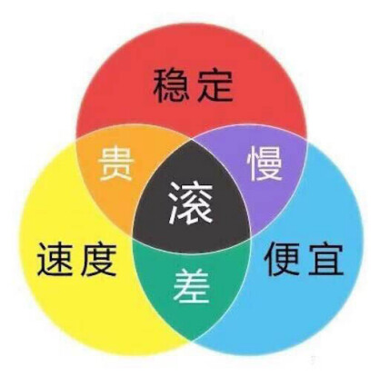
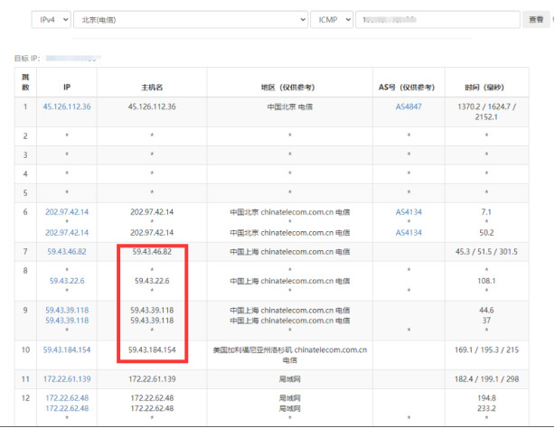
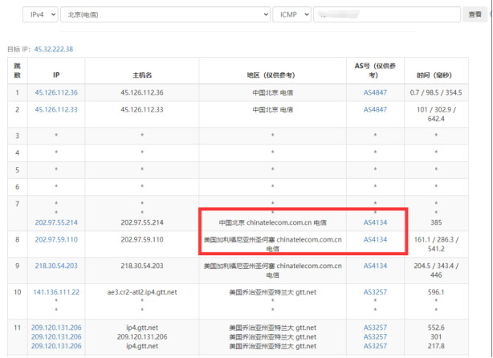
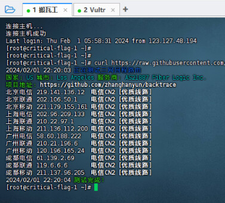
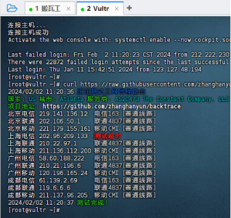

> 什么是国际线路（跨境网络）

从境内访问国外的网站，你的网络会顺着网线/wifi到运营商，经流转到达国外的网站，中间会有一条出海线路，连通中国和其他国家的网络。这条网络就是国际线路，但由于存在GFW（长城防火墙）导致部分网站（如：谷歌）无法访问，所以需要加上一个可以通过GFW的VPS提供代理服务。



### 国内三大运营商国际线路主要以下几种。

#### 中国电信：

- `163骨干网` ：电信第一代承载网络，也有称之为CN1。承载电信85％的流量，线路慢且拥挤，晚高峰丢包率达30％以上，波动极大。胜在便宜大碗，类比国道。无论商家宣传的优化线路还是bgp三网优化都不会走CN2。

- `CN2` ：第二代承载网络，承载电信剩下的15%流量，如同高速公路，客流量少，速度快，不拥挤。但收高速费，价格比163贵很多，只有少部分服务商提供接入。

CN2又分为CN2 GT 和CN2 GIA ，区别就在于，GT国际线路走CN2线路，国内走163骨干网，也叫半程CN2。且在CN2线路中优先级低于GIA，所以还是存在上述问题。而GIA国际线路和国内都走CN2线路（省内还是会经过163骨干网），并且优先级高于GT，所以价格是GT的2到3倍。

CN2 GIA 产品还分为单网、双网、三网三种，顾名思义，单网 CN2 GIA 一般指的是仅中国电信用户访问去回，走 CN2 GIA 网络，联通/移动/教育网等用户访问过去，均走各自运营商的国际出口（典型产品为阿里云国际香港节点）；双网 CN2 GIA 一般指的是中国电信/中国联通用户访问过去，走 CN2 GIA 网络（特别地，该产品允许中国联通线路在省级跨网并入到中国电信的 CN2 网络，典型产品为标准互联的圣何塞 CN2 GIA 产品）；三网 CN2 GIA 一般指的是中国电信/中国联通/中国移动三网用户的去回访问，均会在省级并入到 CN2 网络，适用性最强（典型产品为搬瓦工的 DC9、DC6 机房）。

#### 中国联通：

- `169骨干网（AS4837）`：如同电信的163骨干网，但流量相对169少一些，晚高峰比163会好一些。但还是存在163的那些问题。

- `A网（AS9929）`：联通对标电信CN2线路的承载网络，其实差很多。CN2是优化度很高的精品网络，A网只是普通网络。曾经是从电信骨干网分出来的网络，多年没升级，优势就是人少，所以拥堵情况好。承载力和质量远不如持续进化的CN2，从很多vps商家价格上也能看出来9299线路价格远低于CN2。

#### 中国移动：

- `CMI`：移动只有这一条普通的跨境网络，好于169和163。

- `CMIN2`：移动的精品网，对标电信CN2。22年推出的，网上信息较少，质量比联通A网强，但比不上电信CN2。目前用CMIN2的商家较少。

#### 政企专线：

在购买机场时，你也会经常看到`IPLC（国际专线）`/`IEPL（国际以太网专线）`两个名词。这两条线路都是政企专线，当然还有其他类型的。这里我们不在介绍不同类型线路之间的区别，感兴趣的可以自行搜索。

专线和上面公共网络区别：专线顾名思义就是专门搭建的网络，只服务于你，他不会经过上面的公共网络，通常是点对点，并且也没有GFW（长城防火墙）。需要有资质的企业或政府向电信运营商申请，并且需要备案，价格也是相当昂贵。例如你用的游戏加速器，通常都是专线。由于没有GFW，也就没有“翻墙”一说。



### 为什么会丢包？

因为运营商的线路带宽有限，当用户数据量＞运营商线路可承载的带宽时，就会根据运营商制定的规则丢弃部分数据包，这里就不得不提到Qos（服务质量） 11。简单讲就是根据优先级，包类型等一些规则来管理这些数据包，可以比喻成马路上的交警在堵车时疏散交通。

- 例子①：在CN2线路网络拥堵时，会根据优先级（例如：CN2GIA＞CN2GT）先放行GIA的数据包，GT的数据包则有可能延后或丢弃，来保障CN2GIA的稳定性。这就是比CN2GT贵2到3倍的原因。

- 例子②：在普通线路中，大家优先级一样，那么对延迟要求高的语音，视频，游戏等数据就会比对延迟不敏感的网页，视频等数据优先放行。

以上只是简单的举例，现实中的网络比这个复杂的多。不光运营商会使用Qos，在我们家用路由器也会使用Qos来保障你的上网体验。

### 其他名词解释

- `BGP线路` ：BGP即边界官网协议，BGP线路简单来说就是将电信、联通、移动等多家运营商的网络融合在一起的线路。国内网络环境比较复杂，如电信单线，只有电信用户访问速度快，其他运营商的访问速度就没有那么好。而BGP线路可以把多家运营商的线路同时接入，路由器根据相关数据进行解析，选出最快的线路反馈回去，以实现不同线路之间的互联互通，基本上都是哪家线路就走哪家家线路。

- `绕路` ：国际线路，存在绕路情况，比如你从广东访问香港，你觉得很近，但有可能从日本去绕一圈再到香港，这是运营商线路问题造成的。在国际网络有很多这种情况，甚至绕地球半圈在到目的地的都有。所以可以通过优化线路减少这种绕路情况。这种往往使用的是163骨干网这种普通网络存在这种情况比较多。

- `单向CN2`与`双向CN2`： CN2除了线路分为两种类型，CN2还区分双向和单向。所为双向，顾名思义，去程的路由节点和回程的路由节点，都使用了CN2的承载网络。而单向CN2，一般都是去程CN2，回程普通电信线路。

- `双线` ：比如有的厂商使用9929+CMI，当你是移动用户时，会选择CMI线路，电信和联通则使用9929线路。

- `三网CN2GIA` ：就是不论你是联通，电信，移动用户，跨境线路均走电信CN2GIA精品网。

- `NTT`，`软银线路`、`iij线路` ：都是日本网络运营商线路，线路根据地区和国内运营商情况，好坏都有，不过多介绍。常见于香港和日本的VPS商家。

### 线路测试

#### 去程测试

打开 https://tools.ipip.net/traceroute.php ，输入vpn服务器ip

- 优质线路（59.43的ip都是CN2线路）



上图为搬瓦工DC6 CN2GIA路由表

- 普通线路（202.97的ip都是163骨干网）



上图为Vultr亚特兰大机房路由表

#### 回程测试

需要在服务器进行，打开ssh客户端

```bash
curl https://raw.githubusercontent.com/zhanghanyun/backtrace/main/install.sh -sSf | sh
```

- 优质线路



- 普通线路

