#  「深度」学习计算广告，最全最好懂的互联网广告生态体系介绍   
  
**「深度」学习计算广告，最全最好懂的互联网广告生态体系介绍**  
  
  
任何复杂系统都是由简单系统衍生发展出来的，广告生态体系也不例外，而这个简单系统也是整个生态的核心逻辑。广告生态体系的核心逻辑很简单：  
  
  
**找一个广告位，展示我的产品。**  
  
  
网站A有一个广告位要出售，曝光1000次10块钱，我想用这个广告位投放我那本《深度学习推荐系统》的广告，于是，一个最简单的广告系统诞生了。早期的广告系统甚至都没有一个所谓的“系统”进行管理，就是网站美工拿到广告主的商品图片，换下广告位的图片就可以了。  
  
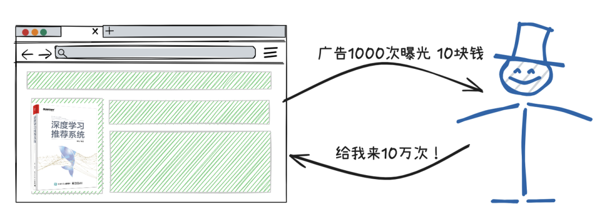  
  
  
随着媒体业务的发展，广告位越来越多，广告尺寸、广告形式也越来越多，每个广告位的价格还各不相同。靠之前那种刀耕火种，人工沟通的方式让媒体方和广告主都很头疼。  
  
  
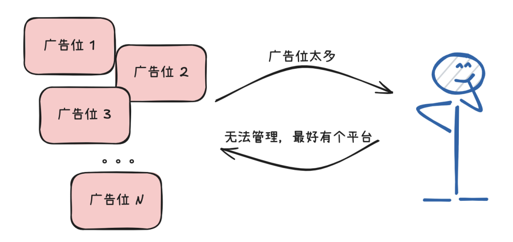  
  
  
于是**供应方平台SSP（Supply-Side Platform）**诞生了。SSP统一管理一个媒体方或多个媒体方的广告位资源，能够完成广告位资源的注册，管理，对接的功能。有了SSP的存在，媒体和广告主都能够一目了然的了解媒体资源的情况，让广告投放下单变得更加便利。  
  
  
  
  
  
但事情又随着广告主数量的增多，广告主需求的多样化变得更加复杂。有的广告主想投游戏类媒体，有的广告主想投财经频道，有的广告主想投男性用户，有的广告主想投一线城市。只有SSP管理媒体资源，没有一个平台满足广告主需求怎么行？于是**需求方平台DSP（Demand-Side Platform）**出现了。有了DSP，广告主不用直接对接原始的媒体资源，而是可以通过DSP完成自己纷繁复杂的投放需求。  
  
  
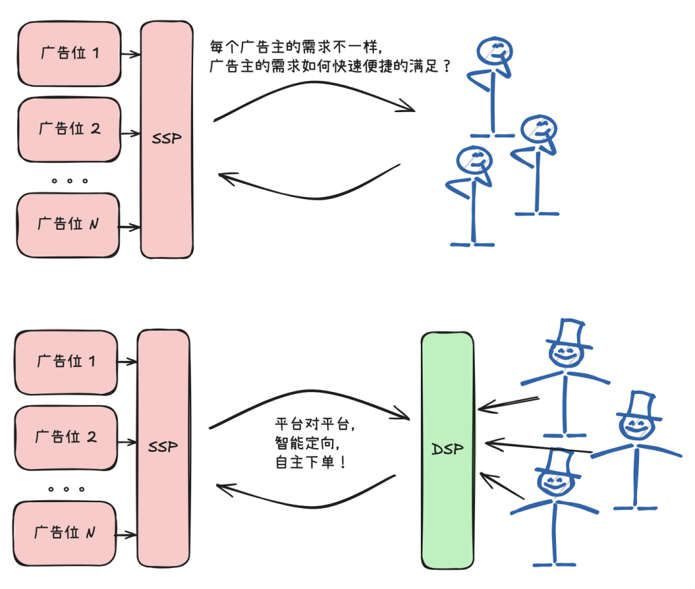  
  
  
但好景不长，随着互联网广告生态的进一步发展，市面上出现了多家SSP和DSP，这次抱怨的是程序员。DSP的程序员说几十家SSP挨个要去对接，数据协议不一样，接口形式不一样，一家一家去对接就罢了，过程中谁改了协议，维护起来就是个灾难。SSP的程序员也疯了，钱是从DSP来的，伺候一家金主爸爸还能忍，同时伺候几十家，臣妾也做不到啊。  
  
  
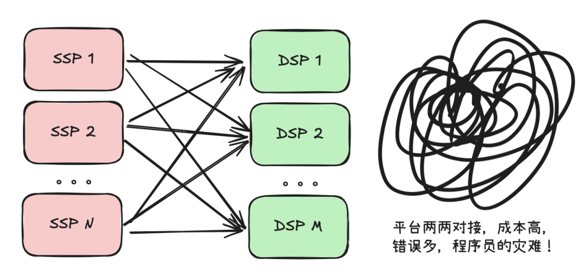  
  
  
于是，整个行业的头部玩家聚在一起，成立了一个**行业协议叫OpenRTB**，所有SSP和DSP全部遵守这个协议来对接采买流量。而所有SSP的流量为了方便，都对接到一个公开的市场售卖，DSP参与竞价，谁竞到了谁拿到流量。这个市场，就是**AD Exchange，简称ADX**。自此，SSP和DSP们的程序员都开心了，因为新的DSP和SSP只需要维护跟ADX的接口和数据规范就可以了。而且大家在一个公开的市场参与竞价，公平公正！  
  
  
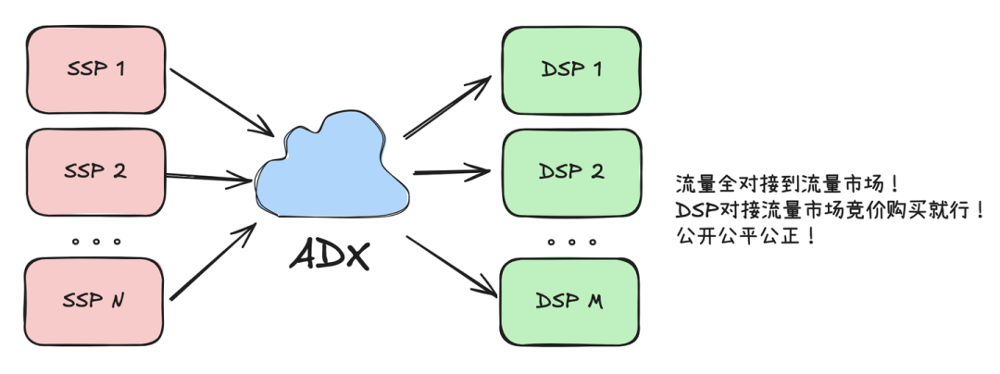  
  
  
广告主爸爸这时候又不干了，你是方便对接了，DSP的建设门槛降低了。市面上冒出来这么多DSP公司，你让我怎么选。选少了，很多用户覆盖不到影响产品推广效果；选多了，用户重复曝光浪费广告费，就没有一个什么大一统的平台把所有DSP管理起来吗？给我一站式服务！甲方有需求，乙方就有对策，**TradingDesk**这种新的平台形式出现了，它号称对接了所有DSP，能够一站式解决甲方投放需求。  
  
  
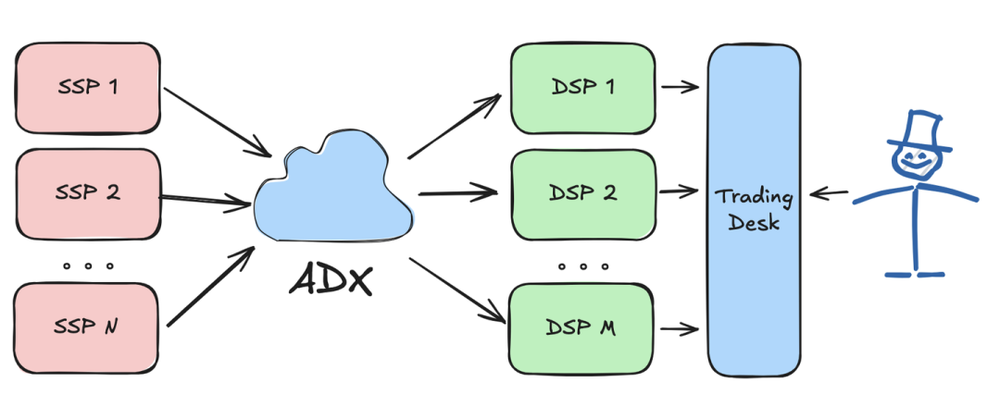  
  
  
广告主有了TradingDesk很开心，想买什么买什么，想买多少就买多少。这时候一些优质的媒体不干了，凭什么我们的流量要跟那些垃圾流量混在一起售卖。人家腾讯新浪今日头条也有理由说的，我带的是什么流量，我带的是门户头条的高质量流量，你们这批是什么流量啊？一堆小站长建的垃圾站，它能混在一起卖吗？混不了！没这个质量知道吗？  
  
  
于是，一大批自有的、私有的广告平台被建立起来，包括一些**独立的媒体平台（Independent Media）**，把一些APP流量联合起来的**网盟（Ad Network）**，以及一线公司的**超级广告平台（Ad Platform）**，比如Meta的Ads Manager，Tiktok的Ads Manager，腾讯的微信广告等等，它们不与任何ADX合作，而是自建平台让广告主直接下单，这是高质量媒体维护自身利益之举。  
  
  
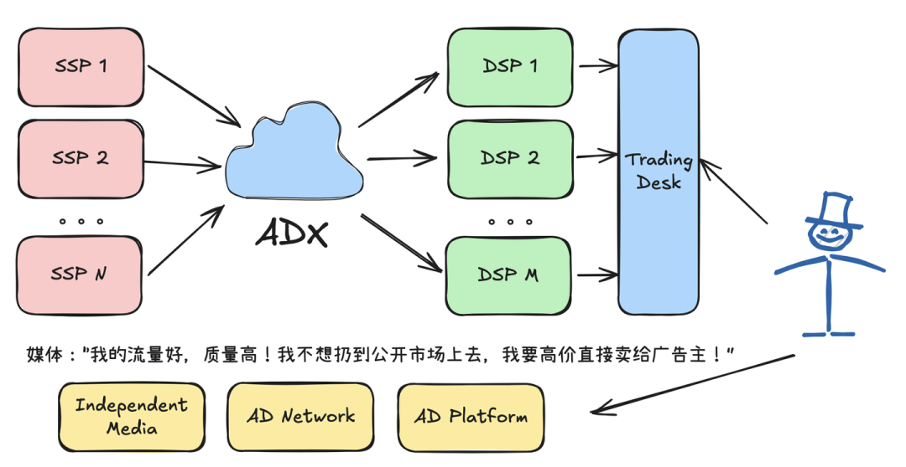  
  
  
事情似乎已经足够复杂了，但还没完。广告主发现一个比较坑的事情。这些独立媒体都号称自己用户覆盖广、媒体质量高，我都投，投了半天用户都投重复了怎么办？一个用户既能在SSP1出现，也能在SSP2出现，还能在一些Ad Network出现，它们互相之间数据不流通，都是数据孤岛，我怎么知道钱是不是都花在了同一批用户上。  
  
  
于是有了第三方**数据管理平台DMP（Data Management Platform）**来解决数据孤岛问题，把生态系统中的所有平台的数据都打通，完成用户、流量属性、商品信息的互通，避免广告主花冤枉钱的同时，用更全面的数据训练模型和算法，让广告主投的更准，效率更高。  
  
  
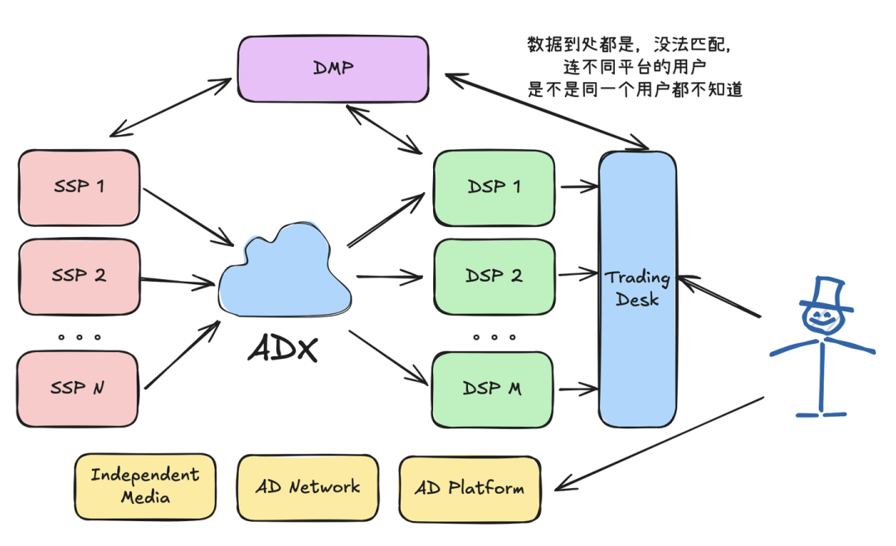  
  
  
广告主不放心的还有很多。我花钱买曝光、买转化，但到底曝光了多少，转化了多少我不能只听媒体的一面之辞啊。特别是我听说现在作弊媒体很多，曝光是假的，点击是假的，甚至转化都能作假。我要找第三方机构监督这些媒体。于是有了第三方的**归因度量平台（Measurement）**比如国内的talkingdata，国外的AppsFlyer等，**数据分析平台（Analytics）**，比如百度统计，Google analytics等。为了集中管理**广告创意（Creative）**，做到一套创意发多个平台，特别是AIGC浪潮到来后，广告创意的生成形式更加多样，第三方的创意生成的平台作为重要的一环也加入到生态系统中来。  
  
  
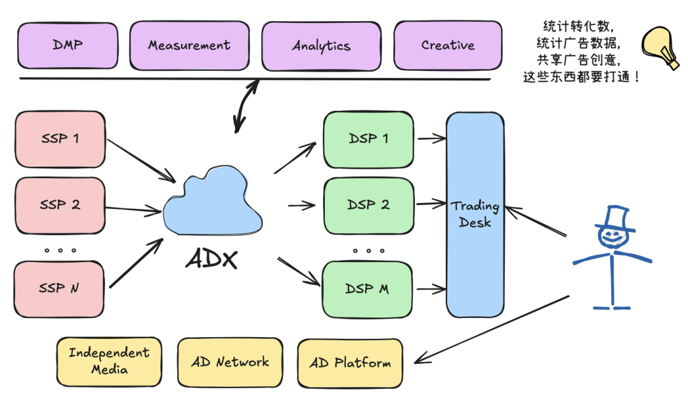  
  
  
广告的生态越来越复杂，媒体方，平台方把自己的功能吹的天花乱坠。广告主的开销越来越大，商品售卖的效果却不见好转？！到底是什么情况？金主爸爸们的想法也逐渐在分裂，一部分真金主爸爸，比如大众，宝马，宝洁，苹果，可口可乐说了，给我来最好的媒体，最高大上的广告创意，我不用你们带来什么点击、转化的，我就要更多用户看见我，维持我在用户心中的品牌。这部分真金爸爸，叫**品牌广告主**。  
  
  
一部分广告主开始抠抠索索起来，本来广告预算就是节省出来的，投一波广告还希望多带带产品销量呢，你可不能瞎投。这部分典型的广告主是游戏、电商广告主。我就是看效果，没有效果，果断停投！这部分广告主，叫**效果广告主**。  
  
  
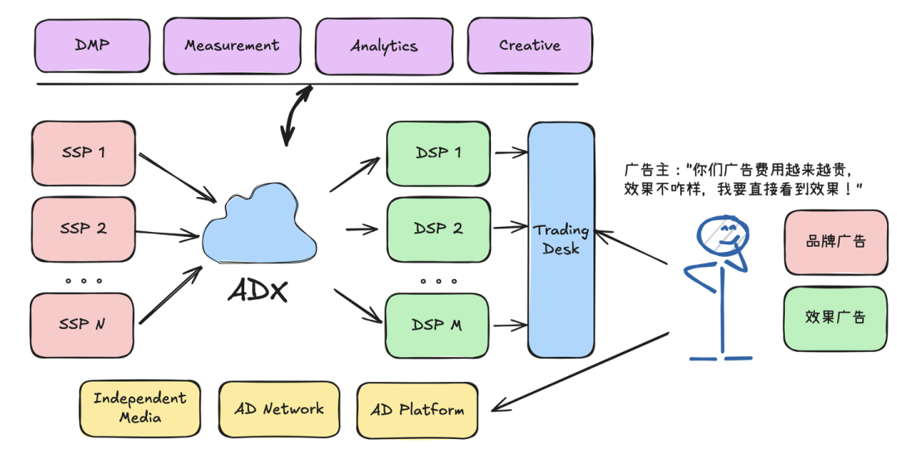  
  
  
广告主投广告的目的不同，广告主支付媒体费用的时候希望使用的标准自然也不相同。品牌广告主财大气粗，就想要优质媒体的优质曝光，那按**CPM（Cost Per Mille）**支付就好了，没有其他的诉求。效果广告主就不同了，要是还按照CPM付费，结果我要的效果你一个没给我带来，那不就花冤枉钱了吗。所以追求点击的广告主希望以**CPC（Cost Per Click）付费，要求安装的广告主希望以CPA（Cost Per Action）**支付，我只为你给我带来的收益付费。  
  
  
这个时候，媒体方又有了不同意见，广告生态里的各方就是一直在博弈中。媒体方说，你要是故意把一个转化的标准设置的比较高怎么办，一个转化1000块钱，要是一个转化都产生不了你得白嫖我多少曝光啊。我们还是要求按CPM付费，但可以兼顾你的优化目标。于是**oCPM的计价方式出现了，被称为“优化千次展示出价”**。广告主还是按照CPM出价，但是广告平台会考虑你的优化目标，尽量通过智能投放，精准建模的方式实现你的优化目标。你要是不满意，我们可以联合优化，要是还不满意，那也能在花销不大的情况下停投。但是你想白嫖我们的流量是不可能的。  
  
  
于是oCPM这种权衡了广告主和广告平台利益的计费方式成为了现在效果广告的主流，字节，Meta，腾讯等头部广告平台都主要用这种方式支持效果广告主。  
  
  
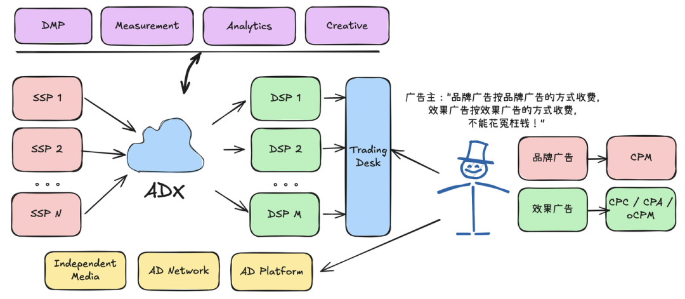  
  
  
至此，我们基本上介绍完了互联网广告生态中的所有主要参与方。这就是计算广告的魅力，这些玩家纵横捭阖，合作中带着竞争，狡猾中带着智慧，整个生态越来越复杂，但也越来越公平合理。希望这篇文章能让你有直观全面的了解。  
  
  
  
