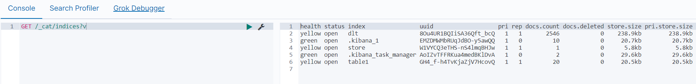
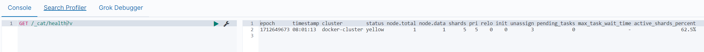

## 通过json文件批量导入

```bash
curl -XPOST "http://elasticsearch:9200/索引库/_bulk?pretty" -H 'Content-Type: application/json' --data-binary "@accounts.json"
```

> `_bulk`: 表示批量处理

## 查看所有的索引
```bash
curl -XGET "http://elasticsearch:9200/_cat/indices?v"
```
> `v`: 表示 verbose 的意思，这样可以更可读（有表头，有对齐），如果不加v，不会显示表头



- `index`：索引名称
- `pri`：有几个私有的分片，
- `rep`：有几个副本，
- `docs.count`：索引里面有几个文档(即里面有几条数据记录)，
- `docs.deleted`：删除了几条记录，
- `store.size`：数据存储总大小(包括副本)，
- `pri.store.size`：分片数据存储的大小。

## 查看es集群是否健康
```bash
curl -XGET "http://elasticsearch:9200/_cat/health?v"
```


## 查看集群节点
```bash
curl -XGET "http://elasticsearch:9200/_cat/nodes?v"
```


- `Green（绿色）`：表示集群的`健康状态良好`。这意味着所有的主分片和副本分片都是可用的，集群可以正常工作。当所有的主分片和副本分片都被正确分配并且没有丢失时，集群状态就是 "green"。

- `Yellow（黄色）`：表示集群的`健康状态不太理想`，但仍然可以正常工作。这意味着所有的主分片都是可用的，但是一些或全部副本分片丢失。当某些副本分片丢失时，集群状态就是 "yellow"。尽管这种情况下 Elasticsearch 仍然可以提供读取和写入操作，但是可能会对可用性产生影响，因为某些数据的冗余备份可能已经丢失。
