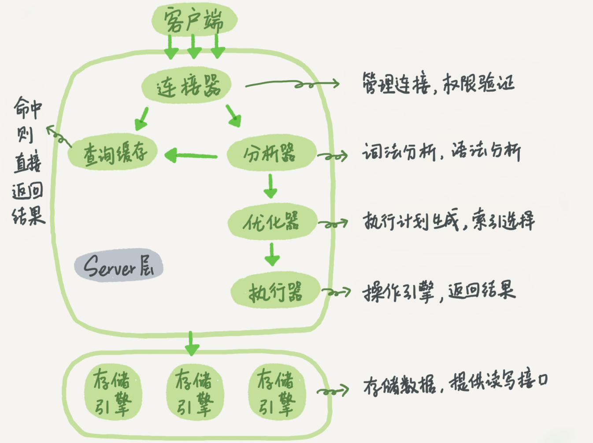
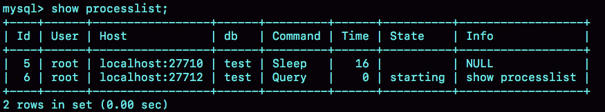

- 比如，你有个最简 单的表，表里只有一个ID字段，在执行下面这个查询语句时：

```sql
select * from T where ID=10；
```

- MySQL的基本架构示意图



> `Server层`包括`连接器`、`查询缓存`、`分析器`、`优化器`、`执行器`等，涵盖MySQL的大多数核心服务 功能，以及所有的`内置函数`（如日期、时间、数学和加密函数等），所有跨`存储引擎`的功能都在 这一层实现，比如`存储过程`、`触发器`、`视图`等。

> 而`存储引擎层`负责数据的存储和提取。其架构模式是插件式的，支持`InnoDB`、`MyISAM`、 `Memory`等多个存储引擎。现在最常用的存储引擎是`InnoDB`，它从`MySQL 5.5.5`版本开始成为了 默认存储引擎。

## 1.连接器

第一步，你会先连接到这个数据库上，这时候接待你的就是连接器。`连接器`负责跟客户端建立连 接、获取权限、维持和管理连接。连接命令一般是这么写的:

```terminal
mysql -h$ip -P$port -u$user -p  

// 完成经典的TCP握手后
//      * 如果用户名或密码不对，你就会收到一个"Access denied for user"的错误，然后客户端程序 结束执行。
// 一个用户成功建立连接后，即使你用管理员账号对这个用户的权限做了修改，也不会影响已经存在连接的权限。
// 修改完成后，只有再新建的连接才会使用新的权限设置。
```

连接完成后，如果你没有后续的动作，这个连接就处于空闲状态，你可以在[show full processlist](/mysql/Mysql实践技巧/processlist.md)命令中看到它。文本中这个图是 `show full processlist` 的结果，其中的 `Command` 列显示为 “`Sleep`” 的这 一行，就表示现在系统里面有一个空闲连接。



客户端如果太长时间没动静，连接器就会自动将它断开。这个时间是由参数 `wait_timeout` 控制的，默认值是8小时。

如果在连接被断开之后，客户端再次发送请求的话，就会收到一个错误提醒： `Lost connection to MySQL server during query`。这时候如果你要继续，就需要重连，然后再执行请求了。

> `长连接`是指连接成功后，如果客户端持续有请求，则一直使用同一个连接。
> `短连接`则是指每次执行完很少的几次查询就断开连接，下次查询再重新建立一个。

建立连接的过程通常是比较复杂的，所以我建议你在使用中要尽量减少建立连接的动作，也就是 尽量使用长连接。

但是全部使用长连接后，你可能会发现，有些时候`MySQL`占用内存涨得特别快，这是因为`MySQL`在执行过程中临时使用的`内存`是管理在`连接对象`里面的。这些资源会在`连接断开`的时候才释放。所以如果长连接累积下来，可能导致`内存占用太大`，被系统强行杀掉（OOM），从现象看就是MySQL异常重启了。

解决方案：

* `定期断开`长连接。使用一段时间，或者程序里面判断执行过一个`占用内存的大查询`后，断开 连接，之后要查询再重连。

* 如果你用的是`MySQL 5.7`或更新版本，可以在每次执行一个比较大的操作后，通过执行 `mysql_reset_connection`来重新初始化连接资源。这个过程不需要`重连`和重新做`权限验证`， 但是会将连接恢复到刚刚创建完时的状态。


## 2.查询缓存

`MySQL`拿到一个查询请求后，会先到`查询缓存`看看，之前是不是执行过这条语句。之前执行过 的语句及其结果可能会以`key-value`对的形式，被直接缓存在内存中。`key`是查询的语句，`value`是查询的结果。如果你的查询能够直接在这个缓存中找到`key`，那么这个`value`就会被直接返回给客户端。

如果语句不在`查询缓存`中，就会继续后面的执行阶段。执行完成后，执行结果会被存入`查询缓存`中。

!> **大多数情况不建议使用查询缓存，查询缓存弊大于利。** 查询缓存的失效非常频繁，只要有对一个表的更新，这个表上所有的查询缓存都会被清空。

对于更新压力大的数据库 来说，查询缓存的命中率会非常低。除非你的业务就是有一张静态表，很长时间才会更新一次。 比如，一个系统配置表，那这张表上的查询才适合使用查询缓存。

好在MySQL也提供了这种“按需使用”的方式。你可以将参数`query_cache_type`设置成 `DEMAND`，这样对于默认的`SQL`语句都不使用`查询缓存`。而对于你确定要使用查询缓存的语句，可以用`SQL_CACHE`显式指定，像下面这个语句一样：


```sql
select SQL_CACHE * from T where ID=10；
```

?> 需要注意的是，`MySQL 8.0`版本直接将查询缓存的整块功能删掉了，也就是说8.0开始彻底没有 这个功能了。


## 3.分析器

如果没有命中查询缓存，就要开始真正执行语句了。

分析器先会做“`词法分析`”。你输入的是由多个字符串和空格组成的一条`SQL`语句，`MySQ`L需要识别出里面的字符串分别是什么，代表什么。

`MySQL`从你输入的"`select`"这个关键字识别出来，这是一个`查询语句`。
它也要把字符串“`T`”识别 成“`表名T`”，把字符串“`ID`”识别成“`列ID`”。 
做完了这些识别以后，就要做“`语法分析`”。根据词法分析的结果，语法分析器会根据语法规则， 判断你输入的这个`SQL语句`是否满足`MySQL语法`。 如果你的语句不对，就会收到“`You have an error in your SQL syntax`”的错误提醒，比如下面这个 语句`select`少打了开头的字母“`s`”。

```sql
select * from t where ID=1;

// ERROR 1064 (42000): You have an error in your SQL syntax; check the manual that corresponds to ...
```

一般语法错误会提示第一个出现错误的位置，所以你要关注的是紧接“`use near`”的内容。

## 4.优化器

`优化器`是在表里面有多个索引的时候，决定使用哪个索引；或者在一个语句有多表关联`join`的时候，决定各个表的连接顺序。比如你执行下面这样的语句，这个语句是执行两个表的`join`：

```sql
select * from t1 join t2 using(ID) where t1.c=10 and t2.d=20;
```

- 既可以先从表t1里面取出c=10的记录的ID值，再根据ID值关联到表t2，再判断t2里面d的值是否等于20。

- 也可以先从表t2里面取出d=20的记录的ID值，再根据ID值关联到t1，再判断t1里面c的值是否等于10。

这两种执行方法的逻辑结果是一样的，但是执行的效率会有不同，而优化器的作用就是决定选择使用哪一个方案。


## 5.执行器

开始执行的时候，要先判断一下你对这个表T有没有执行`查询的权限`，如果没有，就会返回没有权限的错误，如下所示。

```sql
select * from T where ID=10;

// ERROR 1142 (42000): SELECT command denied to user 'b'@'localhost' for table 'T'
```

如果有权限，就打开表继续执行。打开表的时候，执行器就会根据表的引擎定义，去使用这个`引擎`提供的接口

比如我们这个例子中的表T中，ID字段`没有索引`，那么执行器的`执行流程`是这样的：

1. 调用`InnoDB`引擎接口取这个表的第一行，判断ID值是不是10，如果不是则跳过，如果是则将这行存在结果集中
2. 调用`引擎接口`取“下一行”，重复相同的判断逻辑，直到取到这个表的最后一行。
3. 执行器将上述遍历过程中所有`满足条件的行`组成的记录集作为`结果集`返回给客户端。至此，这个语句就执行完成了

对于有索引的表，执行的逻辑也差不多。第一次调用的是“取满足条件的第一行”这个接口，之后循环取“满足条件的下一行”这个接口，这些接口都是引擎中已经定义好的。


你会在数据库的慢查询日志中看到一个`rows_examined`的字段，表示这个语句执行过程中扫描了多少行。这个值就是在执行器每次调用引擎获取数据行的时候累加的。

!> 在有些场景下，执行器调用一次，在引擎内部则扫描了多行，因此引擎扫描行数跟`rows_examined`并不是完全相同的。
