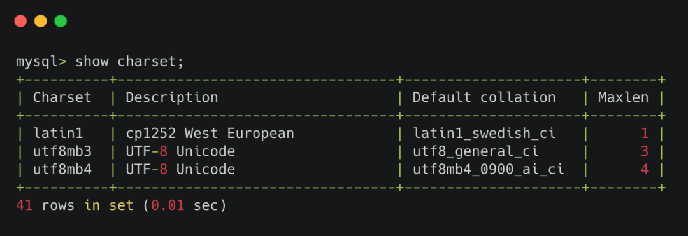
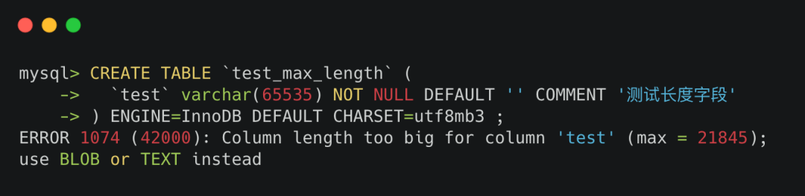
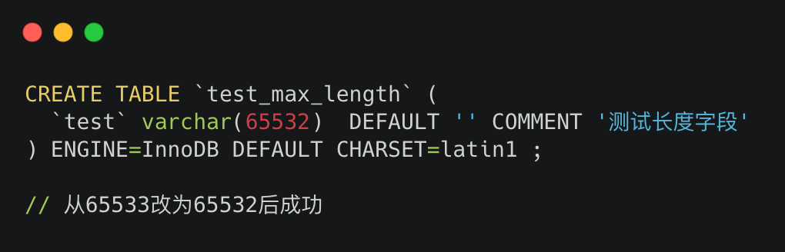
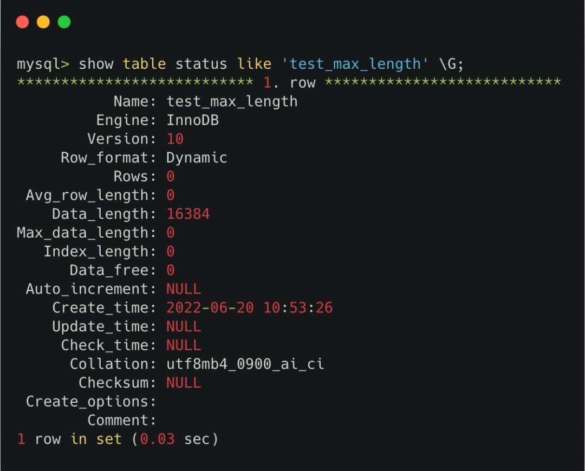
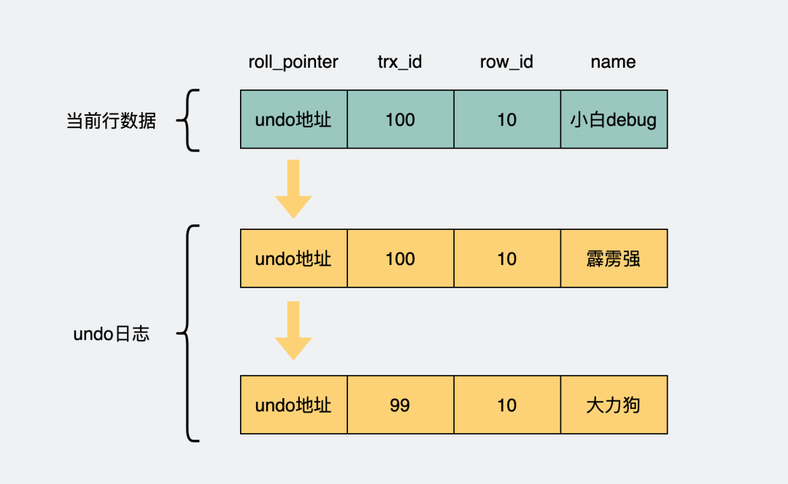
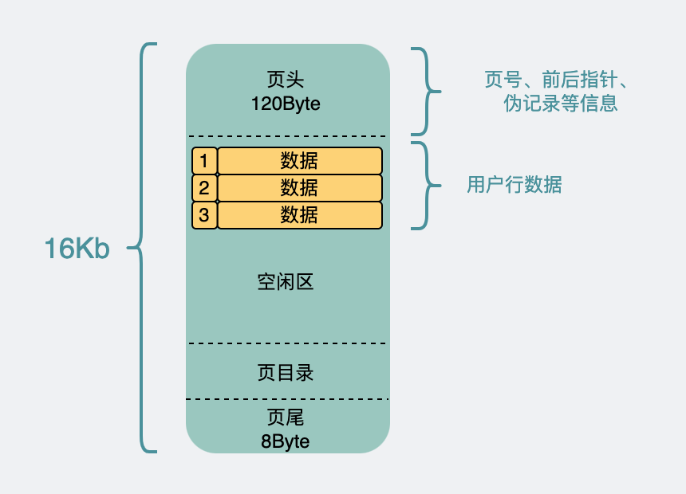
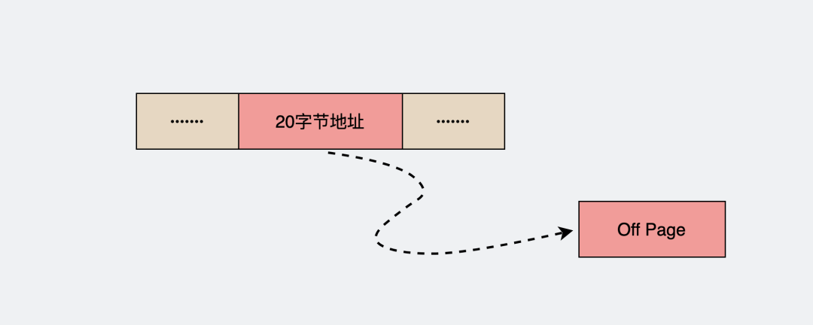

转自：[mysql 的 varchar 字段最大长度真的是 65535吗？](https://mp.weixin.qq.com/s/fHmxixegZEBYh5T1focIQA)

在mysql建表sql里，我们经常会有定义`字符串`类型的需求。

```sql
CREATE TABLE `user` (
  `name` varchar(100) NOT NULL DEFAULT '' COMMENT '名字'
) ENGINE=InnoDB DEFAULT CHARSET=utf8mb4 ;
```

比方说user表里的名字，就是个字符串。mysql里有两个`类型`比较适合这个场景。

`char`和`varchar`。

声明它们都需要在字段边上加个数组，比如`char(100)`和`varchar(100)`，这个100是指当前字段能放的`最大字符数`。

`char`和`varchar`的区别在于，`varchar`虽然声明了最大能放100个字符，但一开始不需要分配100个字符的空间，可以根据需要慢慢增加空间。而`char`一开始声明是多少，就固定预留多少空间。

所以，varchar比起char更省空间，一般没啥大事，大家都爱用`varchar`。

那问题来了，声明`varchar`字段时，它的最大长度是多少呢？

相信大家应该听说过`varchar`字段的最大长度是`65535`吧。

没听过也没关系，你现在听到了。

但实际上是这样吗？

我们来做个实验。


## varchar最大值是多少

我们直接拿65535来试一下。


很明显报错了。长度为65535的varchar报错 

报错内容也说了, 由于列长度过大导致报错，最长是`16383`。

把上面的65535改成 16383，确实是成功了。

哦？所以说varchar最大值是16383？

当然不是。

这其实还有好几个因素影响这这个最大值。


## 不同字符集的影响

varchar里放的是字符串，而字符串看起来可以是英文字母，也可以是数字或中文。但不管怎么样，都可以把这样的中英文数字转成二进制的01串。

按照一定规则把符号和二进制码对应起来，这就是`编码`。而把n多这种已经编码的字符聚在一起，就是我们常说的`字符集`。

建表语句里有个`CHARSET`，这里填的是`字符集`。

不同的字符集要求使用的字节个数也不同，我们可以通过 `show charset`; 看到mysql支持哪些字符集，以及这些字符集里`存储一个字符所需的最大字节数（Maxlen）`。



查看mysql支持哪些charset

我们尝试下把建表sql语句里的CHARSET改一改，比如改成`utf8mb3`。

我们再执行下，会发现，最大值又不一样了。



utf8mb3下的报错 并且，上面虽然提示`max=21845`，但要是真执行起来会发现还是报错。在改为`21844之后才成功`。

不讲武德。再把字符集改为 `latin1`。会发现，最大值会是 `65533`。


varchar为65533时创建成功

这里渐渐可以发现规律。

* utf8mb4的maxlen=4，对应varchar最大长度=16383。4*16383 = 65532。

* utf8mb3的maxlen=3，对应varchar最大长度=21844。3*21844 = 65532。

* latin1的maxlen=1，对应varchar最大长度=65533。   1 * 65533 = 65533。

也就是说varchar边上的长度代表的是这一列能放的最大`字符数`，而maxlen代表单个字符占用的最大`字节数`。相乘的结果很接近65535。说明`65535是指的字节数`，而不是`字符数`。

也就是说varchar的最大长度，根据选择的字符集的不同，会有区别。

总的来说接近于 `65535` 除以 `字符集`的maxlen。

`但其实这样还不够严谨`。还有其他影响因素。

## 是否可以为NULL的影响

上面的建表语句里声明了test字段都是`NOT NULL`，也就是非空，如果我们将这个改成可以为NULL，再用 `CHARSET=latin1`去试试。这时候就会发现，前面NOT NULL的时候最大能使用65533去建表，现在报错了。

改成65532，就能成功了，也就是最长`长度少了1个字节`。



这是因为一个字段是否为NULL这件事情，是需要`一个字节`去记录下来的。

而当字段为`NOT NULL`的时候，则可以省下这个字节。

## 列数的影响

上面提到的情况都是在表里只有一列时的结果，当我们表里`有更多的列`时，我们会发现varchar的最大值还会有变化。比如同样还是latin1字符集，我们再增加一列varchar类型，并且用的还是前面允许的最大值65533。

结果发现这次会失败。


查了一下资料发现，原来65535是mysql单行的最大长度（不包含blob和text等类型的情况下）

mysql表里单行中的`所有列加起来`（不考虑其他隐藏列和记录头信息） ，占用的最大长度是65535个字节。

`注意上面加粗的部分，加起来不超过65535`。

比如如果还有int的列，那它占用4个字节，bigint占用8个字节，字段越多，留给单个varchar列的空间就越少。

因此，`前面提到的 varchar 的最大长度，接近于 65535 除以 字符集的maxlen，但前提是只有一列not null 的varchar类型的字段`。

## 为什么不是65535而是65533？

不过问题又来了，上面建表sql里，不管是那种字符集，最后得到的字符数都约等于65533。

但数据库单行最大值应该是65535。`65535 - 65533 = 2` 。这里面还差了个2，为什么呢？

这就要聊一下mysql单行里数据到底是怎么存储的。

### 数据表行存储的格式

我们可以通过 `show table status` 命令，查看到当前表格使用的行格式。



通过上面的 `Row_format` 字段可以看到这个表用的是 `Dynamic` 行格式。

事实上，现在的mysql数据表一般都是采用Dynamic行记录格式。

我们来看下`Dynamic`行格式长什么样子。


Dynamic格式将行记录分为两部分，分为是`行记录的额外信息`和`行记录的真实数据`。

`行记录的额外信息`：

- `变长字段长度列表`：指的是varchar，text，blob这种类型，它们属于变长字段，这里表示的就是这些字段的长度。

- `NULL值列表`：用来记录当前行里哪些列是为null的。如果全部列都是not null的话，那就不需要有这个字段。

- `记录头信息`：这是固定5个字节，用来记录一些特殊的信息，比如这一行是否被删了，这一行在这个16k的数据页内是不是最小的，以及指向下一条记录的指针之类的一些信息，不需要太关注。

`行记录的真实数据`：

里面放的就是一行里，每一列的真正内容。除了我们建表时里涉及到的列以外，还有一些隐藏列。

比如Row_ID，这个是在建表是没有声明主键时，数据表自动会生成的隐藏主键。另外还有`trx_id`字段，用于记录当前这一行数据行是被`哪个事务`修改的，和一个`roll_pointer`字段，这个字段是用来指向当前这个数据行的上一个版本，通过这个字段，可以为这行数据形成一条版本链，从而实现`多版本并发控制（MVCC）`。有没有很眼熟，这个在之前写的[文章](https://mp.weixin.qq.com/s?__biz=Mzg5NDY2MDk4Mw==&mid=2247488340&idx=1&sn=6c5a0743918d582eb6ee76571d992897&scene=21#wechat_redirect)里出现过。



所以我们回过头来看我们建的表，当只有一列not null的 varchar字段时，行记录长下面这样。


前面提到，行最大值65535字节是不包含隐藏列和记录头信息的，所以其实是指上图中红色的部分。

而最左边的`变长字段长度列表`中，为了表示varchar列的长度，占用了`两个字节`，也就是16位，2的16次方，最大可以表示65535的长度，正好足够用来表示varchar列当前的长度是65533。

所以`65535 - 65533 = 2` 。这里面差的2，是用来`存varchar字段长度`去了。

## 一个页才16k，怎么保存65533（64k）数据？

之前的文章里其实多次提到了mysql底层是以页的形式去存储数据的，而一个页固定16k，而一个varchar字段最大能放65533字节数据，换算一下大概是64k，整整4个16k的页。



这里面是怎么实现的？

对于这种情况，其实行数据里针对这个超大的varchar字段只保存个20字节的指针（实际上是个偏移量），这个指针会指向新的页（off page），这些页里保存的是实际的varchar字段里的65533字节数据。这种由于字段过长导致需要额外的页来保存数据的现象叫`行溢出`。



## 大于64k的字符串该怎么处理？

如果离谱点，数据量更大，比64k还大，这时候就不能继续用varchar了，需要改用text和blob类型字段。

而text和blob类型本身也是分TINY、MEDIUM，LONG三个档位的，对应着不同的数据长度，最大到4G左右。

像下面这样就可以将数据类型定义为LONGTEXT。

```sql
CREATE TABLE `test_max_length` (
  `test` LONGTEXT NOT NULL COMMENT '测试长度字段'
) ENGINE=InnoDB DEFAULT CHARSET=latin1 ;
```

而他们的存储方式也跟varchar的情况类似，只保存20个字节的指针，实际数据保存在其他溢出页里。

以前我们查某一行数据，他们都在一个16k的数据页里，查询时只要一次磁盘IO就能将这个数据页读取出来。

当一个数据库里某行数据里有个特别大的字符串时，我们如果还想把整行数据给读出来，那我们还得把`off page`的数据给全部读出来，这意味着`更多的磁盘IO，性能就更差`了。

为了规避这个问题，我们写`select sql`的时候，如果发现某列字段，是个特别长的字符串时，能不读它就尽量不加到select里，这也是为什么大家`不建议使用select * from table的原因`。

### blob和text的区别

一般来说，blob和text都可以用来放超长字符串。但它们会有一点点区别。

我们知道字符集（charset）下还有个`校对规则（collation）`的概念，比如同样是a，大写A和小写a能不能算作是一个字符，这会影响比较和排序，collation就是定义这个规则用的。

`blob没有字符集的概念，而text有`。这意味如果用blob来存文本的话，就没法用字符集的校对规则来排序和做比较。

还有一个区别，blob还能保存二进制数据，比如压缩过的文本数据，图片或者视频，别笑，虽然不合适，但我确实见过有人拿它来保存视频。。。

## 总结

- 现在的mysql数据表一般采用`Dynamic`行记录格式。它由`行记录的额外信息`和`行记录的真实数据`组成。

- mysql表里单行中的`所有列加起来`（不考虑其他隐藏列和记录头信息） ，占用的`最大长度是65535个字节`。

- 如果数据表里只有一列 `not null` 的`varchar`字段，它的最大长度，接近于 `65535` 除以 `字符集的maxlen`。

- 如果要存放`大于64k`的字段数据，可以考虑使用`longtext`和`longblob`等类型。

- mysql的数据页大小是16k，为了保存varchar或者text，`blob`这种长度可能大于16k的字段，在`Dynamic`行格式中，会只保留`20个字节`的指针，实际数据则放在`其他溢出页`中。为了将它们读取出来，会需要更多的磁盘IO。

- blob和text很像，但blob没有字符集的概念，并且还能存放`二进制`的数据，比如图片或视频，但实际上图片和视频更推荐放在对象存储（Object Storage Service，简称oss）中。


