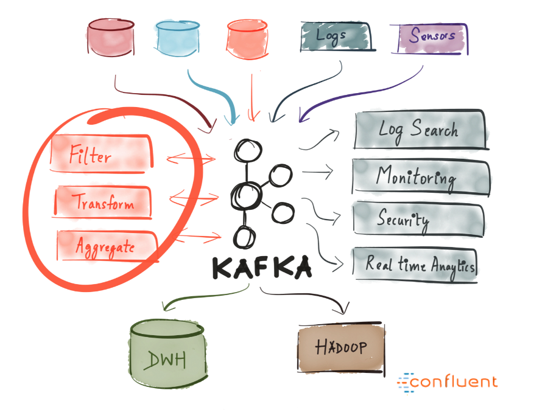

?> Apache Kafka 是一款开源的消息引擎系统，也是一个分布式流计算平台，此外，还可以作为数据存储。

## 1.Kafka 的功能

Kafka 的核心功能如下：

- `消息引擎` - Kafka 可以作为一个消息引擎系统。
- `流处理` - Kafka 可以作为一个分布式流处理平台。
- `存储` - Kafka 可以作为一个安全的分布式存储。

## 2.Kafka 的特性

Kafka 的设计目标：

- **高性能**
    - `分区、分段、索引`：基于分区机制提供并发处理能力。分段、索引提升了数据读写的查询效率。
    - `顺序读写`：使用顺序读写提升磁盘 IO 性能。
    - `零拷贝`：利用零拷贝技术，提升网络 I/O 效率。
    - `页缓存`：利用操作系统的 PageCache 来缓存数据（典型的利用空间换时间）
    - `批量读写`：批量读写可以有效提升网络 I/O 效率。
    - `数据压缩`：Kafka 支持数据压缩，可以有效提升网络 I/O 效率。
    - `pull 模式`：Kafka 架构基于 pull 模式，可以自主控制消费策略，提升传输效率。
- **高可用**
    - `持久化`：Kafka 所有的消息都存储在磁盘，天然支持持久化。
    - `副本机制`：Kafka 的 Broker 集群支持副本机制，可以通过冗余，来保证其整体的可用性。
    - `选举 Leader`：Kafka 基于 ZooKeeper 支持选举 Leader，实现了故障转移能力。
- **伸缩性**
    - `分区`：Kafka 的分区机制使得其具有良好的伸缩性。

## 3.Kafka 术语

- `消息`：Kafka 的数据单元被称为消息。消息由字节数组组成。
- `批次`：批次就是一组消息，这些消息属于同一个主题和分区。
- `主题（Topic）`：Kafka 消息通过主题进行分类。主题就类似数据库的表。
    - 不同主题的消息是物理隔离的；
    - 同一个主题的消息保存在一个或多个 Broker 上。但用户只需指定消息的 Topic 即可生产或消费数据而不必关心数据存于何处。
    - 主题有一个或多个分区。
- `分区（Partition）`：分区是一个有序不变的消息序列，消息以追加的方式写入分区，然后以先入先出的顺序读取。Kafka 通过分区来实现数据冗余和伸缩性。
- `消息偏移量（Offset）`：表示分区中每条消息的位置信息，是一个单调递增且不变的值。
- `生产者（Producer）`：生产者是向主题发布新消息的 Kafka 客户端。生产者可以将数据发布到所选择的主题中。生产者负责将记录分配到主题中的哪一个分区中。
- `消费者（Consumer）`：消费者是从主题订阅新消息的 Kafka 客户端。消费者通过检查消息的偏移量来区分消息是否已读。
- `消费者群组（Consumer Group）`：多个消费者共同构成的一个群组，同时消费多个分区以实现高并发。
    - 每个消费者属于一个特定的消费者群组（可以为每个消费者指定消费者群组，若不指定，则属于默认的群组）。
    - 群组中，一个消费者可以消费多个分区
    - 群组中，每个分区只能被指定给一个消费
- `再均衡（Rebalance）`：消费者组内某个消费者实例挂掉后，其他消费者实例自动重新分配订阅主题分区的过程。分区再均衡是 Kafka 消费者端实现高可用的重要手段。
- `Broker` : 一个独立的 Kafka 服务器被称为 Broker。Broker 接受来自生产者的消息，为消息设置偏移量，并提交消息到磁盘保存；消费者向 Broker 请求消息，Broker 负责返回已提交的消息。
- `副本（Replica）`：Kafka 中同一条消息能够被拷贝到多个地方以提供数据冗余，这些地方就是所谓的副本。副本还分为领导者副本和追随者副本，各自有不同的角色划分。副本是在分区层级下的，即每个分区可配置多个副本实现高可用。

## 4.Kafka 发行版本
Kafka 主要有以下发行版本：

- `Apache Kafka`：也称社区版 Kafka。优势在于迭代速度快，社区响应度高，使用它可以让你有更高的把控度；缺陷在于仅提供基础核心组件，缺失一些高级的特性。
- `Confluent Kafka`：Confluent 公司提供的 Kafka。优势在于集成了很多高级特性且由 Kafka 原班人马打造，质量上有保证；缺陷在于相关文档资料不全，普及率较低，没有太多可供参考的范例。
- `CDH/HDP Kafka`：大数据云公司提供的 Kafka，内嵌 Apache Kafka。优势在于操作简单，节省运维成本；缺陷在于把控度低，演进速度较慢。

## 5.参考资料

- [1] [Kafka 官网](https://kafka.apache.org/)
- [2] [Kafka 官方文档](https://kafka.apache.org/documentation/)
- [3] [Kafka 官方文档中文版](https://kafka.apachecn.org/)
