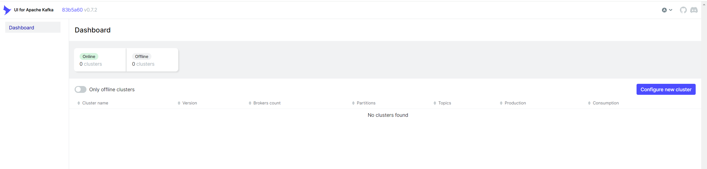
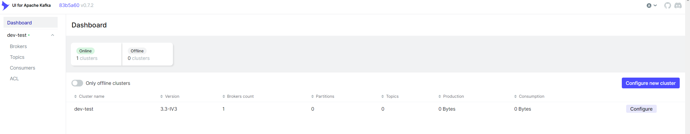

以下`docker-compose.yml`文件用来搭建一套单节点`zookeeper`和单节点`kafka`环境，并且在8080端口提供`kafka-ui`管理界面。


!> `host.docker.internal` 是一个特殊的主机名，它可以用来访问运行Docker 容器的主机的本地网络资源。 例如，如果你在容器内运行一个Web 服务器，并希望在浏览器中访问它，你可以使用host.docker.internal 来访问运行容器的主机上的Web 服务器。

- `KAFKA_ADVERTISED_LISTENERS`: 负责发布外网地址，这个地址会发布到zookeeper中

```yaml
version: '2.1'

services:
  zoo1:
    image: confluentinc/cp-zookeeper:7.3.2
    hostname: zoo1
    container_name: zoo1
    ports:
      - "2181:2181"
    environment:
      ZOOKEEPER_CLIENT_PORT: 2181
      ZOOKEEPER_SERVER_ID: 1
      ZOOKEEPER_SERVERS: zoo1:2888:3888

  kafka1:
    image: confluentinc/cp-kafka:7.3.2
    hostname: kafka1
    container_name: kafka1
    ports:
      - "9092:9092"
      - "29092:29092"
      - "9999:9999"
    environment:
      KAFKA_ADVERTISED_LISTENERS: INTERNAL://kafka1:19092,EXTERNAL://${DOCKER_HOST_IP:-127.0.0.1}:9092,DOCKER://host.docker.internal:29092
      KAFKA_LISTENER_SECURITY_PROTOCOL_MAP: INTERNAL:PLAINTEXT,EXTERNAL:PLAINTEXT,DOCKER:PLAINTEXT
      KAFKA_INTER_BROKER_LISTENER_NAME: INTERNAL
      KAFKA_ZOOKEEPER_CONNECT: "zoo1:2181"
      KAFKA_BROKER_ID: 1
      KAFKA_LOG4J_LOGGERS: "kafka.controller=INFO,kafka.producer.async.DefaultEventHandler=INFO,state.change.logger=INFO"
      KAFKA_OFFSETS_TOPIC_REPLICATION_FACTOR: 1
      KAFKA_TRANSACTION_STATE_LOG_REPLICATION_FACTOR: 1
      KAFKA_TRANSACTION_STATE_LOG_MIN_ISR: 1
      KAFKA_JMX_PORT: 9999
      KAFKA_JMX_HOSTNAME: ${DOCKER_HOST_IP:-127.0.0.1}
      KAFKA_AUTHORIZER_CLASS_NAME: kafka.security.authorizer.AclAuthorizer
      KAFKA_ALLOW_EVERYONE_IF_NO_ACL_FOUND: "true"
    depends_on:
      - zoo1
  kafka-ui:
    container_name: kafka-ui
    image: provectuslabs/kafka-ui:latest
    ports:
      - 8080:8080
    depends_on:
      - kafka1
    environment:
      DYNAMIC_CONFIG_ENABLED: "TRUE"

```

将上述`docker-compose.yml`文件在本地保存，在同一目录下执行以下命令启动容器。
```bash
docker-compose up -d
```

容器启动后，使用浏览器打开127.0.0.1:8080 即可看到如下kafka-ui界面。



点击页面右侧的“Configure new cluster”按钮，配置kafka服务连接信息。


填写完信息后，点击页面下方的“Submit”按钮提交即可。



