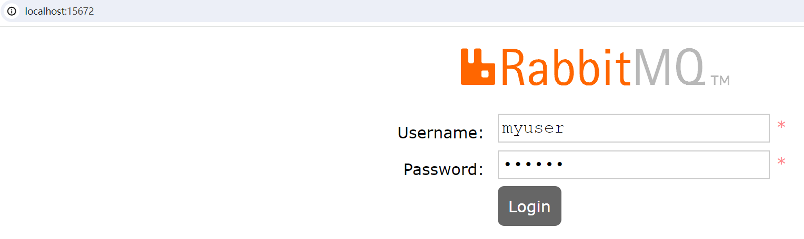
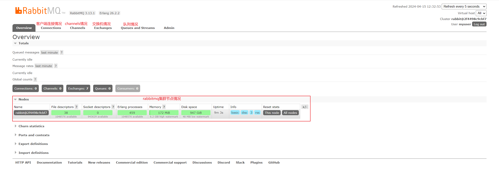

> RabbitMQ快速搭建开发环境，因为RabbitMQ使用Erlang开发，常规方式安装需要先安装Erlang，再安装RabbitMQ比较麻烦，所以这里推荐使用Docker方式部署，一条命令搞定。

?> 建议：推荐大家使用Docker部署开发环境，简单、方便维护多套环境，没必要花太多时间在环境部署上面，MacOS和linux环境安装Docker很简单，网上可以找到，Windows10系统也支持安装Docker，不过建议安装个Linux虚拟机吧，做后端的测试环境Windows系统还是不太方便。

## Docker方式部署

首次安装命令

```terminal
docker run -d --name rabbitmq -p 5672:5672 -p 15672:15672 rabbitmq:3-management
```

说明：上面命令下载并且启动了一个rabbitmq容器实例，开放了两个端口5672和15672， 15672端口是管理后台的端口号，5672是我们写代码的时候要访问的端口。

关于rabbitmq docker镜像版本，这里使用的是3-management版本
可以到docker官方镜像仓库找最新版本地址：https://hub.docker.com/_/rabbitmq

## rabbitmq容器维护

### 关闭rabbitmq容器
```terminal
docker stop rabbitmq
```

### 再次启动rabbitmq容器
```terminal
docker start rabbitmq
```

提示：docker容器只要安装一次即可，后面只要start/stop启动和关闭容器即可。

## Rabbitmq管理后台

访问rabbitMQ管理后台地址：http://localhost:15672/

默认账号和密码：guest / guest

提示：使用虚拟机的话，localhost换成虚拟机Ip地址。

登录页面：


管理页面：
