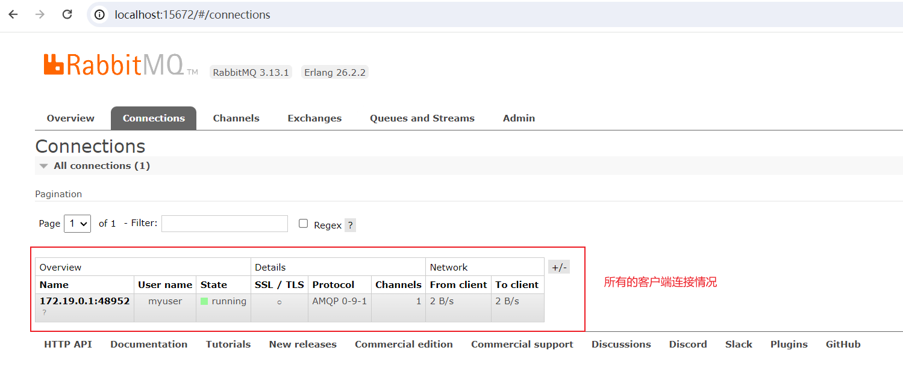
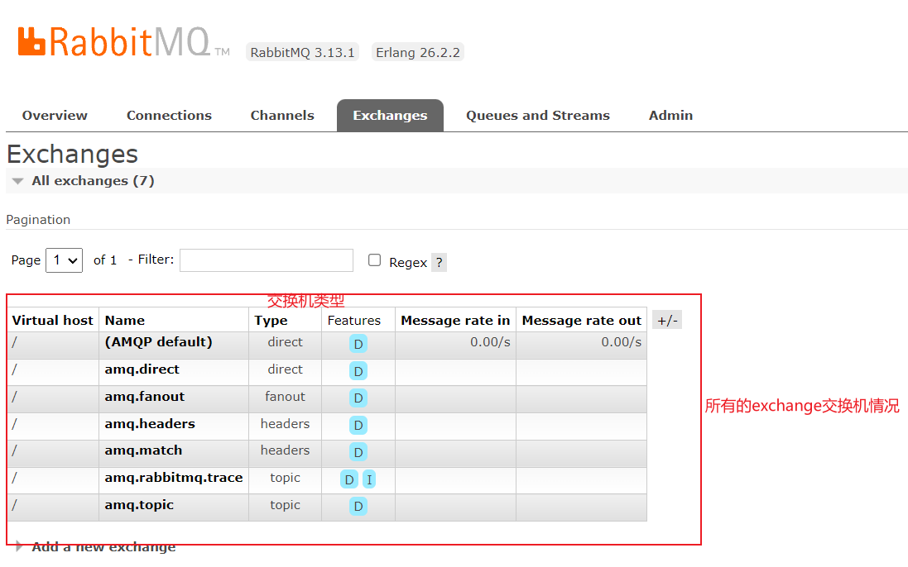
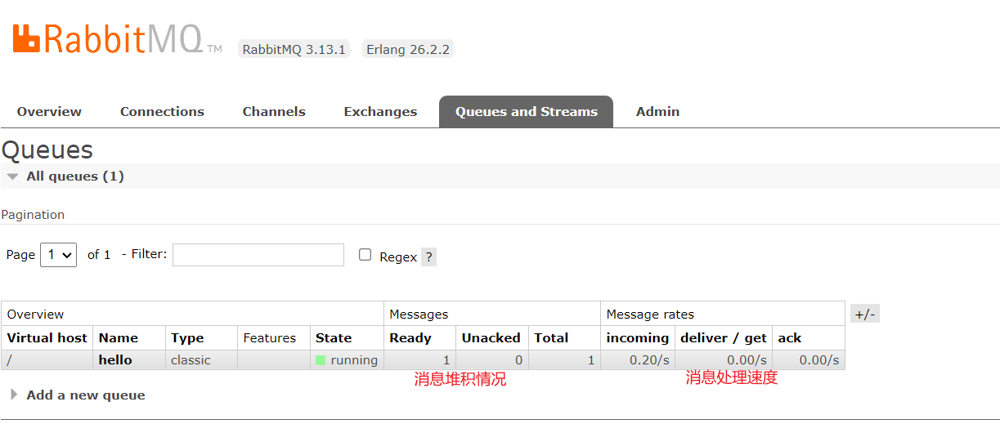
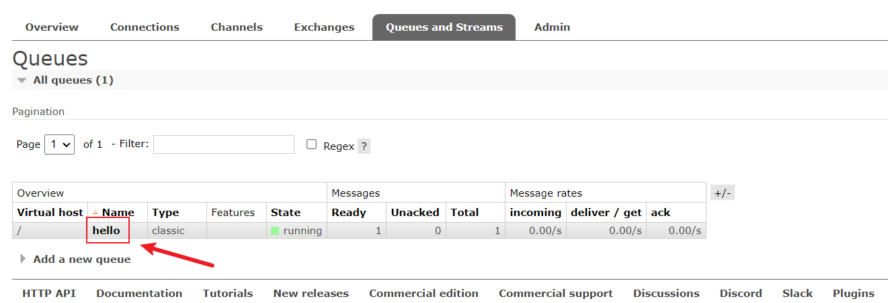
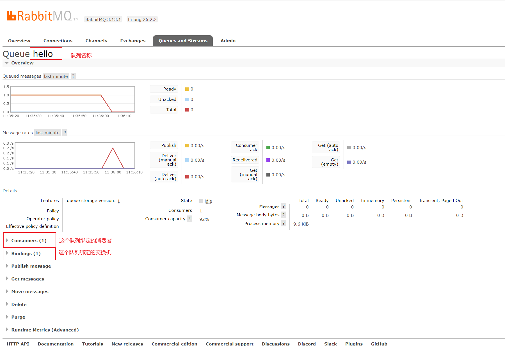

> RabbitMQ快速搭建开发环境，因为RabbitMQ使用Erlang开发，常规方式安装需要先安装Erlang，再安装RabbitMQ比较麻烦，所以这里推荐使用Docker方式部署，一条命令搞定。

?> 建议：推荐大家使用Docker部署开发环境，简单、方便维护多套环境，没必要花太多时间在环境部署上面，MacOS和linux环境安装Docker很简单，网上可以找到，Windows10系统也支持安装Docker，不过建议安装个Linux虚拟机吧，做后端的测试环境Windows系统还是不太方便。

## Docker方式部署

首次安装命令

```terminal
docker run -d --name rabbitmq -p 5672:5672 -p 15672:15672 rabbitmq:3-management
```

说明：上面命令下载并且启动了一个rabbitmq容器实例，开放了两个端口5672和15672， 15672端口是管理后台的端口号，5672是我们写代码的时候要访问的端口。

关于rabbitmq docker镜像版本，这里使用的是3-management版本
可以到docker官方镜像仓库找最新版本地址：https://hub.docker.com/_/rabbitmq

## rabbitmq容器维护

### 关闭rabbitmq容器
```terminal
docker stop rabbitmq
```

### 再次启动rabbitmq容器
```terminal
docker start rabbitmq
```

提示：docker容器只要安装一次即可，后面只要start/stop启动和关闭容器即可。

------

##  Ubuntu 上安装 RabbitMQ

### ✅ 1. 安装 Erlang（RabbitMQ 的依赖）

RabbitMQ 依赖 Erlang 运行时，建议使用 RabbitMQ 官方推荐的 Erlang 源：

```bash
# 添加 Erlang GPG key
curl -fsSL https://packages.erlang-solutions.com/ubuntu/erlang_solutions.asc | sudo gpg --dearmor -o /usr/share/keyrings/erlang.gpg

# 添加 Erlang 源
echo "deb [signed-by=/usr/share/keyrings/erlang.gpg] https://packages.erlang-solutions.com/ubuntu $(lsb_release -cs) contrib" | sudo tee /etc/apt/sources.list.d/erlang.list

# 更新软件源并安装 Erlang
sudo apt update
sudo apt install -y erlang
```

------

### ✅ 2. 安装 RabbitMQ

添加 RabbitMQ 官方源并安装：

```bash
# 添加 RabbitMQ GPG key
curl -fsSL https://packagecloud.io/rabbitmq/rabbitmq-server/gpgkey | sudo gpg --dearmor -o /usr/share/keyrings/rabbitmq.gpg

# 添加 RabbitMQ 源
echo "deb [signed-by=/usr/share/keyrings/rabbitmq.gpg] https://packagecloud.io/rabbitmq/rabbitmq-server/ubuntu/ $(lsb_release -cs) main" | sudo tee /etc/apt/sources.list.d/rabbitmq.list

# 更新软件源并安装 RabbitMQ
sudo apt update
sudo apt install -y rabbitmq-server
```

------

### ✅ 3. 启动和设置开机自启

```bash
sudo systemctl enable rabbitmq-server
sudo systemctl start rabbitmq-server
```

检查运行状态：

```bash
sudo systemctl status rabbitmq-server
```

------

### ✅ 4. 启用管理后台（可选）

RabbitMQ 提供一个 Web 管理界面：

```bash
sudo rabbitmq-plugins enable rabbitmq_management
```

默认访问地址：

- **[http://localhost:15672](http://localhost:15672/)**
- 默认用户名/密码：`guest` / `guest`（只允许本地访问）

如果需要远程访问，需要创建新用户或配置 `rabbitmq.conf` 允许远程。

------

### ✅ 5. 创建新用户（可选）

```bash
# 创建新用户
sudo rabbitmqctl add_user myuser mypassword

# 赋予管理员权限
sudo rabbitmqctl set_user_tags myuser administrator

# 设置权限
sudo rabbitmqctl set_permissions -p / myuser ".*" ".*" ".*"
```

------

## Rabbitmq管理后台

访问rabbitMQ管理后台地址：http://localhost:15672/

默认账号和密码：guest / guest

提示：使用虚拟机的话，localhost换成虚拟机Ip地址。

### 登录页面：


### 管理页面：


### RabbitMQ 客户端连接情况



### RabbitMQ 交换机情况



### RabbitMQ 队列情况



### RabbitMQ 队列详情



