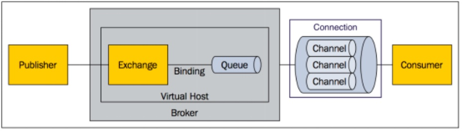

### RabbitMQ概念示意图

### 概念解释

- `Message`: 消息，包含消息头（即附属的配置信息）和消息体（即消息内容）

- `Publisher`:消息的生产者，是一个向交换器发布消息的客户端应用程序

- `Exchange`:交换器，用来接收生产者发送的消息并且将这些消息路由给服务器中的队列
    > 四种Exchange类型:
    > - `Direct类型`：将消息中的Routing key与该Exchange关联的所有Binding中的Routing key进行比较，如果相等，则发送到该Binding对应的Queue中
    > - `Topic 类型`：将消息中的Routing key与该Exchange关联的所有Binding中的Routing key进行对比，如果匹配上了，则发送到该Binding对应的Queue中。
    > - `Fanout 类型`：直接将消息转发到所有binding的对应queue中，这种exchange在路由转发的时候，忽略Routing key。
    > - `Headers 类型`：将消息中的headers与该Exchange相关联的所有Binging中的参数进行匹配，如果匹配上了，则发送到该Binding对应的Queue中（不常用，作用于Direct类型类似）。
    >
    > 提示：Exchange类型后面的工作模式章节会有详细介绍，这里先有个概念。

- `Binding`:绑定关系，用于建立消息队列和交换器之间的关系

- `Queue`:消息队列，用来保存消息直到发送给消费者，他是消息的容器，也是消息的终点。一个消息可投入一个或者多个队列。消息一直在队列里面，等待消费者连接到这个队列将其取走

- `Connection`:网络连接比如tcp连接

- `Channel`:信道，信道是建立在真实的TCP连接内地虚拟连接，AMQP命令都是通过信道发出去的，不管是发布消息，订阅队列，还是接受消息，这些动作都是在信道完成的。

因为对于操作系统来说建立和销毁TCP都是非常安昂贵的开销，所以引入信道的概念，以此来复用一条TCP连接

- `Consumer`:消息的消费者，表示一个从消息队列中取得消息的客户端应用程序

- `Virtual Host`:虚拟主机，表示一批交换机，消息队列和相关的对象。虚拟主机是共享相同的身份认证和加密环境的独立服务器域。

    每个vhost本质上就是一个mini版的RabbitMQ服务器，拥有自己的队列、交换器、绑定和权限机制。

    vhost是AMQP概念的基础，必须在连接的时候指定，RabbitMQ默认的vhost是/

    > 提示：Virtual Host就是一种资源隔离策略，可以在同一个RabbitMQ中划分多个隔离的区域。

- `Broker`:表示消息队列服务器实体