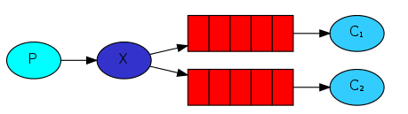

发布订阅模式，就是`一个生产者`发送的消息会被`多个消费者`获取，因为一条消息会被多个消费者分别消费处理，所以也叫`广播模式`、`一对多模式`。

?> 说明：因为RabbitMQ实现发布订阅模式使用的exchange类型是fanout，所以也叫fanout模式。

### 架构图
fanout模式

说明：

- P 代表生产者 , C1、C2 代表消费者，红色代表队列, X代表交换机(Exchange)。
- 交换机(Exchange)负责将消息转发至绑定交换机的所有队列。
- 可以定义多个队列，分别绑定同一个交换机。
- 每个队列可以有一个或者多个消费者。

?> 提示：同一个队列，一条消息只能被一个消费者处理，fanout模式之所以能够实现消息广播，本质上是通过多个消息队列实现。

### 应用场景
发布订阅模式，是一种比较常用一对多消费模式，例如：电商下单之后产生下单消息、仓库模块订阅下单消息处理发货、通知模块订阅下单消息处理发短信、积分模块订阅下单消息处理积分等等，按需订阅消息，实现业务扩展，是一种低耦合的设计模式。