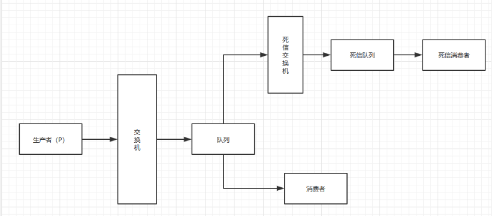

在rabbitmq中，当消息在一个队列中变成一个死信（消费者无法处理的消息）之后，它将被重新投递到另一个交换机上，这个交换机我们就叫做死信交换机，死信交换机将死信投递到一个队列上就是死信队列。

## 死信队列示意图


上图描述了，死信的产生到处理整个过程。

## 死信的产生
下面是死信产生的条件：

- 消息被消费者手动拒绝(basic.reject / basic.nack)，并且requeue = false
- 消息TTL（消息存活时间）过期
- 队列达到最大长度

## 死信队列处理步骤

- 定义一个死信交换机（别被名字误导，就是一个普通的交换机，只不过用在了死信处理场景，才叫这个名字）
- 定义一个队列绑定死信交换机（这个队列就叫死信队列，也是一个普通队列）
- 定义死信消费者，消费死信队列（别被名字误导，这也是普通的消费者）
- 将死信交换机绑定到指定队列上（那个队列需要处理死信就绑定谁）

?> 提示：原理参考上面的示意图，所有开发语言处理死信队列都是这个步骤。

## Golang处理死信队列
### 1.定义死信交换机
当成普通交换机定义就行。
```go
// 声明交换机
    err = ch.ExchangeDeclare(
        "sreio.dead",   // 交换机名字
        "topic", // 交换机类型
        true,     // 是否持久化
        false,
        false,
        false,
        nil,
    )
```

### 2.定义死信队列
当成普通队列定义就行
```go
    // 声明队列
    q, err := ch.QueueDeclare(
        "",    // 队列名字，不填则随机生成一个
        false, // 是否持久化队列
        false,
        true,
        false,
        nil,
    )

    // 队列绑定死信交换机
    err = ch.QueueBind(
        q.Name, // 队列名
        "#",     // 路由参数，# 井号的意思就匹配所有路由参数，意思就是接收所有死信消息
        "sreio.dead", // 死信交换机名字
        false,
        nil)
```

?> 提示：死信队列就当成普通队列用就是了

### 3.定义死信消费者
```go
// 创建消费者
    msgs, err := ch.Consume(
        q.Name, // 引用前面的死信队列名
        "",     // 消费者名字，不填自动生成一个
        true,   // 自动向队列确认消息已经处理
        false, 
        false, 
        false, 
        nil,
    )

    // 循环消费死信队列中的消息
    for d := range msgs {
        log.Printf("接收死信消息=%s", d.Body)
    }
```

### 4.将死信交换机绑定到指定队列
```go
    // 队列属性
    props := make(map[string]interface{})
    // 绑定死信交换机
    props["x-dead-letter-exchange"] = "sreio.dead"
    // 可选: 设置死信投递到死信交换机的时候的路由参数，如果不设置，则使用消息原先自带的路由参数
    // props["x-dead-letter-routing-key"] = "www.sreio.com"

    q, err := ch.QueueDeclare(
        "sreio.demo.hello", // 队列名
        true,   // 是否持久化
        false, 
        false, 
        false,   
        props,     // 设置队列属性
    )
```
这样，只要sreio.demo.hello队列的消息变成死信的话，消息会被转发到sreio.dead死信交换机。