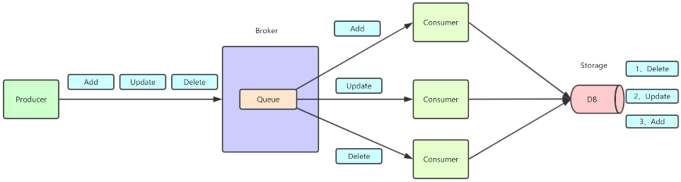

RabbitMQ使用过程中，有些业务场景需要我们保证顺序消费，例如：业务上产生三条消息，分别是对数据的增加、修改、删除操作，如果没有保证顺序消费，执行顺序可能变成删除、修改、增加，这就乱了。

如下如：

RabbitMQ的消息顺序问题，需要分三个环节看待，发送消息的顺序、队列中消息的顺序、消费消息的顺序。

## 发送消息的顺序
消息发送端的顺序，大部分业务不做要求，谁先发消息无所谓，如果遇到业务一定要发送消息也确保顺序，那意味着，只能全局加锁一个个的操作，一个个的发消息，不能并发发送消息。

## 队列中消息的顺序
RabbitMQ中，消息最终会保存在队列中，在同一个队列中，消息是顺序的，先进先出原则，这个由Rabbitmq保证，通常也不需要开发关心。

?> 提示：不同队列中的消息顺序，是没有保证的，例如：进地铁站的时候，排了三个队伍，不同队伍之间的，不能确保谁先进站。

## 消费消息的顺序
我们说如何保证消息顺序性，通常说的就是消费者消费消息的顺序，在多个消费者消费同一个消息队列的场景，通常是无法保证消息顺序的，开篇的示意图已经说明，虽然消息队列的消息是顺序的，但是多个消费者并发消费消息，获取的消息的速度、执行业务逻辑的速度快慢、执行异常等等原因都会导致消息顺序不一致。

例如：消息A、B、C按顺序进入队列，消费者A1拿到消息A、消费者B1拿到消息B, 结果消费者B执行速度快，就跑完了，又或者消费者A1挂了，都会导致消息顺序不一致。

解决消费顺序的问题，通常就是一个队列只有一个消费者
这样就可以一个个消息按顺序处理，缺点就是并发能力下降了，无法并发消费消息，这是个取舍问题。

?> 提示：如果业务又要顺序消费，又要增加并发，通常思路就是开启多个队列，业务根据规则将消息分发到不同的队列，通过增加队列的数量来提高并发度，例如：电商订单场景，只需要保证同一个用户的订单消息的顺序性就行，不同用户之间没有关系，所以只要让同一个用户的订单消息进入同一个队列就行，其他用户的订单消息，可以进入不同的队列。