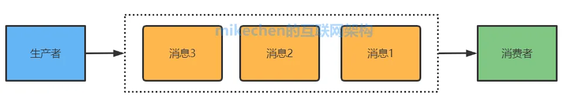
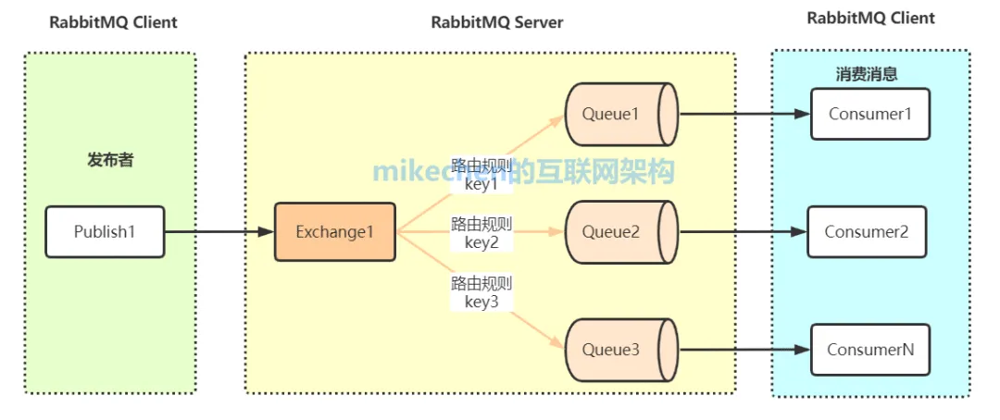
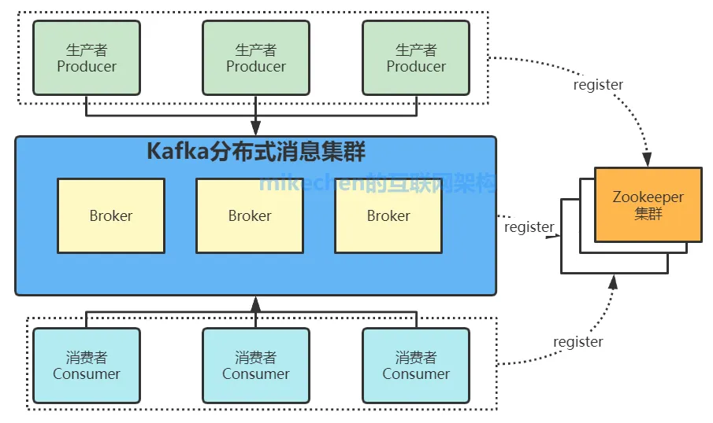
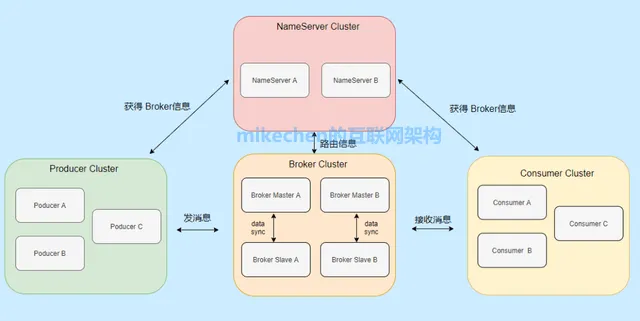
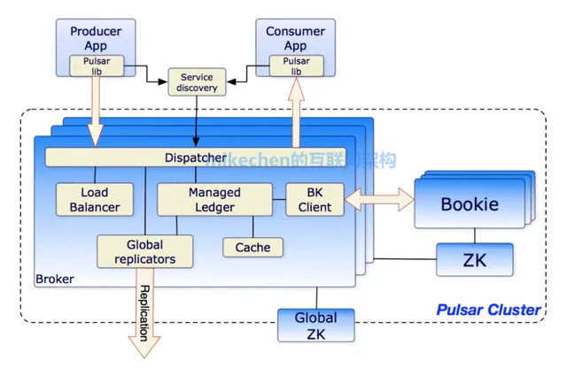
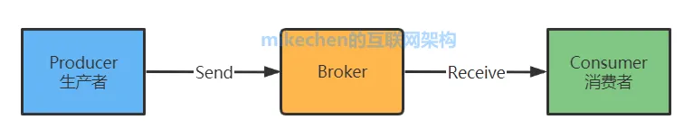
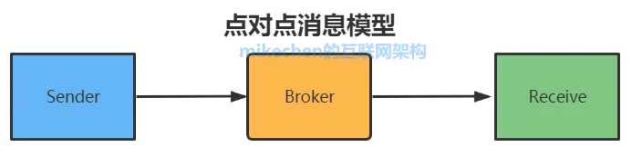
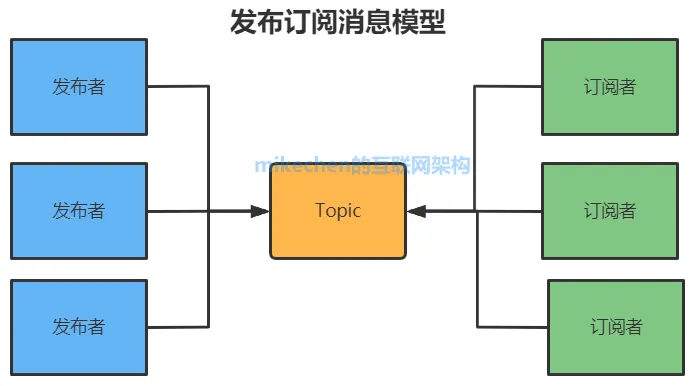

> 消息队列MQ

`消息队列`（Message Queue，简称MQ）是一种用于在软件系统之间传递消息的通信方式。

如下图所示：

消息通常包含了：要传递的信息，可以是`文本`、`二进制数据`、`JSON`、`XML`等格式。

可以是任何形式的信息，例如：订单信息、日志记录、事件等，都可以进行传输。

## MQ消息队列应用

1. `解耦性`: 发送积分、发短信等任务，可以通过消息队列实现解耦，可以极大提升性能。
2. `异步通信`: 在需要后台处理的任务中，发送方可以将任务信息发送到队列，然后继续执行其他操作，而不必等待任务的实时处理。
3. `日志`: Kafka等消息队列系统常被用于日志收集，实现大规模、实时的日志处理和分析。日志场景，包含：日志的集中存储、分析和监控等等，Kafka就是典型的使用者。
4. `削峰`: 消息队列可以平滑处理流量峰值，防止系统过载。在大型购物活动，如阿里双11期间，消息队列用于平滑处理大量的交易请求，确保系统的可伸缩性和稳定性。

## Kafka、ActiveMQ、RabbitMQ、RocketMQ 有什么优缺点？

|           特性           |         [ActiveMQ](#activemq)         |               [RabbitMQ](#rabbitmq)                |                                                 [RocketMQ](#rocketmq)                                                 |                                                                 [Kafka](#kafka)                                                                 |
| :----------------------: | :-----------------------------------: | :------------------------------------------------: | :-------------------------------------------------------------------------------------------------------------------: | :---------------------------------------------------------------------------------------------------------------------------------------------: |
|        单机吞吐量        | 万级，比 RocketMQ、Kafka 低一个数量级 |                    同 ActiveMQ                     |                                                  10 万级，支撑高吞吐                                                  |                                    10 万级，高吞吐，一般配合大数据类的系统来进行实时数据计算、日志采集等场景                                    |
| topic 数量对吞吐量的影响 |                                       |                                                    | topic 可以达到几百/几千的级别，吞吐量会有较小幅度的下降，这是 RocketMQ 的一大优势，在同等机器下，可以支撑大量的 topic | topic 从几十到几百个时候，吞吐量会大幅度下降，在同等机器下，Kafka 尽量保证 topic 数量不要过多，如果要支撑大规模的 topic，需要增加更多的机器资源 |
|          时效性          |                 ms 级                 |     微秒级，这是 RabbitMQ 的一大特点，延迟最低     |                                                         ms 级                                                         |                                                                延迟在 ms 级以内                                                                 |
|          可用性          |      高，基于主从架构实现高可用       |                    同 ActiveMQ                     |                                                  非常高，分布式架构                                                   |                                  非常高，分布式，一个数据多个副本，少数机器宕机，不会丢失数据，不会导致不可用                                   |
|        消息可靠性        |         有较低的概率丢失数据          |                      基本不丢                      |                                           经过参数优化配置，可以做到 0 丢失                                           |                                                                   同 RocketMQ                                                                   |
|         功能支持         |         MQ 领域的功能极其完备         | 基于 erlang 开发，并发能力很强，性能极好，延时很低 |                                        MQ 功能较为完善，还是分布式的，扩展性好                                        |                              功能较为简单，主要支持简单的 MQ 功能，在大数据领域的实时计算以及日志采集被大规模使用                               |

## 5大常用消息队列MQ

### 1. ActiveMQ

> ActiveMQ是Apache基金会的一个开源消息中间件，用于在分布式系统中实现消息传递。

###### 特点：

支持JMS规范，实现了Java语言的消息中间件。

提供`点对点（P2P）`和`发布-订阅（Pub/Sub）`两种消息传递模型。

提供高级特性，如事务、持久性、消息过滤、消息导向等。

多语言支持，适用于Java、C++, .NET等。

###### 应用:

适用于Java环境下的分布式系统，企业级应用中的消息传递和异步通信。

###### 性能:
性能在万级/秒。

### 2. RabbitMQ

> RabbitMQ是Erlang语言开发的开源消息队列服务器，支持多种消息模式和协议。

###### 特点:

实现AMQP（Advanced Message Queuing Protocol）标准。

提供灵活的消息路由和交换机模型，支持多种消息模式。

具有高可用性和可扩展性，支持集群配置。

提供`事务`和`持久性`，支持`消息确认机制`。

###### 架构:

RabbitMQ采用基于代理的架构，包括`Exchange（交换机）`、`Queue（队列）`、`Binding（绑定）`等核心组件。

如下图所示：

###### 应用:

适用于微服务通信、任务队列、实时通信等各种场景。

### 3. Kafka

> Kafka是Apache基金会的一个开源分布式消息系统，用于处理实时数据流。

###### 特点:

- 高吞吐量，适用于大规模数据流处理。
- 持久性存储，支持消息的持久化。
- 分布式设计，可扩展性强，支持水平扩展。
- 提供多分区和多副本的特性。

###### 架构:

Kafka采用分布式发布-订阅模型，包括`Producer（生产者）`、`Broker（代理服务器`）、`Consumer（消费者）`等组件。

如下图所示：

###### 应用:

在大数据领域和实时数据处理中得到广泛应用，处理大规模数据流的场景。

###### 性能：

具有极高的吞吐量，能够每秒处理数百万条消息，适用于高频率的数据流处理。

### 4.RocketMQ

> RocketMQ是阿里开源的开源消息队列，基于Paxos协议实现高可用，支持事务消息和消息轨迹。

###### 特点:

- 阿里巴巴开发，支持分布式、高可用性和可伸缩性。
- 提供顺序消息、事务消息等高级特性。
- 高度可定制化，支持分布式事务。

###### 架构:

RocketMQ包括`Namesrv（名称服务）`、`Broker（代理服务器）`、`Producer（生产者）`、`Consumer（消费者）`等组件。

如下图所示：

###### 性能：

能够处理十万级别的消息传递，支持大规模分布式部署。

### 5.Pulsar

> Pulsar是Apache基金会的一个开源消息队列，支持流式数据处理。

###### 特点:

云原生设计，支持分布式、多租户和可伸缩。

提供水平扩展，支持多数据中心部署。

支持多种消息传递模型和协议。

提供强大的流式处理和事件驱动支持。

###### 架构:

Pulsar的架构包括`Broker（代理服务器）`、`ZooKeeper`等组件。

###### 应用:

适用于新一代的云原生分布式消息流平台，特别适用于处理大规模数据流的场景。

## 消息队列MQ架构

### 一.整体架构

消息队列MQ的整体架构，如下图所示：

主要会包含：生产者Producer、Broker、消费Consumer。

- ##### 1.生产者Producer

生产者：是系统中负责创建，并发送消息到消息队列的组件。

生产者的主要责任包括：

- `创建消息`：构造消息体并添加必要的元数据，例如：消息标识、时间戳等。
- `将消息发送到消息队列`：将消息发送到指定的队列或主题，将消息传递给中间件。

- ##### 2.消息体

消息体是消息中的实际数据，它包含了：需要在生产者和消费者之间传递的信息。

消息体的内容可以是：文本、JSON、二进制数据等，具体格式取决于应用的需求。

 
- ##### 3.Broker

Broker中间件：`负责接收`、`存储`和`传递消息`。

如下图所示：

Broker，充当了生产者和消费者之间的中介。

主要职责包括：

1. `接收消息`: 从生产者接收消息，并将其存储在消息队列中。
2. `管理消息`: 维护消息队列的元数据，确保消息按照规定的顺序传递。
3. `将消息传递给消费者`: 将消息传递给，订阅了相关队列或主题的消费者

总之，Broker是消息队列（Message Queue）中的一个重要组件，它充当了消息的中间人，负责`协调`和`管理消息的传递`。

- ##### 4.消费者Consumer

消费者（Consumer）是消息队列系统中的一个重要组件，其主要责任是订阅消息队列中的消息，并进行处理。

以下是一些常见的消息队列中的消费方式：

1. `Push模式`:在Push模式中，消息队列主动将消息推送给消费者。一旦消息队列接收到消息，它立即将消息推送给已经订阅了该队列或主题的消费者， 这样的方式使得消费者能够即时地获取消息。
2. `Pull模式`:在Pull模式中，消费者主动从消息队列中拉取消息。，消费者根据需要向消息队列请求消息，然后进行处理。
3. `批量拉取`:一些消息队列系统支持批量拉取消息，即消费者可以一次性获取多个消息。
4. `定时拉取`:消费者可以定时地按照一定的频率拉取消息，而不是实时处理，这种方式适用于一些场景，例如：需要按照固定间隔处理消息的情况。

### 二、消息队列MQ类型

消息队列类型，主要会包含：`点对点模型`和`订阅-发布模型`。

- ##### 1.点对点模型

点对点模型，是一对一关系，如下图所示：

在点对点模型中，`一条消息`只会被`一个消费`者消费， 即使有多个消费者订阅了同一个队列，每条消息也只会被其中一个消费者接收。

适用于`任务分发模式`，每个任务只被一个消费者执行的场景，这种模型常见于一些`任务分配`、`请求-响应`等场景。

- ##### 2.订阅-发布模型

订阅-发布模型，全称是Publish-Subscribe Model，是消息队列中一种常见的消息传递模型，也被称为`发布订阅模型`。

如下图所示：

###### 特点：

- `一对多关系`： 每条消息可以被多个消费者接收。
- `主题（Topic）`： 消息被发布到一个主题，而订阅者可以选择订阅特定的主题。
- `发布者（Publisher）`： 生产者或发布者，负责将消息发布到一个或多个主题。
- `订阅者（Subscriber）`： 消费者或订阅者，可以选择订阅一个或多个主题，以接收发布到这些主题的消息。

###### 流程：

- `发布消息：` 发布者将消息发布到一个特定的主题，如"新闻"或"实时通知"。
- `订阅主题：` 订阅者，选择订阅感兴趣的主题，比如：订阅"新闻"主题。
- `消息传递：` 当发布者发布与订阅者已订阅的主题相关的消息时，订阅者将接收到这些消息。

###### 应用场景：

- `实时广播`： 适用于需要将消息广播给多个消费者的场景，例如：实时通知、广播消息等。
- `事件驱动`： 用于实现事件驱动架构。
- `分布式系统集成`： 在分布式系统中，发布-订阅模型可以用于实现组件之间的松耦合通信，提高系统的灵活性和可扩展性。

- ##### 3.点对点和发布订阅的区别

`点对点模型`适用于`一对一`的场景，关注直接连接的点对点关系，而发布订阅模型适用于一对多的场景。

###### 点对点模型

着重于消息的直接传递，消息的生产者和消费者之间直接连接。

这种模型通常强调点对点的关系，消息的生产者和消费者之间是一对一的。

###### 发布订阅模型

着重于消息的广播和分发，消息的发布者和订阅者之间通过主题进行间接连接。

这种模型通常强调一对多的关系，一个消息可以被多个订阅者接收。

## 名词解释

> 主要对 MQ 涉及的专有名词及术语进行定义和解析，方便您更好地理解相关概念并使用 MQ。

|     名词      |  中文名称  |        描述                |
| :--------------: | :--------------------: |:------------------------------------------------------------------------------------------------------: |
| Message Queue |  消息队列  |                       消息队列，专业消息中间件，是企业级互联网架构的核心产品，提供基于高可用分布式集群技术搭建的消息发布订阅、轨迹查询、资源统计、定时（延时）、监控报警等一系列消息云服务。                       |
|    Message    |    消息    |                                                                                             消息队列中的信息传递载体。                                                                                             |
|  Message ID   |   消息ID   |                                                                                       由 MQ 系统自动生成，唯一标识某条消息。                                                                                       |
|  Message Key  |  消息Key   |                                                                                  由消息生产者（Producer）设置，唯一标识某个消息。                                                                                  |
|     `Topic`     |    主题    |                                                                 消息队列中的消息分类，由消息生产者（Producer）设置，由消息消费者（Consumer）订阅。                                                                 |
|      `Tag`      |    标签    |                                                                          消息标签，二级消息类型，用来进一步区分某个 Topic 下的消息分类。                                                                           |
|   `Producer`    | 消息生产者 |                                                                                 消息生产者，也称为消息发布者，负责生产并发送消息。                                                                                 |
|  Producer ID  |  生产者ID  |                                                                               由消息生产者（Producer）设置，唯一标识某个 Producer。                                                                                |
| Producer 实例 | 生产者实例 |                                       Producer 的一个对象实例，不同的 Producer 实例可以运行在不同进程内或者不同机器上。Producer 实例线程安全，可在同一进程内多线程之间共享。                                       |
|   `Consumer`    | 消息消费者 |                                                                                 消息消费者，也称为消息订阅者，负责接收并消费消息。                                                                                 |
|  Consumer ID  |  消费者ID  |                                                                    一类 Consumer 的标识，这类 Consumer 通常接收并消费一类消息，且消费逻辑一致。                                                                    |
| Consumer 实例 | 消费者实例 |                   Consumer 的一个对象实例，不同的 Consumer 实例可以运行在不同进程内或者不同机器上。Consumer 实例线程安全，可在同一进程内多线程之间共享。一个 Consumer 实例内配置线程池消费消息。                   |
|   集群消费    |            |             一个 Consumer ID 所标识的所有 Consumer 平均分摊消费消息。例如某个 Topic 有 9 条消息，一个 Consumer ID 有 3 个 Consumer 实例，那么在集群消费模式下每个实例平均分摊，只消费其中的 3 条消息。             |
|   广播消费    |            |              一个 Consumer ID 所标识的所有 Consumer 都会各自消费某条消息一次。例如某个 Topic 有 9 条消息，一个 Consumer ID 有 3 个 Consumer 实例，那么在广播消费模式下每个实例都会各自消费 9 条消息。              |
|   定时消息    |            |                                  Producer 将消息发送到 MQ 服务端，但并不期望这条消息立马投递，而是推迟到在当前时间点之后的某一个时间投递到 Consumer 进行消费，该消息即定时消息。                                   |
|   延时消息    |            |                                           Producer 将消息发送到 MQ 服务端，但并不期望这条消息立马投递，而是延迟一定时间后才投递到 Consumer 进行消费，该消息即延时消息。                                            |
|   事务消息    |            |                                                                 MQ 提供类似 X/Open XA 的分布事务功能，通过 MQ 事务消息能达到分布式事务的最终一致。                                                                 |
|   顺序消息    |            |                                                                  MQ 提供的一种按照顺序进行发布和消费的消息类型, 分为全局顺序消息和分区顺序消息。                                                                   |
|   顺序发布    |            |                                                                           对于指定的一个 Topic，客户端将按照一定的先后顺序进行发送消息。                                                                           |
|   顺序消费    |            |                                                            对于指定的一个 Topic，按照一定的先后顺序进行接收消息，即先发送的消息一定会先被客户端接收到。                                                            |
| 全局顺序消息  |            |                                                                   对于指定的一个 Topic，所有消息按照严格的先入先出（FIFO）的顺序进行发布和消费。                                                                   |
| 分区顺序消息  |            |    对于指定的一个 Topic，所有消息根据 sharding key 进行区块分区。同一个分区内的消息按照严格的 FIFO 顺序进行发布和消费。Sharding key 是顺序消息中用来区分不同分区的关键字段，和普通消息的 key 是完全不同的概念。    |
|   消息堆积    |            |                          Producer 已经将消息发送到 MQ 服务端，但由于 Consumer 消费能力有限，未能在短时间内将所有消息正确消费掉，此时在 MQ 服务端保存着未被消费的消息，该状态即消息堆积。                           |
|   消息过滤    |            |                                                  订阅者可以根据消息标签（Tag）对消息进行过滤，确保订阅者最终只接收被过滤后的消息类型。消息过滤在 MQ 服务端完成。                                                   |
|   消息轨迹    |            | 在一条消息从发布者发出到订阅者消费处理过程中，由各个相关节点的时间、地点等数据汇聚而成的完整链路信息。通过消息轨迹，用户能清晰定位消息从发布者发出，经由 MQ 服务端，投递给消息订阅者的完整链路，方便定位排查问题。 |
| 重置消费位点  |            |                   以时间轴为坐标，在消息持久化存储的时间范围内（默认3天），重新设置消息订阅者对其订阅 Topic 的消费进度，设置完成后订阅者将接收设定时间点之后由消息发布者发送到 MQ 服务端的消息。                   |

