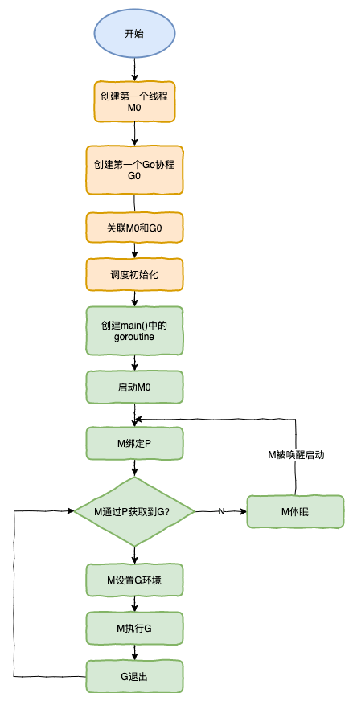
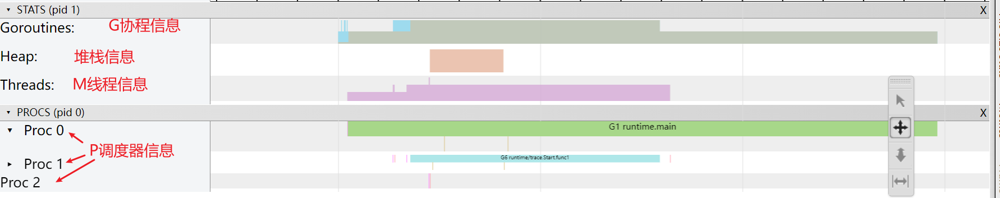
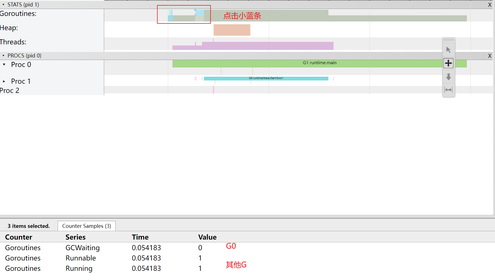
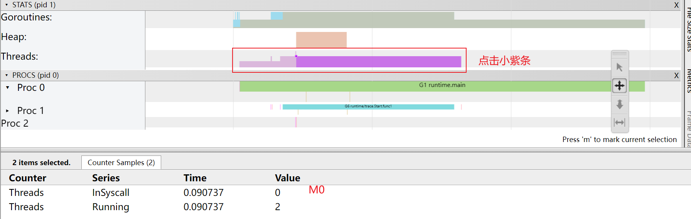
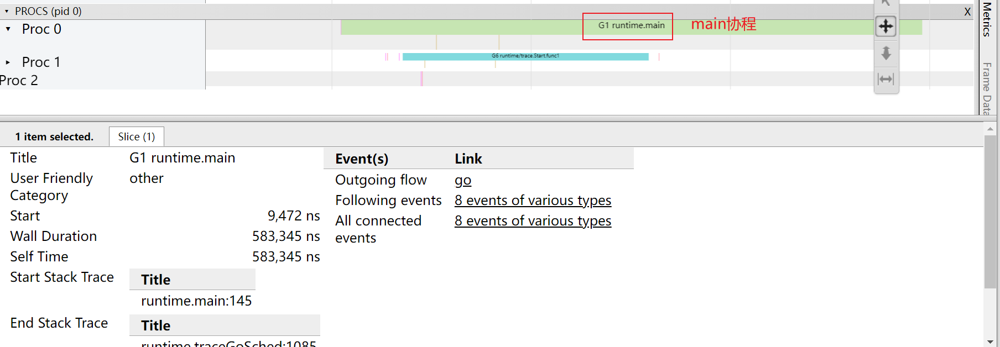

!> goroutine 是轻量级`线程`，goroutine 的调度是由 Golang 运行时进行管理的。

## goroutine 语法格式：

> `go 函数名( 参数列表 )`

### 例如
```go
go Say(message string)
```


### 看下面的示例：

```go
func hello() {
    fmt.Println("Hello Goroutine!")
}
func main() {
    hello()
    fmt.Println("main goroutine done!")
}
/**
Hello Goroutine!
main goroutine done!
*/
```

接下来我们在调用hello函数前面加上关键字go，也就是启动一个goroutine去执行hello这个函数。

```go
func main() {
    go hello() // 启动另外一个goroutine去执行hello函数
    fmt.Println("main goroutine done!")
} 

/**
main goroutine done!
*/
```

为什么只输出了main函数的打印？这是因为在golang中协程(goroutine)是依据在主线程生存的，这里main函数执行结束之后，协程内容还没有执行

那最简单的方法就是在main函数sleep一些时间，看看协程是否能正常运行

```go
func main() {
    go hello() // 启动另外一个goroutine去执行hello函数
    fmt.Println("main goroutine done!")
    time.Sleep(time.Second)
}

/**
main goroutine done!
Hello Goroutine!
*/
```

### 启动多个goroutine

> `sync.WaitGroup`来实现goroutine的同步

```go
package main

import "fmt"
import "sync"

var wg sync.WaitGroup

func hello(i int) {
    defer wg.Done() // goroutine结束就登记-1
    fmt.Println("Hello Goroutine!", i)
}
func main() {

    for i := 0; i < 10; i++ {
        wg.Add(1) // 启动一个goroutine就登记+1
        go hello(i)
    }
    wg.Wait() // 等待所有登记的goroutine都结束
}
```

多次执行上面的代码，会发现每次打印的数字的顺序都不一致。这是因为10个goroutine是并发执行的，而`goroutine的调度是随机的`。


**如果主协程退出了，其他任务还执行吗（运行下面的代码测试一下吧）**

```go
package main

import (
    "fmt"
    "time"
)

func main() {
    // 合起来写
    go func() {
        i := 0
        for {
            i++
            fmt.Printf("new goroutine: i = %d\n", i)
            time.Sleep(time.Second)
        }
    }()
    i := 0
    for {
        i++
        fmt.Printf("main goroutine: i = %d\n", i)
        time.Sleep(time.Second)
        if i == 2 {
            break
        }
    }
}
```

### goroutine与线程

#### 可增长的栈

`OS线程（操作系统线程）`一般都有`固定的栈内存`（通常为2MB）,一个`goroutine`的`栈`在其`生命周期开始`时只有`很小的栈`（典型情况下`2KB`），`goroutine`的栈不是固定的，他可以`按需增大和缩小`，goroutine的栈大小限制可以达到`1GB`，虽然极少会用到这个大。所以在Go语言中一次创建十万左右的goroutine也是可以的。

#### goroutine调度

`GPM`是Go语言运行时（runtime）层面的实现，是go语言自己实现的一套`调度系统`。区别于操作系统调度OS线程。

- 1.`G`很好理解，就是个goroutine的，里面除了存放本`goroutine信息`外 还有与`所在P的绑定等信息`。
- 2.`P`管理着一组`goroutine队列`，P里面会存储当前goroutine运行的`上下文环境（函数指针，堆栈地址及地址边界）`，P会对自己管理的goroutine队列做一些调度（比如把占用CPU时间较长的goroutine暂停、运行后续的goroutine等等）当自己的队列消费完了就去全局队列里取，如果全局队列里也消费完了会去其他P的队列里抢任务。
- 3.`M`（machine）是Go运行时（runtime）对操作系统内核线程的虚拟， M与内核线程一般是一一映射的关系， 一个groutine最终是要放到M上执行的；

P与M一般也是一一对应的。他们关系是： P管理着一组G挂载在M上运行。当一个G长久阻塞在一个M上时，runtime会新建一个M，阻塞G所在的P会把其他的G 挂载在新建的M上。当旧的G阻塞完成或者认为其已经死掉时 回收旧的M。

P的个数是通过`runtime.GOMAXPROCS`设定（最大256），`Go1.5版本之后默认为物理线程数`。 在并发量大的时候会增加一些P和M，但不会太多，切换太频繁的话得不偿失。

单从线程调度讲，Go语言相比起其他语言的优势在于OS线程是由OS内核来调度的，`goroutine`则是由Go运行时（runtime）自己的`调度器`调度的，这个调度器使用一个称为m:n调度的技术（复用/调度m个goroutine到n个OS线程）。 其一大特点是goroutine的调度是在`用户态`下完成的， 不涉及内核态与用户态之间的频繁切换，包括内存的分配与释放，都是在用户态维护着一块大的内存池， 不直接调用系统的`malloc`函数（除非内存池需要改变），成本比调度OS线程低很多。 另一方面充分利用了多核的硬件资源，近似的把若干goroutine均分在物理线程上， 再加上本身goroutine的超轻量，以上种种保证了go调度方面的性能。

## GMP 模型


---


- `全局队列`（Global Queue）：存放等待运行的 G。
- `P 的本地队列`：同全局队列类似，存放的也是等待运行的 G，存的数量有限，不超过 256 个。新建 G’时，G’优先加入到 P 的本地队列，如果队列满了，则会把本地队列中一半的 G 移动到全局队列。
- `P 列表`：所有的 P 都在程序启动时创建，并保存在数组中，最多有 `GOMAXPROCS`(可配置) 个。
- `M`：线程想运行任务就得获取 P，从 P 的本地队列获取 G，P 队列为空时，M 也会尝试从全局队列`拿`一批 G 放到 P 的本地队列，或从其他 P 的本地队列`偷`一半放到自己 P 的本地队列。M 运行 G，G 执行之后，M 会从 P 获取下一个 G，不断重复下去。

?> Goroutine 调度器和 OS 调度器是通过 M 结合起来的，每个 M 都代表了 1 个内核线程，OS 调度器负责把内核线程分配到 CPU 的核上执行。


### 有关 P 和 M 的个数问题

#### 1、P 的数量：

由启动时环境变量 `$GOMAXPROCS` 或者是由 `runtime` 的方法 `GOMAXPROCS()` 决定。这意味着在程序执行的任意时刻都只有 `$GOMAXPROCS` 个 goroutine 在同时运行。

#### 2、M 的数量:

- go 语言本身的限制：go 程序启动时，会设置 M 的最大数量，默认 10000. 但是内核很难支持这么多的线程数，所以这个限制可以忽略。
- `runtime/debug` 中的 `SetMaxThreads` 函数，设置 M 的最大数量
- 一个 M 阻塞了，会创建新的 M。

M 与 P 的数量没有绝对关系，一个 M 阻塞，P 就会去创建或者切换另一个 M，所以，即使 P 的默认数量是 1，也有可能会创建很多个 M 出来。


#### P 和 M 何时会被创建

- 1、P 何时创建：在确定了 P 的最大数量 n 后，运行时系统会根据这个(GOMAXPROCS)数量创建 n 个 P。
- 2、M 何时创建：没有足够的 M 来关联 P 并运行其中的可运行的 G。比如所有的 M 此时都阻塞住了，而 P 中还有很多就绪任务，就会去寻找空闲的 M，而没有空闲的，就会去创建新的 M。

#### 调度器的设计策略

- `复用线程`：避免频繁的创建、销毁线程，而是对线程的复用。
    - 1）work stealing 机制
        - 当本线程无可运行的 G 时，尝试从其他线程绑定的 P 偷取 G，而不是销毁线程。
    - 2）hand off 机制
        - 当本线程因为 G 进行系统调用阻塞时，线程释放绑定的 P，把 P 转移给其他空闲的线程执行。
- `利用并行`：GOMAXPROCS 设置 P 的数量，最多有 GOMAXPROCS 个线程分布在多个 CPU 上同时运行。`GOMAXPROCS`也限制了并发的程度，比如 `GOMAXPROCS = 核数/2`，则最多利用了一半的 CPU 核进行并行。
- `抢占`：在 coroutine 中要等待一个协程主动让出 CPU 才执行下一个协程，在 Go 中，一个 goroutine 最多占用 CPU 10ms，防止其他 goroutine 被饿死，这就是 goroutine 不同于 coroutine 的一个地方。
- `全局 G 队列`：在新的调度器中依然有全局 G 队列，但功能已经被弱化了，当 M 执行 work stealing 从其他 P 偷不到 G 时，它可以从全局 G 队列获取 G。

### go func () 调度流程


也会经历如上图所示的过程：

1. runtime创建最初的线程m0和goroutine g0，并把2者关联。
2. 调度器初始化：初始化m0、栈、垃圾回收，以及创建和初始化由GOMAXPROCS个P构成的P列表。
3. 示例代码中的main函数是`main.main`，`runtime`中也有1个main函数——`runtime.main`，代码经过编译后，`runtime.main`会调用`main.main`，程序启动时会为`runtime.main`创建goroutine，称它为main goroutine吧，然后把main goroutine加入到P的本地队列。
4. 启动m0，m0已经绑定了P，会从P的本地队列获取G，获取到main goroutine。
5. G拥有栈，M根据G中的栈信息和调度信息设置运行环境
6. M运行G
7. G退出，再次回到M获取可运行的G，这样重复下去，直到`main.main`退出，`runtime.main`执行Defer和Panic处理，或调用`runtime.exit`退出程序。

## 调度器的生命周期



## 可视化 GMP 编程

有 2 种方式可以查看一个程序的 GMP 的数据。

### 方式 1：go tool trace

trace 记录了运行时的信息，能提供可视化的 Web 页面。

简单测试代码：main 函数创建 trace，trace 会运行在单独的 goroutine 中，然后 main 打印”Hello World” 退出。

```go
// trace.go
package main

import (
    "os"
    "fmt"
    "runtime/trace"
)

func main() {

    //创建trace文件
    f, err := os.Create("trace.out")
    if err != nil {
        panic(err)
    }

    defer f.Close()

    //启动trace goroutine
    err = trace.Start(f)
    if err != nil {
        panic(err)
    }
    defer trace.Stop()

    //main
    fmt.Println("Hello World")
}
```

```terminal
$ go run trace.go 
Hello World
```

会得到一个 trace.out 文件，然后我们可以用一个工具打开，来分析这个文件。
```terminal
$ go tool trace trace.out
2024/03/29 16:45:58 Preparing trace for viewer...
2024/03/29 16:45:58 Splitting trace for viewer...
2024/03/29 16:45:58 Opening browser. Trace viewer is listening on http://127.0.0.1:5627

```

我们可以通过浏览器打开 http://127.0.0.1:5627 网址，点击 view trace 能够看见可视化的调度流程。



G的信息：




M的信息：



P的信息：




### 方式2：Debug trace


```go
package main

import (
    "fmt"
    "time"
)

func main() {
    for i := 0; i < 5; i++ {
        time.Sleep(time.Second)
        fmt.Println("Hello World")
    }
}
```


编译

```terminal
$ go build trace2.go
```


通过Debug方式运行

```terminal
$ GODEBUG=schedtrace=1000 ./trace2 
SCHED 0ms: gomaxprocs=2 idleprocs=0 threads=4 spinningthreads=1 idlethreads=1 runqueue=0 [0 0]
Hello World
SCHED 1003ms: gomaxprocs=2 idleprocs=2 threads=4 spinningthreads=0 idlethreads=2 runqueue=0 [0 0]
Hello World
SCHED 2014ms: gomaxprocs=2 idleprocs=2 threads=4 spinningthreads=0 idlethreads=2 runqueue=0 [0 0]
Hello World
SCHED 3015ms: gomaxprocs=2 idleprocs=2 threads=4 spinningthreads=0 idlethreads=2 runqueue=0 [0 0]
Hello World
SCHED 4023ms: gomaxprocs=2 idleprocs=2 threads=4 spinningthreads=0 idlethreads=2 runqueue=0 [0 0]
Hello World

```


- `SCHED`：调试信息输出标志字符串，代表本行是goroutine调度器的输出；
- `0ms`：即从程序启动到输出这行日志的时间；
- `gomaxprocs`: P的数量，本例有2个P, 因为默认的P的属性是和cpu核心数量默认一致，当然也可以通过GOMAXPROCS来设置；
- `idleprocs`: 处于idle状态的P的数量；通过gomaxprocs和idleprocs的差值，我们就可知道执行go代码的P的数量；
- t`hreads: os threads/M`的数量，包含scheduler使用的m数量，加上runtime自用的类似sysmon这样的thread的数量；
- `spinningthreads`: 处于自旋状态的os thread数量；
- `idlethread`: 处于idle状态的os thread的数量；
- `runqueue=0`： Scheduler全局队列中G的数量；
- `[0 0]`: 分别为2个P的local queue中的G的数量。