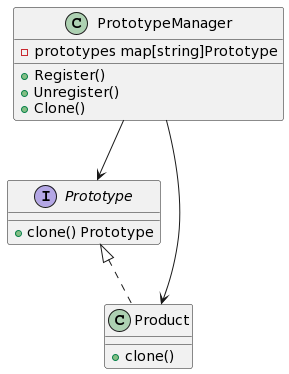

## 1. 什么是原型模式
在软件开发中，原型模式是一种创建型设计模式，它允许通过复制现有对象来创建新对象，而无需使用new操作符。这种方式利用了对象之间的克隆关系，将对象的创建和使用分离开来。

## 2. 原型模式的特点和优点
- 特点：
  - 允许对象在运行时动态创建。
  - 可以减少对象的创建时间，提高系统性能。
  - 对象的创建和使用相分离，便于管理和扩展。
- 优点：
  - 提高对象的创建效率。
  - 简化对象的创建过程。
  - 可以动态地增加或减少对象。

## 3. Golang原型模式的应用场景

原型模式适用于以下场景：

- 对象的创建比较复杂，但是通过复制已有对象的方式可以更高效地创建对象。
- 需要动态地创建或克隆对象，而不是通过直接创建新的对象实例。

## 4. Golang中的原型模式实现

### 4.1. UML类图



### 4.2. 实现步骤1: 创建一个原型接口
首先需要创建一个原型接口，该接口定义了克隆方法。
```go
type Prototype interface {
    clone() Prototype
}
```

### 4.3. 实现步骤2: 使用原型接口创建和克隆对象
#### 4.3.1. 创建原型管理类
原型管理类负责创建和管理原型对象。

```go

type PrototypeManager struct {
    prototypes map[string]Prototype
}

func NewPrototypeManager() *PrototypeManager {
    return &PrototypeManager{
        prototypes: make(map[string]Prototype),
    }
}

func (pm *PrototypeManager) Register(name string, prototype Prototype) {
    pm.prototypes[name] = prototype
}

func (pm *PrototypeManager) Unregister(name string) {
    delete(pm.prototypes, name)
}

func (pm *PrototypeManager) Clone(name string) Prototype {
    prototype, ok := pm.prototypes[name]
    if ok {
        return prototype.clone()
    }
    return nil
}
```

#### 4.3.2. 使用原型管理类创建和克隆对象
```go
type Product struct {
    name string
}

func (p *Product) clone() Prototype {
    return &Product{
        name: p.name,
    }
}

func main() {
    manager := NewPrototypeManager()

    // 在原型管理类中注册原型对象
    manager.Register("productA", &Product{name: "Product A"})

    // 使用原型管理类创建和克隆对象
    productA := manager.Clone("productA").(*Product)
    fmt.Println(productA.name) // Output: Product A
}
```

### 4.4. 实现步骤3: 使用原型模式的注意事项与实践建议
在使用原型模式时，需要注意以下几点：

- 原型模式适合在对象的创建成本较高时使用，因为通过克隆对象可以节省创建时间。
- 注意对象的克隆方法的实现，确保克隆的对象与原