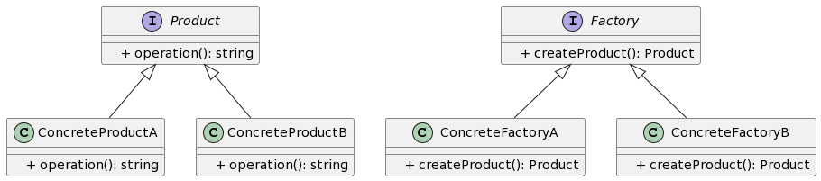

## 1. 什么是工厂方法模式
工厂方法模式是一种创建型设计模式，它提供了一种将对象的创建过程封装在子类中的方式。这样，客户端就可以通过调用工厂方法来创建对象，而无需关心对象的具体创建过程。

## 2. 工厂方法模式的特点和优点
工厂方法模式的特点包括：

- 将对象的创建和使用解耦，客户端只需关心工厂方法和抽象产品接口。
- 可以通过添加新的具体工厂类和具体产品类来扩展系统，符合开闭原则。

工厂方法模式的优点包括：

- 封装了对象的创建过程，使系统更加灵活和可扩展。
- 隐藏了具体产品类的实现细节，减少了客户端对具体类的依赖和耦合。
- 提供了一种标准化的产品创建方式，方便了系统的维护和扩展。
  
## 3. 工厂方法模式的应用场景
工厂方法模式适用于以下场景：

- 客户端不依赖具体产品类，而是依赖于抽象产品接口。
- 客户端需要根据不同的条件动态创建不同的产品对象。
- 需要对产品对象的创建过程进行封装和隐藏。

## 4. Golang中的工厂方法模式实现
### 4.1 UML类图



### 4.2 实现步骤1：定义抽象产品接口
```go
package factory

// Product 是抽象产品接口
type Product interface {
    Operation() string
}
```
### 4.3 实现步骤2：创建具体产品实现类
```go
package factory

// ConcreteProductA 是具体产品A类
type ConcreteProductA struct{}

// Operation 是具体产品A类的方法
func (p *ConcreteProductA) Operation() string {
    return "ConcreteProductA"
}

// ConcreteProductB 是具体产品B类
type ConcreteProductB struct{}

// Operation 是具体产品B类的方法
func (p *ConcreteProductB) Operation() string {
    return "ConcreteProductB"
}
```
### 4.4 实现步骤3：定义抽象工厂接口
```go
package factory

// Factory 是抽象工厂接口
type Factory interface {
    CreateProduct() Product
}
```
### 4.5 实现步骤4：创建具体工厂实现类
```go
package factory

// ConcreteFactoryA 是具体工厂A类
type ConcreteFactoryA struct{}

// CreateProduct 是具体工厂A类的方法
func (f *ConcreteFactoryA) CreateProduct() Product {
    return &ConcreteProductA{}
}

// ConcreteFactoryB 是具体工厂B类
type ConcreteFactoryB struct{}

// CreateProduct 是具体工厂B类的方法
func (f *ConcreteFactoryB) CreateProduct() Product {
    return &ConcreteProductB{}
}
```
### 4.6 实现步骤5：客户端调用工厂方法创建产品对象
```go
package main

import (
    "fmt"

    "github.com/your/package/factory"
)

func main() {
    // 创建具体工厂A
    factoryA := &factory.ConcreteFactoryA{}
    // 调用工厂方法创建产品对象
    productA := factoryA.CreateProduct()
    fmt.Println(productA.Operation())

    // 创建具体工厂B
    factoryB := &factory.ConcreteFactoryB{}
    // 调用工厂方法创建产品对象
    productB := factoryB.CreateProduct()
    fmt.Println(productB.Operation())
}
```
以上代码中，我们定义了抽象产品接口 Product 和具体产品类 ConcreteProductA 和 ConcreteProductB。然后，我们又定义了抽象工厂接口 Factory 和具体工厂类 ConcreteFactoryA 和 ConcreteFactoryB。客户端可以通过调用具体工厂类的工厂方法来创建具体产品对象，从而实现了工厂方法模式。

通过以上步骤，我们就完成了Golang工厂方法模式的实现。这种方式使得客户端和具体产品类之间实现了解耦，一方面客户端只需关心抽象产品接口，另一方面具体产品类的实现细节被封装在具体工厂类中，使得系统更加灵活和可扩展。工厂方法模式在实际应用中非常常见，特别是在需要动态创建不同类型对象的场景下，可以有效地提高代码的复用性和可维护性。