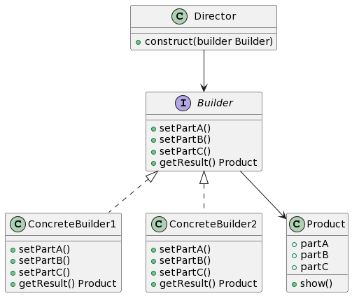

## 1. 什么是建造者模式
建造者模式是一种创建型设计模式，它允许你按照步骤创建复杂对象。它将对象的构建与其表示分离，可以根据所需的组合配置不同的属性和参数。

## 2. 建造者模式的特点和优点
建造者模式的特点和优点包括：

- 封装了对象的创建和组装过程，使客户端代码与具体的构建过程分离，更加灵活和可维护。
- 可以通过不同的建造者组合配置不同的属性和参数，以创建不同的对象。
- 提高了代码的可读性和可维护性，使得代码更易于理解和扩展。
- 可以避免在构造函数中使用过多的参数，使得代码更加简洁。

## 3. 建造者模式的应用场景
建造者模式适用于以下场景：

- 当需要一步一步构建复杂对象时，可以使用建造者模式。
- 当对象的构建过程比较复杂，并且存在多种不同的组合配置时，可以使用建造者模式。
- 当需要创建不同表示的对象时，可以使用建造者模式。
- 
## 4. Golang中的建造者模式实现
### 4.1 UML类图


### 4.2 建造者模式的基本结构
在Golang中，我们可以使用接口和结构体来实现建造者模式的基本结构。下面是一个示例代码：
```go
type Builder interface {
    setPartA()
    setPartB()
    setPartC()
    getResult() *Product
}

type ConcreteBuilder struct {
    product *Product
}

func (b *ConcreteBuilder) setPartA() {
    b.product.partA = "Part A"
}

func (b *ConcreteBuilder) setPartB() {
    b.product.partB = "Part B"
}

func (b *ConcreteBuilder) setPartC() {
    b.product.partC = "Part C"
}

func (b *ConcreteBuilder) getResult() *Product {
    return b.product
}

type Product struct {
    partA string
    partB string
    partC string
}

func (p *Product) show() {
    fmt.Println("Part A:", p.partA)
    fmt.Println("Part B:", p.partB)
    fmt.Println("Part C:", p.partC)
}

type Director struct {
    builder Builder
}

func (d *Director) construct() {
    d.builder.setPartA()
    d.builder.setPartB()
    d.builder.setPartC()
}
```

### 4.3 使用建造者模式创建复杂对象
下面是一个示例代码，演示了如何使用建造者模式创建复杂对象：
```go
builder := &ConcreteBuilder{}
director := &Director{builder: builder}

director.construct()
product := builder.getResult()
product.show()
```

在上面的代码中，我们创建了一个ConcreteBuilder对象和一个Director对象。然后，我们使用Director对象调用construct方法来逐步构建复杂对象。最后，我们通过调用builder对象的getResult方法来获取建造好的产品对象，并通过show方法展示出对象的不同部分。

### 4.4 建造者模式与其他设计模式的关系
建造者模式与其他设计模式的关系包括：

- 建造者模式可以与抽象工厂模式结合使用，来创建多个产品系列。
- 建造者模式可以与单例模式结合使用，来创建单例对象的复杂构建过程。
