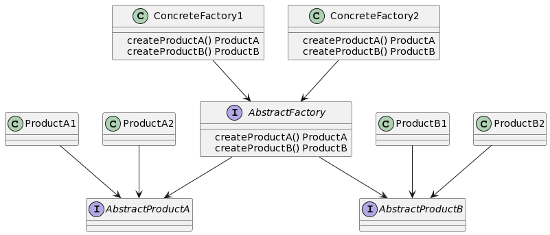

## 什么是抽象工厂模式
抽象工厂模式是一种创建型设计模式，它提供了一种创建一系列相关或相互依赖对象的接口，而无需指定它们具体的类，本章讲解Golang中如何实现抽象工厂模式。

## 抽象工厂模式的特点和优点
抽象工厂模式具有以下特点和优点：

将对象的创建与使用分离，客户端只需关心接口而不需要关心具体实现。
可以遵循单一职责原则和开闭原则，易于扩展和维护。
提供了一种统一的方式来创建一系列产品，让产品之间的关联更加灵活。
抽象工厂模式的应用场景
抽象工厂模式通常适用于以下场景：

当系统需要一系列相互关联或相互依赖的对象时，可以使用抽象工厂模式来统一创建。
需要一个产品系列的对象，而不关心具体实现时，可以使用抽象工厂模式来创建该系列的对象。

## Golang中的抽象工厂模式实现
### UML类图
以下是抽象工厂模式在Golang中的UML类图：



## Golang工厂方法模式

### 实现步骤1: 定义抽象工厂接口
首先，我们需要定义一个抽象工厂接口，该接口声明了创建抽象产品的方法。
```go
type AbstractFactory interface {
    CreateProductA() AbstractProductA
    CreateProductB() AbstractProductB
}
```

### 实现步骤2: 定义具体工厂类
然后，我们需要定义具体的工厂类，该类实现了抽象工厂接口中的方法，用于创建具体的产品。

```go
type ConcreteFactory1 struct{}

func (f *ConcreteFactory1) CreateProductA() AbstractProductA {
    return &ProductA1{}
}

func (f *ConcreteFactory1) CreateProductB() AbstractProductB {
    return &ProductB1{}
}

type ConcreteFactory2 struct{}

func (f *ConcreteFactory2) CreateProductA() AbstractProductA {
    return &ProductA2{}
}

func (f *ConcreteFactory2) CreateProductB() AbstractProductB {
    return &ProductB2{}
}
```

### 实现步骤3: 定义抽象产品接口
接下来，我们需要定义一个抽象产品接口，该接口声明了产品的方法。

```go
type AbstractProductA interface {
    MethodA()
}

type AbstractProductB interface {
    MethodB()
}
```

### 实现步骤4: 定义具体产品类
然后，我们需要定义具体的产品类，这些类实现了抽象产品接口中的方法。
```go
type ProductA1 struct{}

func (p *ProductA1) MethodA() {
    fmt.Println("Product A1: Method A")
}

type ProductA2 struct{}

func (p *ProductA2) MethodA() {
    fmt.Println("Product A2: Method A")
}

type ProductB1 struct{}

func (p *ProductB1) MethodB() {
    fmt.Println("Product B1: Method B")
}

type ProductB2 struct{}

func (p *ProductB2) MethodB() {
    fmt.Println("Product B2: Method B")
}
```

### 实现步骤5: 客户端使用抽象工厂和产品
最后，我们可以创建一个客户端程序来使用抽象工厂和产品。
```go
func CreateProduct(factory AbstractFactory) {
    productA := factory.CreateProductA()
    productB := factory.CreateProductB()

    productA.MethodA()
    productB.MethodB()
}

func main() {
    factory1 := &ConcreteFactory1{}
    factory2 := &ConcreteFactory2{}

    CreateProduct(factory1) // Output: Product A1: Method A, Product B1: Method B

    CreateProduct(factory2) // Output: Product A2: Method A, Product B2: Method B
}
```
以上代码实现了抽象工厂模式在Golang中的应用，客户端程序可以根据不同的工厂类型来创建不同的产品。