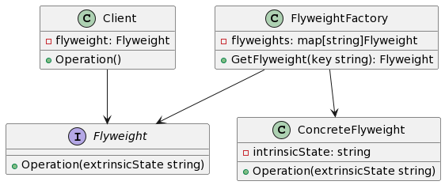

## 1. 什么是享元模式
### 1.1 定义和概念
享元模式是一种结构型设计模式，它的主要目的是最小化共享对象的数量，从而节省内存和提高性能。享元模式通过共享相同或相似的对象来减少对象的创建和消耗，以达到性能优化的效果。

### 1.2 与其他设计模式的区别
与其他设计模式相比，享元模式主要关注对象的共享和复用。它将对象分为可共享的内部状态和不可共享的外部状态。通过共享内部状态，可以减少对象的创建和内存占用，提高系统的性能效率。

## 2. 享元模式的特点和优点
享元模式的主要特点和优点包括：

- 最小化内存使用：通过共享相同或相似的对象，减少了内存的消耗。
- 提高性能：减少对象的创建和销毁操作，加快了系统的运行速度。
- 支持大量细粒度的对象：可以创建大量细粒度的对象，而不会占用过多的内存空间。
- 简化系统结构：将对象的内部状态和外部状态分离，简化了系统的结构和复杂度。
## 3. 享元模式的实际应用场景举例
享元模式可以在如下场景中应用：

- 游戏中的粒子对象：可以将每个粒子对象的属性分为内部状态和外部状态，共享具有相同属性的粒子对象。
- 网络服务器中的连接对象：可以将连接对象的属性分为内部状态和外部状态，在连接对象被回收之前，可以复用已有的连接对象。
## 4. Golang中的享元模式实现
### 4.1 UML类图
下面是Golang中享元模式的UML类图：



### 4.2 示例介绍
在本示例中，我们将创建一个基于享元模式的图形编辑器，其中包含不同颜色的圆形，通过共享颜色相同的圆形对象来减少内存使用。

### 4.3 实现步骤
#### 4.3.1 创建享元接口和具体享元类
首先，我们需要创建一个Flyweight接口，定义共享对象的操作方法。然后，我们可以创建一个ConcreteFlyweight类，实现Flyweight接口并包含内部状态。
```go
// Flyweight 定义享元对象的接口
type Flyweight interface {
    Operation(extrinsicState string)
}

// ConcreteFlyweight 具体享元对象，实现Flyweight接口
type ConcreteFlyweight struct {
    intrinsicState string
}

// Operation 实现共享对象的操作方法
func (f *ConcreteFlyweight) Operation(extrinsicState string) {
    fmt.Printf("具体享元对象，内部状态：%s，外部状态：%s\n", f.intrinsicState, extrinsicState)
}
```
#### 4.3.2 创建享元工厂类
接下来，我们可以创建一个FlyweightFactory类，用于管理和共享享元对象。该工厂类维护一个flyweights字典来存储已创建的享元对象。
```go
// FlyweightFactory 享元工厂类
type FlyweightFactory struct {
    flyweights map[string]Flyweight
}

// GetFlyweight 从工厂中获取或创建享元对象
func (f *FlyweightFactory) GetFlyweight(key string) Flyweight {
    if fw, ok := f.flyweights[key]; ok {
        return fw
    }

    flyweight := &ConcreteFlyweight{
        intrinsicState: key,
    }

    f.flyweights[key] = flyweight

    return flyweight
}
```
#### 4.3.3 客户端调用示例
最后，我们可以创建一个Client类，演示如何使用享元模式实现图形编辑器。
```go
// Client 客户端类
type Client struct {
    flyweight Flyweight
}

// Operation 执行操作
func (c *Client) Operation() {
    c.flyweight.Operation("外部状态")
}
```
### 4.4 实现注意事项和最佳实践
#### 4.4.1 状态共享和线程安全
在使用享元模式时，需要注意内部状态的共享和线程安全的问题。由于享元对象是被多个客户端共享的，所以需要保证内部状态的一致性。

#### 4.4.2 对象池的管理
为了更好地管理和复用享元对象，可以使用对象池来存储已创建的享元对象。对象池可以提高对象的复用率，减少对象的创建和销毁开销。

#### 4.4.3 对象状态的外部管理
享元模式将对象的内部状态和外部状态分离，但外部状态需要由客户端来管理。客户端在使用享元对象时，需要将外部状态传递给享元对象进行操作。

完整代码示例
下面是完整的Golang代码示例：
```go
package main

import "fmt"

// Flyweight 定义享元对象的接口
type Flyweight interface {
    Operation(extrinsicState string)
}

// ConcreteFlyweight 具体享元对象，实现Flyweight接口
type ConcreteFlyweight struct {
    intrinsicState string
}

// Operation 实现共享对象的操作方法
func (f *ConcreteFlyweight) Operation(extrinsicState string) {
    fmt.Printf("具体享元对象，内部状态：%s，外部状态：%s\n", f.intrinsicState, extrinsicState)
}

// FlyweightFactory 享元工厂类
type FlyweightFactory struct {
    flyweights map[string]Flyweight
}

// GetFlyweight 从工厂中获取或创建享元对象
func (f *FlyweightFactory) GetFlyweight(key string) Flyweight {
    if fw, ok := f.flyweights[key]; ok {
        return fw
    }

    flyweight := &ConcreteFlyweight{
        intrinsicState: key,
    }

    f.flyweights[key] = flyweight

    return flyweight
}

// Client 客户端类
type Client struct {
    flyweight Flyweight
}

// Operation 执行操作
func (c *Client) Operation() {
    c.flyweight.Operation("外部状态")
}

func main() {
    factory := &FlyweightFactory{
        flyweights: make(map[string]Flyweight),
    }

    flyweight1 := factory.GetFlyweight("A")
    flyweight1.Operation("外部状态1")

    flyweight2 := factory.GetFlyweight("B")
    flyweight2.Operation("外部状态2")

    client := &Client{
        flyweight: factory.GetFlyweight("A"),
    }
    client.Operation()
}

```