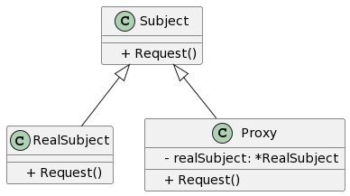

## 1. 什么是代理模式
代理模式是一种结构型设计模式，充当一个代理，控制某个对象的访问。代理模式基于目标对象（被代理对象）提供了一个代理对象，客户端通过代理对象来访问目标对象，从而可以在目标对象的基础上增加额外的功能。

### 1.1 代理模式的定义
代理模式是一种由两个或多个对象协同工作的设计模式。其中，一个对象是真正要调用的目标对象，而其他一个或多个对象充当代理对象。代理对象通过拦截对目标对象的访问，提供了一种间接访问目标对象的方式。

### 1.2 代理模式的作用和目的
代理模式的主要目的是为了给目标对象提供一种间接访问的方式，从而能够在访问目标对象的基础上添加额外的功能。代理对象可以处理一些公共的逻辑，例如对目标对象的访问控制、缓存、日志记录等。代理模式还可以实现懒汉式加载，即当需要访问目标对象时再进行实例化。

## 2. 代理模式的特点和优点
代理模式具## 有以下特点和优点：

- 可以在不修改目标对象的情况下扩展其功能。
- 可以通过代理对象对目标对象的访问进行控制。
- 可以在访问目标对象之前或之后执行一些附加操作。
- 可以实现懒汉式加载，即当需要访问目标对象时再进行实例化。

## 3. 代理模式的实际应用场景举例
代理模式在许多应用场景中有着广泛的应用，以下是一些常见的实际应用场景举例：

- 远程代理：用于对网络上的对象进行本地化访问。
- 虚拟代理：用于根据需要创建高开销的对象。
- 安全代理：用于控制对对象的访问权限。
- 智能引用：用于在访问对象时执行一些额外操作，例如对对象的计数等。
## 4. Golang中的代理模式实现
### 4.1 UML类图
以下是Golang中代理模式的UML类图：



### 4.2 示例介绍
假设我们有一个接口Subject，其中定义了一个Request方法。我们有一个具体实现类RealSubject，它实现了Subject接口。然后我们创建了一个代理类Proxy，它持有一个RealSubject对象，并实现了Subject接口。在Proxy类的Request方法中，我们可以在调用RealSubject的Request方法之前或之后执行一些额外的操作。

### 4.3 实现步骤1: 定义代理接口
首先，我们需要定义一个Subject接口，其中包含一个Request方法:
```go
package main

type Subject interface {
    Request()
}
```
### 4.4 实现步骤2: 实现被代理对象
接下来，我们实现具体的被代理对象RealSubject，它实现了Subject接口:
```go
package main

import "fmt"

type RealSubject struct {}

func (r *RealSubject) Request() {
    fmt.Println("RealSubject: Handling Request")
}
```
### 4.5 实现步骤3: 实现代理对象
然后，我们创建一个代理对象Proxy，它持有一个RealSubject对象，并实现了Subject接口。在Proxy的Request方法中，我们可以在调用RealSubject的Request方法之前或之后执行一些额外的操作:
```go
package main

import "fmt"

type Proxy struct {
    realSubject *RealSubject
}

func (p *Proxy) Request() {
    fmt.Println("Proxy: Pre-Request")

    if p.realSubject == nil {
        p.realSubject = &RealSubject{}
    }

    p.realSubject.Request()

    fmt.Println("Proxy: Post-Request")
}
```
### 4.6 实现步骤4: 调用代理对象
最后，我们可以使用代理对象Proxy来调用被代理对象RealSubject的方法：
```go
package main

func main() {
    proxy := Proxy{}
    proxy.Request()
}
```
运行以上代码，输出结果为：

```
Proxy: Pre-Request
RealSubject: Handling Request
Proxy: Post-Request
```
## 5. 代理模式的热点问题解析
### 5.1 代理模式和装饰器模式的区别和联系
代理模式和装饰器模式都是结构型设计模式，它们都包含一个目标对象和一个代理/装饰器对象。然而，两者之间存在一些区别：

- 代理模式一般是一个对目标对象的访问控制，而装饰器模式更关注对目标对象的扩展。
- 代理模式通常在目标对象之前或之后执行一些附加操作，而装饰器模式则是在目标对象的基础上动态添加额外的功能。

### 5.2 静态代理和动态代理的比较
代理模式可以分为静态代理和动态代理。静态代理是在编译时就已经确定代理对象的类型，代理对象是由程序员手动编写的。动态代理则是在运行时动态生成代理对象，代理对象是由代理框架根据目标对象的接口自动生成的。相比而言，动态代理更加灵活，但也更加复杂。

### 5.3 代理模式在微服务中的应用
代理模式可以应用于微服务架构中。例如，我们可以使用代理来封装对其他微服务的访问，并在代理层实现负载均衡、限流、熔断等机制。这样可以提高系统的可靠性和性能。代理模式还可以用于服务发现和路由功能的实现。