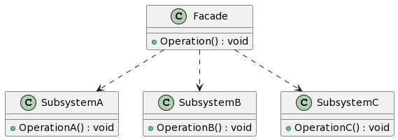

## 1. 什么是外观模式
外观模式（Facade Pattern）是一种结构型设计模式，提供了一个统一的接口，用于访问子系统中的一组接口。它隐藏了子系统的复杂性，为外部提供了一个简化的接口。

## 2. 外观模式的特点和优点
外观模式有以下特点和优点：

- 提供了一个简化的接口，使得子系统更易于使用。
- 将客户端与子系统的耦合度降低，客户端只需要与外观类进行交互，而不需要了解子系统的具体实现细节。
- 符合开闭原则，可以很方便地增加或修改子系统中的功能。
## 3. 外观模式的实际应用场景举例
外观模式在实际开发中有着广泛的应用场景，例如：

- 提供简化的接口来访问复杂的第三方库或API。
- 封装一组复杂的逻辑操作，以简化客户端的调用过程。
- 为现有系统提供一个简单的接口，以便与其他系统进行集成。
## 4. Golang中的外观模式实现
### 4.1. UML类图


### 4.2. 示例介绍
在这个示例中，我们假设有一个电子商务平台，它包括订单管理、库存管理和支付系统。订单管理系统负责创建订单、查询订单等功能，库存管理系统负责查询商品库存、扣减库存等功能，支付系统负责支付订单的功能。为了简化客户端与子系统的交互，我们可以使用外观模式来设计这些子系统的接口。

### 4.3. 实现步骤1: 定义外观类
```go
type Facade struct {
    subsystemA *SubsystemA
    subsystemB *SubsystemB
    subsystemC *SubsystemC
}

func NewFacade() *Facade {
    return &Facade{
        subsystemA: NewSubsystemA(),
        subsystemB: NewSubsystemB(),
        subsystemC: NewSubsystemC(),
    }
}

func (f *Facade) Operation() {
    f.subsystemA.OperationA()
    f.subsystemB.OperationB()
    f.subsystemC.OperationC()
}
```
### 4.4. 实现步骤2: 定义子系统类
```go
type SubsystemA struct {
}

func NewSubsystemA() *SubsystemA {
    return &SubsystemA{}
}

func (s *SubsystemA) OperationA() {
    // 子系统A的操作逻辑
}

type SubsystemB struct {
}

func NewSubsystemB() *SubsystemB {
    return &SubsystemB{}
}

func (s *SubsystemB) OperationB() {
    // 子系统B的操作逻辑
}

type SubsystemC struct {
}

func NewSubsystemC() *SubsystemC {
    return &SubsystemC{}
}

func (s *SubsystemC) OperationC() {
    // 子系统C的操作逻辑
}
```
### 4.5. 实现步骤3: 使用外观模式实现客户端代码
```go
func main() {
    facade := NewFacade()
    facade.Operation()
}
```