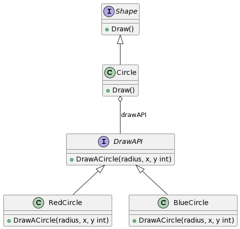

## 1. 什么是桥接模式
### 1.1 定义和概念
桥接模式，也称为Bridge模式，是一种结构型设计模式，它将抽象与实现解耦，使得两者可以独立地变化。简单地说，桥接模式是一种让抽象和实现分离的方案。

### 1.2 桥接模式的目的和作用
桥接模式的主要目的是将抽象部分与其实现部分解耦，以便二者可以独立地进行变化和扩展。这是通过建立一个抽象的桥接类完成的，该类链接到一个具体实现类。

## 2. 桥接模式的特点和优点
桥接模式的一些主要特点和优点如下：

- 提高了系统的可扩展性。抽象和实现都可以独立扩展，不会影响到对方。
- 符合开闭原则，抽象部分和实现部分可以分别独立扩展，而不会影响到彼此。
- 实现细节对客户透明，可以对用户隐藏实现细节。

## 3. 桥接模式的应用场景
当你想要分离一个复杂对象的实现和抽象的时候，可以使用桥接模式。 这可能会对现有代码的性能有好影响，尤其是当程序在运行时只使用了对象的一部分。
当你需要在多个对象间分享特定的实现状态，但对于客户方代码而言，它们需要呈现为独立类。

## 4. Golang中的桥接模式实现
### 4.1 UML类图介绍



### 4.2 实现步骤详解
#### 4.2.1 定义抽象角色接口
首先，我们先定义一个DrawAPI接口，具体代码如下：
```go
// 抽象角色接口
type DrawAPI interface {
    DrawACircle(radius, x, y int)
}
```

#### 4.2.2 实现具体角色类
然后，我们分别定义RedCircle和BlueCircle两个类，实现上述的DrawAPI接口之中的方法。

```go
// 具体角色类
type RedCircle struct {}

func (c *RedCircle) DrawACircle(radius, x, y int) {
    // logic of drawing a red circle
}

type BlueCircle struct {}

func (c *BlueCircle) DrawACircle(radius, x, y int) {
    // logic of drawing a blue circle
}
```

#### 4.2.3 定义抽象桥接接口
定义Shape桥接接口
```go
// 抽象桥接接口
type Shape interface {
    Draw()
}
```

#### 4.2.4 实现具体桥接类
实现Circle类，该类实现Shape接口，并包含了一个DrawAPI接口类型的对象。

```go
// 具体桥接类
type Circle struct {
    x, y, radius int
    drawAPI      DrawAPI
}

func (c *Circle) Draw() {
    c.drawAPI.DrawACircle(c.radius, c.x, c.y)
}
```

#### 4.2.5 客户端调用示例
```go
func main() {
    redCircle := &Circle{100, 100, 10, new(RedCircle)}
    blueCircle := &Circle{100, 100, 10, new(BlueCircle)}

    redCircle.Draw()
    blueCircle.Draw()
}
```
这样，我们便实现了Golang中的桥接模式。