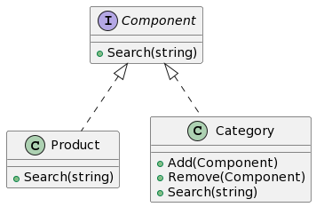

## 一、什么是组合模式
组合模式（Composite Pattern）是一种常用的对象结构型设计模式。它是将对象组合成树状结构以表示“部分-整体”的层次结构，使得客户端以一致的方式处理单个对象和对象组合。

## 二、组合模式的特点和优点
组合模式的主要优点有：

可以清楚地定义分层次的复杂对象，表示对象的全部或部分层次，使得增加新构件也更容易。
提供一个统一的接口，使得访问组合部分和单个对象的接口一致，使客户端对单个对象和组合对象的使用是一致的。
## 三、组合模式的应用场景
你希望表示对象的部分-整体层次
你希望客户忽略组合对象与单个对象的不同，客户将统一的使用组合结构中的所有对象。
## 四、Golang中的组合模式实现
假设我们在设计一个电商应用，商品目录就是一个很好的组合模式例子。一个类别可以包含其他类别，也可以包含商品(如电子类别包含了手机，电脑，而手机又包含了苹果手机，三星手机等）。

### 4.1 UML类图


### 4.2 示例介绍
在这个例子里，我们有Component（明显利用到面向对象的接口特性）作为抽象基类，Composite和Leaf都实现该接口，它们分别代表容器对象和基本对象。

### 4.3 实现步骤1: 定义抽象组件类
这个方法通常在接口类定义，并且是关键的中心操作。

#### 4.3.1 定义抽象组件类接口
```go
//Component : 基础组件接口，定义了群体和个体的共性
type Component interface {
    Search(string)
}
```
#### 4.3.2 实现抽象组件类基本方法
这个步骤函数具体在容器组件类和叶子组件类实现。

### 4.4 实现步骤2: 定义叶子组件类
这个具体类代表层次中的底部类别或对象，它没有下一层的对象。

#### 4.4.1 继承抽象组件类
在Go中，interface的继承通过Struct实现方法的方式。

#### 4.4.2 实现叶子组件类特有方法
```go
//Product : 代表叶子节点，即商品，不能有子节点
type Product struct {
    Name string
}

//Search : 搜索商品
func (p *Product) Search(keyword string) {
    if strings.Contains(p.Name, keyword) {
        fmt.Printf("Product: '%s' contains keyword: '%s'\n", p.Name, keyword)
    }
}
```
### 4.5 实现步骤3: 定义容器组件类
这个类用于存储和管理子对象，一般包含一些管理和组织子对象的方法，如add(Component), remove(Component)等。

#### 4.5.1 继承抽象组件类
这同样通过Go的Struct实现接口方法实现。

#### 4.5.2 实现容器组件类特有方法
```go
//Category : 代表容器节点，即商品类别，可以有子节点
type Category struct {
    Name     string
    Children []Component
}

//Add 添加子节点
func (c *Category) Add(child Component) {
    c.Children = append(c.Children, child)
}

//Remove 删除子节点
func (c *Category) Remove(child Component) {
    //具体实现略
}

//Search 搜索商品
func (c *Category) Search(keyword string) {
    fmt.Printf("Category: %s\n", c.Name)
    for _, composite := range c.Children {
        composite.Search(keyword)
    }
}
```
### 4.6 实现步骤4: 客户端代码示例
实例化一个结构体，组装成一个树形结构，然后调用树形结构的访问操作。
```go
func main() {
    root := &Category{Name: "Root"}
    electronics := &Category{Name: "Electronics"}

    phone := &Product{Name: "Phone"}
    tv := &Product{Name: "Television"}

    root.Add(electronics)
    electronics.Add(phone)
    electronics.Add(tv)

    root.Search("phone") // This will search in all children
}
```