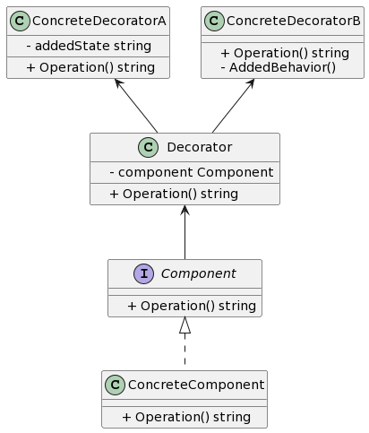

## 1. 什么是装饰器模式
装饰器模式是一种结构型设计模式，它允许动态地向一个对象添加额外的功能，而无需修改对象的代码。装饰器模式通过将对象包装在装饰器类中，实现在运行时添加、修饰或修改对象行为的能力。

## 2. 装饰器模式的特点和优点
装饰器模式的特点和优点包括：

- 动态扩展对象的功能，无需修改对象代码。
- 符合开闭原则，可动态添加和移除装饰器。
- 可以组合多个装饰器，实现嵌套式的功能扩展。
- 装饰器可以独立于对象被装饰的方式独立变化。
## 3. 装饰器模式的实际应用场景举例
装饰器模式在实际开发中有许多应用场景，例如：

- 动态添加日志记录功能
- 动态添加缓存功能
- 动态数据校验
## 4. Golang中的装饰器模式实现
4.1. UML类图


### 4.2. 示例介绍
在示例中，我们有一个Component接口和一个ConcreteComponent类，它实现了Component接口的方法Operation。

然后我们有一个Decorator类，它也实现了Component接口。Decorator类有一个Component类型的成员变量component。

ConcreteDecoratorA和ConcreteDecoratorB类都继承自Decorator类，并通过重写Operation方法来实现额外的功能。

### 4.3. 实现步骤1: 定义接口和实现类
```go
type Component interface {
    Operation() string
}

type ConcreteComponent struct {}

func (c *ConcreteComponent) Operation() string {
    return "具体组件的操作"
}
```
### 4.4. 实现步骤2: 定义装饰器
```go
type Decorator struct {
    component Component
}

func (d *Decorator) Operation() string {
    return d.component.Operation()
}
```
### 4.5. 实现步骤3: 装饰器的实现
```go
type ConcreteDecoratorA struct {
    Decorator
    addedState string
}

func (c *ConcreteDecoratorA) Operation() string {
    c.addedState = "New State"
    return c.addedState + " " + c.component.Operation()
}

type ConcreteDecoratorB struct {
    Decorator
}

func (c *ConcreteDecoratorB) Operation() string {
    return "具体装饰器B的操作 " + c.component.Operation()
}
```
### 4.6. 实现步骤3: 装饰器的使用
```go
func main() {
    component := &ConcreteComponent{}

    decoratorA := &ConcreteDecoratorA{}
    decoratorA.component = component

    decoratorB := &ConcreteDecoratorB{}
    decoratorB.component = decoratorA

    result := decoratorB.Operation()
    fmt.Println(result)
}
```
## 5. 装饰器模式和其他设计模式的比较
### 5.1. 与继承的比较
装饰器模式与继承相比，它可以动态地添加功能而无需修改已有的代码。而继承则是静态的，需要在编译时确定。

### 5.2. 与静态代理模式的比较
装饰器模式与静态代理模式都可以实现功能扩展，但装饰器模式更加灵活，可以动态添加和移除功能。

### 5.3. 与动态代理模式的比较
装饰器模式和动态代理模式都可以在运行时对对象进行功能扩展，但装饰器模式是对单个对象进行装饰，而动态代理模式是代理对象与被代理对象之间的间接访问。