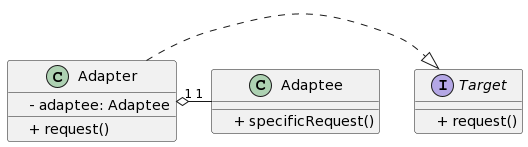

## 1. 什么是适配器模式
### 1.1 定义
适配器模式是一种结构型设计模式，它允许将一个类的接口转换成客户端所期望的另一个接口。适配器模式使得那些原本由于接口不兼容而不能一起工作的类可以协同工作。

### 1.2 目的和作用
适配器模式的主要目的是解决两个不兼容接口之间的兼容性问题。通过使用适配器类，可以使得不兼容的两个类能够合作进行某个特定功能的实现。

### 1.3 适配器模式的基本原则
- 将接口转换成另一个接口时，适配器模式适用于处理已存在的类。
- 适配器模式通过创建一个适配器类来实现接口转换，而不是修改原有的类。
- 适配器模式可以通过类适配器或对象适配器来实现。

## 2. 适配器模式的特点和优点
适配器模式具有以下特点和优点：

- 提供了接口转换的解决方案，使得不兼容的类能够一起工作。
- 可以增加系统的灵活性和可扩展性。
- 可以复用已存在的类，减少代码重复和开发成本。
- 提供了一种松耦合的设计方案，使得系统更加灵活和易于维护。

## 3. 适配器模式的应用场景
适配器模式在以下场景中常被使用：

- 当需要使用一个已经存在的类，但其接口不符合需求时。
- 当需要创建一个可以复用的类，该类能够与不兼容的接口一起工作。
- 当需要在多个类之间进行接口转换时。

## 4. Golang中的适配器模式实现
### 4.1 UML类图



### 4.2 实现步骤1: 设计适配器接口
```go
package main

type Target interface {
    Request()
}
```
### 4.3 实现步骤2: 实现适配器类
```go
package main

type Adaptee struct {
}

func (a *Adaptee) SpecificRequest() {
    // 实现适配者类的具体功能
}

type Adapter struct {
    adaptee *Adaptee
}

func NewAdapter() *Adapter {
    return &Adapter{adaptee: &Adaptee{}}
}

func (a *Adapter) Request() {
    a.adaptee.SpecificRequest()
}
```
### 4.4 实现步骤3: 客户端代码调用适配器模式
```go
package main

func main() {
    adapter := NewAdapter()
    adapter.Request()
}
```
## 5. 适配器模式的进阶应用
### 5.1 适配器模式与桥接模式的区别与联系
适配器模式和桥接模式都可以用于处理两个不同类的接口问题，但它们的主要区别在于：

- 适配器模式主要关注的是两个已经存在的接口之间的兼容性转换。
- 桥接模式主要关注的是抽象与实现的分离，通过接口和实现类之间的桥接来实现解耦。
### 5.2 适配器模式在微服务架构中的应用
在微服务架构中，不同的微服务可能使用不同的接口进行通信。适配器模式可以帮助我们解决不同服务之间的接口兼容性问题，使得它们可以协同工作。

### 5.3 适配器模式在前后端分离开发中的应用
前后端分离开发中，前端通常需要从后端获取数据，而后端暴露的接口可能不符合前端的需求。适配器模式可以帮助我们将后端的接口适配成前端所期望的接口，实现前后端的无缝协作。