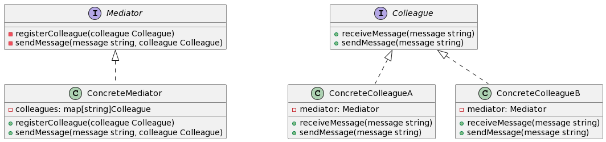

## 1. 什么是中介者模式
中介者模式是一种行为型设计模式，它通过将对象之间的通信转移给一个中介者对象，从而减少对象之间的直接依赖关系。在中介者模式中，各个对象不再直接与彼此通信，而是通过中介者对象进行通信。

## 2. 中介者模式的特点和优点
中介者模式的特点和优点如下：

- 减少了对象之间的直接耦合，降低了系统复杂性。
- 可以简化对象之间的通信，由中介者对象统一处理对象之间的通信。
- 可以集中控制对象之间的交互，便于扩展和维护。

## 3. 中介者模式的实际应用场景举例
中介者模式在现实生活中有许多应用场景。例如，一个机场调度系统中，调度员充当中介者角色，飞机、地面交通等各个模块作为同事类，通过调度员进行协调和通信。

## 4. Golang中的中介者模式实现
### 4.1 UML类图介绍
下面是Golang中介者模式的UML类图描述：



### 4.2 示例介绍
在这个示例中，我们将实现一个简单的聊天室应用，使用中介者模式来管理不同用户之间的通信。

### 4.3 实现步骤1: 定义中介者接口和具体中介者
首先，我们定义一个中介者接口和具体中介者类：
```go
type Mediator interface {
    registerColleague(colleague Colleague)
    sendMessage(message string, colleague Colleague)
}

type ConcreteMediator struct {
    colleagues map[string]Colleague
}

func (m *ConcreteMediator) registerColleague(colleague Colleague) {
    m.colleagues[colleague.getName()] = colleague
}

func (m *ConcreteMediator) sendMessage(message string, colleague Colleague) {
    for _, c := range m.colleagues {
        if c != colleague {
            c.receiveMessage(message)
        }
    }
}
```
### 4.4 实现步骤2: 定义同事类接口和具体同事类
然后，我们定义一个同事类接口和具体同事类：
```go
type Colleague interface {
    receiveMessage(message string)
    sendMessage(message string)
    getName() string
}

type ConcreteColleagueA struct {
    mediator Mediator
    name     string
}

func (c *ConcreteColleagueA) receiveMessage(message string) {
    fmt.Printf("%s received message: %s\n", c.name, message)
}

func (c *ConcreteColleagueA) sendMessage(message string) {
    c.mediator.sendMessage(message, c)
}

func (c *ConcreteColleagueA) getName() string {
    return c.name
}

type ConcreteColleagueB struct {
    mediator Mediator
    name     string
}

func (c *ConcreteColleagueB) receiveMessage(message string) {
    fmt.Printf("%s received message: %s\n", c.name, message)
}

func (c *ConcreteColleagueB) sendMessage(message string) {
    c.mediator.sendMessage(message, c)
}

func (c *ConcreteColleagueB) getName() string {
    return c.name
}
```
### 4.5 实现步骤3: 在中介者中管理同事类
在具体中介者类中，我们需要实现registerColleague方法和sendMessage方法来管理同事类之间的通信：
```go
func main() {
    mediator := &ConcreteMediator{
        colleagues: make(map[string]Colleague),
    }

    colleagueA := &ConcreteColleagueA{
        mediator: mediator,
        name:     "Colleague A",
    }
    colleagueB := &ConcreteColleagueB{
        mediator: mediator,
        name:     "Colleague B",
    }

    mediator.registerColleague(colleagueA)
    mediator.registerColleague(colleagueB)

    colleagueA.sendMessage("Hello, World!")
    colleagueB.sendMessage("Hi, there!")
}
```
在main函数中，我们创建了一个具体中介者对象和两个具体同事对象，然后通过中介者对象注册同事对象，并进行通信测试。