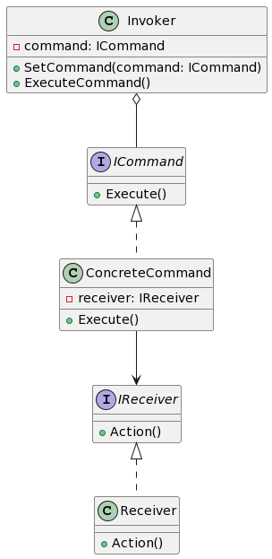

## 1. 什么是命令模式
### 1.1 定义和概念
命令模式是一种行为设计模式，它允许将请求封装为一个对象，从而使你可以用不同的请求对客户端进行参数化。

### 1.2 命令模式的作用
命令模式的主要目的是解耦发送者和接收者。通过将请求封装成一个对象，发送者只需要和命令对象进行交互，而不需要直接和接收者交互。

## 2. 命令模式的特点和优点
命令模式具有以下特点和优点：

-将请求封装成对象，使发送者和接收者解耦。
-可以将请求排队、记录日志、撤销等操作。
-可以在不改变原有代码的情况下扩展新的命令。

## 3. 命令模式的实际应用场景举例
命令模式在以下场景中适用：

- 需要将请求和执行命令的对象解耦。
- 需要支持撤销和重做操作。
- 需要将一组操作排队执行。

## 4. Golang中的命令模式实现
### 4.1 UML类图


### 4.2 示例介绍
在这个示例中，我们将创建一个简单的命令模式的实现。假设我们有一个电视机作为接收者，可以执行打开和关闭的操作。我们也有一个遥控器作为调用者，它可以设置具体的命令并执行它。

### 4.3 实现步骤
#### 4.3.1 定义命令接口
```go
type ICommand interface {
    Execute()
}
```
#### 4.3.2 实现具体命令类
```go
type ConcreteCommand struct {
    receiver IReceiver
}

func (c *ConcreteCommand) Execute() {
    c.receiver.Action()
}
```
#### 4.3.3 定义接收器接口
```go
type IReceiver interface {
    Action()
}
```
#### 4.3.4 实现具体接收器类
```go
type Receiver struct {}

func (r *Receiver) Action() {
    fmt.Println("执行操作")
}
```
#### 4.3.5 实现调用者角色
```go
type Invoker struct {
    command ICommand
}

func (i *Invoker) SetCommand(command ICommand) {
    i.command = command
}

func (i *Invoker) ExecuteCommand() {
    i.command.Execute()
}
```
#### 4.3.6 客户端代码示例
```go
func main() {
    receiver := &Receiver{}
    command := &ConcreteCommand{receiver: receiver}
    invoker := &Invoker{}
    invoker.SetCommand(command)
    invoker.ExecuteCommand()
}
```
## 5. 命令模式与策略模式的区别
命令模式和策略模式在某种程度上是相似的，它们都将某些行为封装成对象。不同之处在于，命令模式主要用于将请求封装为对象并实现撤销和执行队列等功能，而策略模式则主要用于封装一系列的算法，并在运行时根据需要选择其中一个算法进行执行。

命令模式更适合于需要记录日志、记账等操作，而策略模式更适合于业务逻辑的灵活变化。