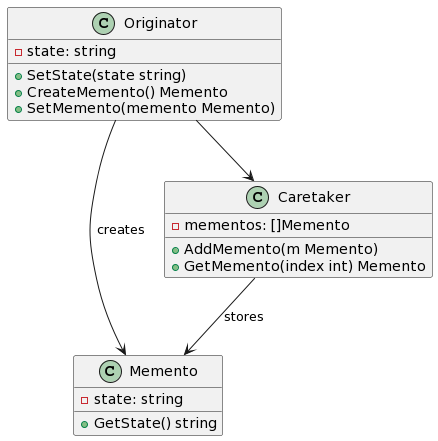

## 1. 什么是备忘录模式
备忘录模式是一种行为型设计模式，用于保存和恢复对象的内部状态。它将对象的状态保存到备忘录对象中，以后可以通过备忘录对象将对象恢复到之前的状态。

## 2. 备忘录模式的特点和优点
备忘录模式的特点和优点包括：

- 可以在不违反封装原则的情况下保存和恢复对象的内部状态。
- 可以灵活地管理对象的历史状态，方便进行撤销和重做操作。
- 可以将状态保存到外部，避免对象内部状态的暴露。

## 3. 备忘录模式的实际应用场景举例
备忘录模式在实际应用中有很多场景，其中一些例子包括：

- 文字编辑器中的撤销和重做功能，可以使用备忘录模式保存每次操作的状态。
- 游戏中的保存和加载功能，可以使用备忘录模式保存游戏进度。
- 电子邮件客户端中的草稿箱功能，可以使用备忘录模式保存草稿邮件的状态。

## 4. Golang中的备忘录模式实现
### 4.1. UML类图


### 4.2. 示例介绍
结合UML类图文字描述
在这个示例中，我们有一个Originator类，它具有一个内部状态state。Originator通过SetState方法设置状态，并通过CreateMemento方法创建备忘录对象。备忘录对象的内部状态与Originator的状态相同。Caretaker类负责存储备忘录对象，并通过AddMemento方法添加备忘录对象。

##### 实现步骤
- 创建备忘录对象Memento，该对象具有保存Originator内部状态的方法GetState。
- 创建Originator对象，该对象具有设置状态和创建备忘录的方法。
- 创建Caretaker对象，该对象负责保存备忘录对象。
- 在Originator中实现创建备忘录和恢复状态的方法：
    - 创建备忘录对象时，将Originator的状态保存到备忘录中。
    - 恢复状态时，将备忘录中的状态恢复到Originator中。
- 在Caretaker中实现添加备忘录和获取备忘录的方法：
    - 添加备忘录方法用于将备忘录对象保存到Caretaker中。
    - 获取备忘录方法用于从Caretaker中获取备忘录对象。

#### 4.3.1. 创建备忘录对象
```go
type Memento struct {
    state string
}

func (m *Memento) GetState() string {
    return m.state
}
```
#### 4.3.2. 存储状态到备忘录
```go
type Originator struct {
    state string
}

func (o *Originator) SetState(state string) {
    o.state = state
}

func (o *Originator) CreateMemento() *Memento {
    return &Memento{state: o.state}
}
```
#### 4.3.3. 从备忘录中恢复状态
```go
func (o *Originator) SetMemento(memento *Memento) {
    o.state = memento.GetState()
}
```
#### 4.3.4. 使用备忘录模式进行撤销操作
```go
type Caretaker struct {
    mementos []*Memento
}

func (c *Caretaker) AddMemento(m *Memento) {
    c.mementos = append(c.mementos, m)
}

func (c *Caretaker) GetMemento(index int) *Memento {
    return c.mementos[index]
}
```
#### 4.3.5. 使用备忘录模式进行重做操作
```go
func main() {
    originator := &Originator{}
    caretaker := &Caretaker{}

    originator.SetState("State 1")
    caretaker.AddMemento(originator.CreateMemento())

    originator.SetState("State 2")
    caretaker.AddMemento(originator.CreateMemento())

    originator.SetMemento(caretaker.GetMemento(0))
    fmt.Println("Originator state after restoring to state 1:", originator.state)

    originator.SetMemento(caretaker.GetMemento(1))
    fmt.Println("Originator state after restoring to state 2:", originator.state)
}
```