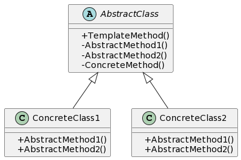

## 1. 什么是模板方法模式
在软件开发中，模板方法模式是一种行为设计模式，它定义了一个算法的骨架，将一些步骤推迟到子类中实现。这样可以在不改变算法结构的情况下，允许子类在特定步骤上具体实现自己的行为。

## 2. 模板方法模式的特点和优点
模板方法模式的特点和优点包括:

- 定义了一个算法的骨架，将一些特定步骤的具体实现延迟到子类中。
- 可以在不改变算法结构的情况下，允许子类重定义算法的某些步骤。
- 提供了一种封装算法的方式，使得算法可以独立于具体实现细节。
- 可以减少代码的重复，提高代码的复用性。

## 3. 模板方法模式的实际应用场景举例
模板方法模式在实际开发中有很多应用场景，其中一些典型的例子包括：

- 框架中的钩子方法：钩子方法可以在算法的某些步骤中提供一个扩展点，允许子类根据需要进行扩展。
- 数据库操作中的模板方法：例如在数据库操作中，可以将连接、打开事务、执行SQL语句、关闭连接等行为抽象为模板方法，由子类实现具体操作。
- GUI应用程序中的事件处理：GUI应用程序中的事件处理通常具有一定的规则和流程，可以使用模板方法模式实现。

## 4. Golang中的模板方法模式实现
### 4.1. UML类图


### 4.2. 示例介绍
模板方法模式示例中，有一个抽象类 AbstractClass，其中包含了一个模板方法 TemplateMethod 和一些抽象方法 AbstractMethod1 和 AbstractMethod2。具体的子类 ConcreteClass1 和 ConcreteClass2 继承自 AbstractClass，实现了具体的抽象方法。

### 4.3. 实现步骤1：定义抽象模板类
首先，我们需要定义一个抽象模板类 AbstractClass，在该类中声明模板方法和抽象方法。
```go
package main

import "fmt"

type AbstractClass interface {
    TemplateMethod()
    AbstractMethod1()
    AbstractMethod2()
    ConcreteMethod()
}

type BaseClass struct{}

func (b *BaseClass) TemplateMethod() {
    b.AbstractMethod1()
    b.AbstractMethod2()
    b.ConcreteMethod()
}

func (b *BaseClass) ConcreteMethod() {
    fmt.Println("执行具体方法")
}
```
### 4.4. 实现步骤2：实现具体模板类
接下来，我们需要创建具体的模板类，例如 ConcreteClass1 和 ConcreteClass2，在这些类中实现抽象方法。
```go
type ConcreteClass1 struct {
    *BaseClass
}

func NewConcreteClass1() *ConcreteClass1 {
    return &ConcreteClass1{
        &BaseClass{},
    }
}

func (c *ConcreteClass1) AbstractMethod1() {
    fmt.Println("执行具体类1的方法1")
}

func (c *ConcreteClass1) AbstractMethod2() {
    fmt.Println("执行具体类1的方法2")
}

type ConcreteClass2 struct {
    *BaseClass
}

func NewConcreteClass2() *ConcreteClass2 {
    return &ConcreteClass2{
        &BaseClass{},
    }
}

func (c *ConcreteClass2) AbstractMethod1() {
    fmt.Println("执行具体类2的方法1")
}

func (c *ConcreteClass2) AbstractMethod2() {
    fmt.Println("执行具体类2的方法2")
}
```
### 4.5. 实现步骤3：定义抽象方法和具体方法
在抽象模板类中，我们需要定义一些抽象方法和具体方法。抽象方法由具体子类去实现，具体方法在模板方法中被调用。

### 4.6. 实现步骤4：客户端使用模板方法
最后，我们可以在客户端代码中使用模板方法，实现具体的业务逻辑。
```go
func main() {
    class1 := NewConcreteClass1()
    class1.TemplateMethod()

    class2 := NewConcreteClass2()
    class2.TemplateMethod()
}
```
### 4.7. 实现步骤5：执行结果
当我们运行上述代码时，将会得到以下输出结果：
```
执行具体类1的方法1
执行具体类1的方法2
执行具体方法
执行具体类2的方法1
执行具体类2的方法2
执行具体方法
```
以上就是Golang中模板方法模式的实现和使用示例。通过使用模板方法模式，我们可以将一些通用的行为封装到抽象类中，并允许具体的子类实现自己的特定行为，从而提高代码的复用性和扩展性。

## 结论
本教程介绍了Golang中的模板方法模式，包括模式的定义、特点和应用场景，并给出了一个实现示例。通过该示例，我们可以清楚地了解模板方法模式在Golang中的具体实现和使用方法。