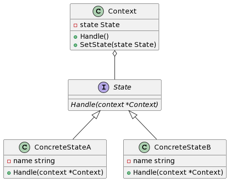

## 1. 什么是状态模式
状态模式是一种行为型设计模式，用于解决对象在不同状态下有不同行为的问题。它将对象的行为封装到不同的状态类中，使得对象在运行时可以根据其内部状态的变化而改变行为。

## 2. 状态模式的特点和优点
状态模式的主要特点和优点如下：

- 将复杂的状态判断逻辑封装到不同的状态类中，增强了代码的可维护性。
- 开闭原则：通过添加新的状态类，可以方便地增加新的状态。
- 各个状态类之间相互独立，修改一个状态类不会影响其他状态类的代码。
- 简化了条件语句的判断逻辑，提高了代码的可读性和可扩展性。

## 3. 状态模式的实际应用场景举例
状态模式在现实生活中有很多应用场景，例如：

-交通信号灯：根据不同的状态，交通信号灯会发出不同的光信号。
-订单状态管理：订单在不同的状态下有不同的操作和行为,如已支付、已发货、已签收等。

## 4. Golang中的状态模式实现
### 4.1 UML类图


### 4.2 示例介绍
在这个示例中，我们将要实现一个简单的订单状态管理系统。订单有多个状态，如已支付、已发货、已签收等。根据不同的状态，订单有不同的操作和行为。

### 4.3 实现案例演示
#### 4.3.1 定义订单状态接口和具体状态类
```go
// 状态接口
type State interface {
    Handle(context *Context)
}

// 具体状态类A
type ConcreteStateA struct {
    name string
}

func (c *ConcreteStateA) Handle(context *Context) {
    fmt.Println("当前状态为：", c.name)
    fmt.Println("执行具体状态A的操作...")
    context.SetState(&ConcreteStateB{name: "具体状态B"})
}

// 具体状态类B
type ConcreteStateB struct {
    name string
}

func (c *ConcreteStateB) Handle(context *Context) {
    fmt.Println("当前状态为：", c.name)
    fmt.Println("执行具体状态B的操作...")
    context.SetState(&ConcreteStateA{name: "具体状态A"})
}
```
#### 4.3.2 定义订单上下文类和状态切换方法
```go
// 上下文类
type Context struct {
    state State
}

// 处理订单
func (c *Context) Handle() {
    c.state.Handle(c)
}

// 设置状态
func (c *Context) SetState(state State) {
    c.state = state
}
```
#### 4.3.3 实现具体状态类的切换方法
```go
// 具体状态类A的切换方法
func (c *ConcreteStateA) SwitchStateB(context *Context) {
    context.SetState(&ConcreteStateB{name: "具体状态B"})
}

// 具体状态类B的切换方法
func (c *ConcreteStateB) SwitchStateA(context *Context) {
    context.SetState(&ConcreteStateA{name: "具体状态A"})
}
```
#### 4.3.4 使用状态模式管理订单状态
```go
func main() {
    // 初始化订单上下文
    context := &Context{
        state: &ConcreteStateA{name: "具体状态A"},
    }

    // 处理订单
    context.Handle()

    // 切换状态
    context.state.(*ConcreteStateA).SwitchStateB(context) // 切换到具体状态B
    context.Handle()

    context.state.(*ConcreteStateB).SwitchStateA(context) // 切换回具体状态A
    context.Handle()
}
```

## 总结
通过使用状态模式，我们可以更好地管理对象在不同状态下的行为，提高代码的可复用性和可扩展性。在本教程中，我们以一个简单的订单管理系统为例，演示了如何使用Golang实现状态模式，并给出了完整的代码实现和UML类图。希望本教程能够帮助您更好地理解和应用状态模式。