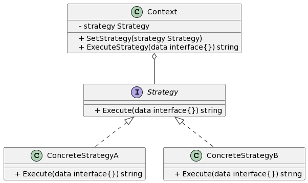

## 1. 什么是策略模式
策略模式是一种行为型设计模式，它允许我们根据不同的情况选择不同的算法或行为。它将不同的算法封装在独立的策略类中，并使这些策略类可以互相替换。通过使用策略模式，我们可以在运行时动态地改变一个对象的行为，而无需直接修改对象的结构。

## 2. 策略模式的特点和优点
策略模式有以下几个特点和优点：

- 策略类可以独立变化，增加新的策略类对原有代码没有影响，符合开闭原则。
- 客户端可以根据需要选择不同的策略，符合单一职责原则。
- 策略模式提供了可重用的算法或行为，可以避免代码重复。
- 策略模式提供了一种更好的组织代码的方式，使代码更加清晰和易于维护。

## 3. 策略模式的实际应用场景举例
策略模式广泛应用于以下场景：

- 不同的支付方式，例如支付宝、微信支付等。
- 不同的排序算法，例如冒泡排序、快速排序等。
- 不同的日志记录方式，例如控制台输出、文件输出等。

## 4. Golang中的策略模式实现
在本节中，我们将使用Golang实现策略模式，并给出相应的示例、UML类图和代码注释。

### 4.1. UML类图
以下是Golang策略模式的UML类图：



### 4.2. 示例介绍
通过上述UML类图描述，我们可以看到策略模式的三个角色：Strategy接口、具体策略类（例如ConcreteStrategyA和ConcreteStrategyB）以及上下文类Context。

在本示例中，我们将以电商系统订单支付方式的选择为例进行讲解。客户端根据不同的支付方式选择对应的策略（ConcreteStrategyA或ConcreteStrategyB），然后调用上下文类的方法进行支付。

### 4.3. 实现步骤1: 定义策略接口和具体策略类
首先，我们需要定义一个策略接口Strategy，其中包含一个Execute(data interface{}) string方法用于执行具体的策略。
```go
type Strategy interface {
    Execute(data interface{}) string
}

type ConcreteStrategyA struct{}

func (s *ConcreteStrategyA) Execute(data interface{}) string {
    // 具体策略A的执行逻辑
}

type ConcreteStrategyB struct{}

func (s *ConcreteStrategyB) Execute(data interface{}) string {
    // 具体策略B的执行逻辑
}
```
### 4.4. 实现步骤2: 实现上下文类
接下来，我们需要实现上下文类Context，该类封装了具体的策略对象，并提供SetStrategy(strategy Strategy)方法用于设置策略对象，以及ExecuteStrategy(data interface{}) string方法用于执行具体的策略。
```go
type Context struct {
    strategy Strategy
}

func (c *Context) SetStrategy(strategy Strategy) {
    c.strategy = strategy
}

func (c *Context) ExecuteStrategy(data interface{}) string {
    if c.strategy == nil {
        // 默认策略的执行逻辑
    } else {
        return c.strategy.Execute(data)
    }
}
```
### 4.5. 实现步骤3: 使用策略模式完成实际业务逻辑
最后，我们可以在客户端中使用策略模式完成实际的业务逻辑。
```go
func main() {
    context := &Context{}

    // 通过SetStrategy方法设置具体策略A
    context.SetStrategy(&ConcreteStrategyA{})
    result := context.ExecuteStrategy("支付宝支付")

    // 通过SetStrategy方法设置具体策略B
    context.SetStrategy(&ConcreteStrategyB{})
    result = context.ExecuteStrategy("微信支付")
}
```

## 结论
通过以上示例代码，我们学习了如何在Golang中实现策略模式。策略模式可以帮助我们根据不同的情况选择不同的算法或行为，并且提供了一种更好的代码组织方式，使代码更加清晰和易于维护。在实际开发中，合理地使用策略模式可以有效提高代码的可扩展性和可维护性。