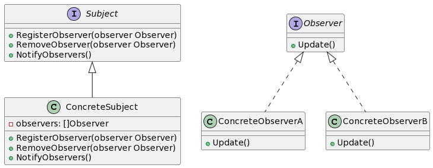

## 1. 什么是观察者模式
观察者模式是一种行为型设计模式，用于在对象之间建立一对多的依赖关系。具体而言，当一个对象（称为主题或者被观察者）发生改变时，它的所有依赖对象（称为观察者）都会得到通知并自动更新。该模式允许主题和观察者之间的松耦合，从而实现对象间的解耦和灵活性。

## 2. 观察者模式的特点和优点
观察者模式具有以下特点和优点：

- 主题和观察者之间是松耦合的，主题不需要知道观察者的具体实现细节。
- 可以动态地添加和删除观察者，使系统更加灵活。
- 主题和观察者之间遵循开闭原则，可以独立地进行扩展和重用。
- 可以实现一对多的依赖关系，一个主题可以有多个观察者。

## 3. 观察者模式的实际应用场景举例
观察者模式在现实生活中有很多应用场景，例如：

- GUI界面中的事件处理机制，如按钮被点击时的处理动作。
- 股票市场的实时行情推送。
- 电商平台中的促销活动通知。

## 4. Golang中的观察者模式实现
### 4.1 UML类图


### 4.2 示例介绍
在这个示例中，我们有一个主题（Subject）和两个观察者（ObserverA和ObserverB）。主题可以注册、注销和通知观察者。

### 4.3 实现步骤
#### 4.3.1 创建主题接口和具体主题类
```go
type Subject interface {
    RegisterObserver(observer Observer)
    RemoveObserver(observer Observer)
    NotifyObservers()
}

type ConcreteSubject struct {
    observers []Observer
}

// 注册监听对象
func (subject *ConcreteSubject) RegisterObserver(observer Observer) {
    subject.observers = append(subject.observers, observer)
}

// 删除监听对象
func (subject *ConcreteSubject) RemoveObserver(observer Observer) {
    for i, obs := range subject.observers {
        if obs == observer {
            subject.observers = append(subject.observers[:i], subject.observers[i+1:]...)
            break
        }
    }
}

// 触发事件通知
func (subject *ConcreteSubject) NotifyObservers() {
    for _, observer := range subject.observers {
        observer.Update()
    }
}
```
#### 4.3.2 创建观察者接口和具体观察者类
```go
type Observer interface {
    Update()
}

type ConcreteObserverA struct {}

func (observer *ConcreteObserverA) Update() {
    fmt.Println("Observer A is notified.")
}

type ConcreteObserverB struct {}

func (observer *ConcreteObserverB) Update() {
    fmt.Println("Observer B is notified.")
}
```
### 4.4 示例代码演示
```go
func main() {
    subject := &ConcreteSubject{}
    observerA := &ConcreteObserverA{}
    observerB := &ConcreteObserverB{}

    subject.RegisterObserver(observerA)
    subject.RegisterObserver(observerB)

    subject.NotifyObservers()

    subject.RemoveObserver(observerA)

    subject.NotifyObservers()
}
```
输出结果：
```
Observer A is notified.
Observer B is notified.
Observer B is notified.
```
上述示例代码演示了观察者模式的具体实现，主题（ConcreteSubject）注册了两个观察者（ObserverA和ObserverB），然后通知了这两个观察者。之后，从主题中注销了观察者A，并再次通知剩下的观察者B。## 