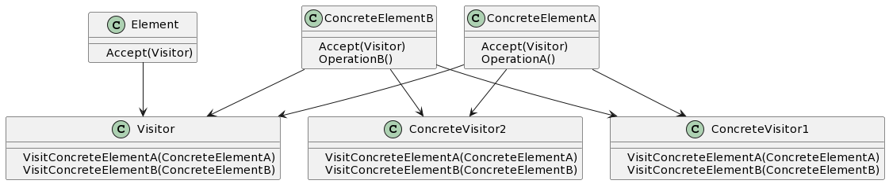

## 1. 什么是访问者模式
访问者模式是一种行为型设计模式，通过将数据结构与数据操作分离，实现对数据的不同操作而不改变数据结构。访问者模式可以将数据结构与操作解耦，从而使操作更加灵活和可扩展。

## 2. 访问者模式的特点和优点
- 特点：
    - 将数据结构与操作解耦，可实现不同操作的动态绑定。
    - 添加新的操作非常方便，无需修改已有代码。
- 优点：
    - 增加新的操作非常方便，符合开闭原则。
    - 可以对数据结构进行复杂的操作，而无需改变数据结构本身。

## 3. 访问者模式的实际应用场景举例
访问者模式在实际应用中具有广泛的应用场景，例如：

- 编译器的语法树分析阶段，可以使用访问者模式来实现不同的语法检查和代码转换操作。
- 数据库查询优化器中，可以使用访问者模式来实现对查询树的不同优化操作。

## 4. Golang中的访问者模式实现
### 4.1 UML类图


### 4.2 示例介绍
访问者模式中包含以下角色：

- Element 定义了一个接受访问者的接口方法 Accept。
- ConcreteElementA 和 ConcreteElementB 是具体的元素类，实现了 Accept 方法，并定义了自己的操作方法。
- Visitor 是访问者接口，定义了访问具体元素的方法。
- ConcreteVisitor1 和 ConcreteVisitor2 是具体的访问者类，实现了访问具体元素的方法。

### 4.3 实现步骤1: 定义访问者接口和具体访问者
首先我们需要定义访问者接口和具体访问者类：
```go
type Visitor interface {
    VisitConcreteElementA(element ConcreteElementA)
    VisitConcreteElementB(element ConcreteElementB)
}

type ConcreteVisitor1 struct{}

func (v *ConcreteVisitor1) VisitConcreteElementA(element ConcreteElementA) {
    // 执行对ConcreteElementA的操作
}

func (v *ConcreteVisitor1) VisitConcreteElementB(element ConcreteElementB) {
    // 执行对ConcreteElementB的操作
}

type ConcreteVisitor2 struct{}

func (v *ConcreteVisitor2) VisitConcreteElementA(element ConcreteElementA) {
    // 执行对ConcreteElementA的操作
}

func (v *ConcreteVisitor2) VisitConcreteElementB(element ConcreteElementB) {
    // 执行对ConcreteElementB的操作
}
```
### 4.4 实现步骤2: 定义元素接口和具体元素类
接下来我们定义元素接口和具体元素类：
```go
type Element interface {
    Accept(visitor Visitor)
}

type ConcreteElementA struct{}

func (e *ConcreteElementA) Accept(visitor Visitor) {
    visitor.VisitConcreteElementA(e)
}

func (e *ConcreteElementA) OperationA() {
    // 具体元素A的操作逻辑
}

type ConcreteElementB struct{}

func (e *ConcreteElementB) Accept(visitor Visitor) {
    visitor.VisitConcreteElementB(e)
}

func (e *ConcreteElementB) OperationB() {
    // 具体元素B的操作逻辑
}
```
### 4.5 实现步骤3: 定义对象结构和具体对象结构
然后我们定义对象结构和具体对象结构：
```go
type ObjectStructure struct {
    elements []Element
}

func (os *ObjectStructure) Attach(element Element) {
    os.elements = append(os.elements, element)
}

func (os *ObjectStructure) Detach(element Element) {
    for i, e := range os.elements {
        if e == element {
            os.elements = append(os.elements[:i], os.elements[i+1:]...)
            break
        }
    }
}

func (os *ObjectStructure) Accept(visitor Visitor) {
    for _, element := range os.elements {
        element.Accept(visitor)
    }
}
```
### 4.6 实现步骤4: 在对象结构中实现元素的访问接口
在对象结构中实现元素的访问接口，将访问操作委托给访问者：
```go
func (os *ObjectStructure) Accept(visitor Visitor) {
    for _, element := range os.elements {
        element.Accept(visitor)
    }
}
```
### 4.7 实现步骤5: 定义客户端代码来使用访问者模式
最后，我们定义客户端代码来使用访问者模式：
```go
func main() {
    elementA := &ConcreteElementA{}
    elementB := &ConcreteElementB{}

    visitor1 := &ConcreteVisitor1{}
    visitor2 := &ConcreteVisitor2{}

    objectStructure := &ObjectStructure{}
    objectStructure.Attach(elementA)
    objectStructure.Attach(elementB)

    objectStructure.Accept(visitor1)
    objectStructure.Accept(visitor2)
}
```

## 结论
通过访问者模式，我们可以将数据结构与数据操作进行解耦，使得操作更加灵活和可扩展。在Golang中实现访问者模式，我们可以使用接口和函数的组合来实现动态绑定，从而达到解耦的目的。无论是语法树分析还是数据库查询优化，访问者模式都能有效地应用于实际场景中。