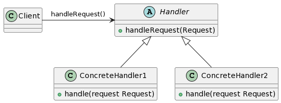

## 1. 什么是责任链模式
责任链模式是一种行为设计模式，它通过将请求的发送者和接收者解耦，使多个对象都有机会处理这个请求。每个接收者都包含对另一个接收者的引用，如果自己无法处理该请求，就会将请求转发给下一个接收者，直到请求被处理或者到达链的末尾。

## 2. 责任链模式的特点和优点
责任链模式的特点和优点如下：

- 解耦发送者和接收者：发送者无需关心请求是由哪个接收者处理，也不需要知道链中的具体处理者。
- 灵活性：可以动态地向责任链中添加、移除或者重新排序处理者，无需修改发送者和接收者的代码。
- 可扩展性：容易扩展责任链，可以方便地添加新的具体处理者。
- 单一职责原则：每个具体处理者都只需要关心自己的处理逻辑。
- 可配置性：可以根据需要配置链中的处理者，使得不同的请求有不同的处理者链。

## 3. 责任链模式的实际应用场景举例
责任链模式在实际应用中有很多场景，例如：

- Web应用中的请求处理：可以使用责任链模式来处理不同类型的请求，如身份验证、日志记录、权限验证等。
- 错误处理：可以使用责任链模式来处理错误，每个处理者负责处理一种类型的错误，并根据需要将错误转发给下一个处理者。
- 事件处理：可以使用责任链模式来处理不同类型的事件，如用户点击事件、网络请求事件等。

## 4. Golang中的责任链模式实现
### 4.1 UML类图



### 4.2 示例介绍
在上面的UML类图中，我们定义了一个抽象处理器（Handler）和两个具体处理器（ConcreteHandler1和ConcreteHandler2）。客户端（Client）通过调用处理器的handleRequest方法来发起请求。

### 4.3 实现步骤1: 定义抽象处理器接口
```go
type Handler interface {
    HandleRequest(request Request) error
    SetNext(handler Handler)
}

type Request interface {
   Condition bool
}
```
抽象处理器接口定义了处理请求的方法HandleRequest和设置下一个处理器的方法SetNext。

### 4.4 实现步骤2: 实现具体处理器类
```go
type ConcreteHandler1 struct {
    next Handler
}

func (h *ConcreteHandler1) HandleRequest(request Request) error {
    // 处理请求的逻辑
    if request.Condition {
        // 处理请求的代码
        return nil
    } else {
        if h.next != nil {
            return h.next.HandleRequest(request)
        }
        return errors.New("No handler found")
    }
}

func (h *ConcreteHandler1) SetNext(handler Handler) {
    h.next = handler
}

type ConcreteHandler2 struct {
    next Handler
}

func (h *ConcreteHandler2) HandleRequest(request Request) error {
    // 处理请求的逻辑
    if request.Condition {
        // 处理请求的代码
        return nil
    } else {
        if h.next != nil {
            return h.next.HandleRequest(request)
        }
        return errors.New("No handler found")
    }
}

func (h *ConcreteHandler2) SetNext(handler Handler) {
    h.next = handler
}
```
具体处理器类实现了抽象处理器接口，并重写了HandleRequest和SetNext方法。

### 4.5 实现步骤3: 构建责任链
```go
handler1 := &ConcreteHandler1{}
handler2 := &ConcreteHandler2{}

handler1.SetNext(handler2)
```
通过将具体处理器实例化并设置为下一个处理器，构建了一个责任链。

### 4.6 实现步骤4: 客户端代码
```go
func main() {
    handler := &ConcreteHandler1{}

    // 构建责任链
    handler.SetNext(&ConcreteHandler2{})

    // 发起请求
    handler.HandleRequest(Request{Condition: true})
}
```
在客户端代码中，实例化了一个具体处理器并设置下一个处理器，然后调用HandleRequest发起请求。