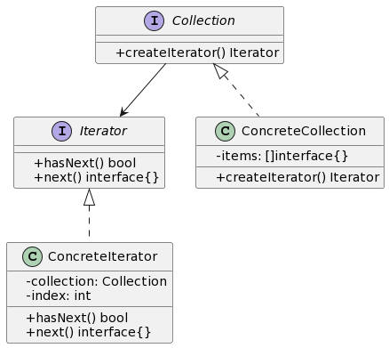

## 1. 什么是迭代器模式
迭代器模式是一种行为设计模式，它提供一种统一的方法来遍历一个聚合对象中的各个元素，而无需暴露该聚合对象的内部表示。

## 2. 迭代器模式的特点和优点
迭代器模式的特点和优点如下：

- 可以隐藏集合对象的内部结构，使得遍历算法和集合对象解耦。
- 提供了一种统一的方式来遍历不同类型的集合对象。
- 简化了客户端代码，使得客户端代码更加清晰、简洁。
- 可以提供迭代器的不同实现方式，以适应不同的遍历需求。

## 3. 迭代器模式的实际应用场景举例
迭代器模式在实际应用中有很多场景，例如：

- 遍历一个数据库查询结果集。
- 遍历一个文件系统中的文件和文件夹。
- 遍历一个集合中的元素。

## 4. Golang中的迭代器模式实现
### 4.1 UML类图


### 4.2 示例介绍
在上面的UML类图中，我们有两个主要的角色：Iterator（迭代器）和Collection（可迭代对象）。

- Iterator（迭代器）定义了遍历集合对象的接口，包括 hasNext() 方法用于判断是否还有下一个元素，以及 next() 方法用于获取下一个元素。
- ConcreteIterator（具体迭代器）是 Iterator（迭代器）的具体实现类，实现了 hasNext() 和 next() 方法。
- Collection（可迭代对象）定义了创建迭代器对象的接口 createIterator()。
- ConcreteCollection（具体可迭代对象）是 Collection（可迭代对象）的具体实现类，实现了 createIterator() 方法。

### 4.3 实现步骤
下面我们将逐步实现迭代器模式的 Golang 版本。

#### 4.3.1 定义迭代器接口和具体迭代器类
```go
type Iterator interface {
    HasNext() bool
    Next() interface{}
}

type ConcreteIterator struct {
    collection *ConcreteCollection
    index      int
}

func (it *ConcreteIterator) HasNext() bool {
    if it.index < len(it.collection.items) {
        return true
    }
    return false
}

func (it *ConcreteIterator) Next() interface{} {
    if it.HasNext() {
        item := it.collection.items[it.index]
        it.index++
        return item
    }
    return nil
}
```
#### 4.3.2 定义可迭代对象接口和具体可迭代对象类
```go
type Collection interface {
    CreateIterator() Iterator
}

type ConcreteCollection struct {
    items []interface{}
}

func (c *ConcreteCollection) CreateIterator() Iterator {
    return &ConcreteIterator{
        collection: c,
        index:      0,
    }
}
```
#### 4.3.3 在可迭代对象类中实现迭代器生成逻辑
```go
func main() {
    collection := &ConcreteCollection{
        items: []interface{}{"Golang", "Python", "Java"},
    }

    iterator := collection.CreateIterator()
    for iterator.HasNext() {
        item := iterator.Next()
        fmt.Println(item)
    }
}
```
运行以上代码，输出如下：
```
Golang
Python
Java
```
在以上代码中，我们定义了一个 ConcreteCollection 类，它实现了 Collection 接口，其中的 CreateIterator() 方法返回一个迭代器对象。我们在 main() 函数中使用这个迭代器对象进行遍历操作。

### 4.4 实现步骤扩展：使用生成器函数简化迭代器实现
在 Golang 中，我们可以使用生成器函数(yield)来简化迭代器的实现。下面是一个使用生成器函数的例子：

```go
func GenerateItems() <-chan interface{} {
    items := []interface{}{"Golang", "Python", "Java"}

    out := make(chan interface{})
    go func() {
        defer close(out)
        for _, item := range items {
            out <- item
        }
    }()
    return out
}

func main() {
    for item := range GenerateItems() {
        fmt.Println(item)
    }
}
```
在以上代码中，我们定义了一个 GenerateItems() 函数，它返回一个只读通道 (<-chan)，在这个函数中使用 yield 将元素依次发送到通道中。在 main() 函数中使用 range 遍历这个只读通道，并输出元素值。

这样，我们就使用生成器函数简化了迭代器的实现。