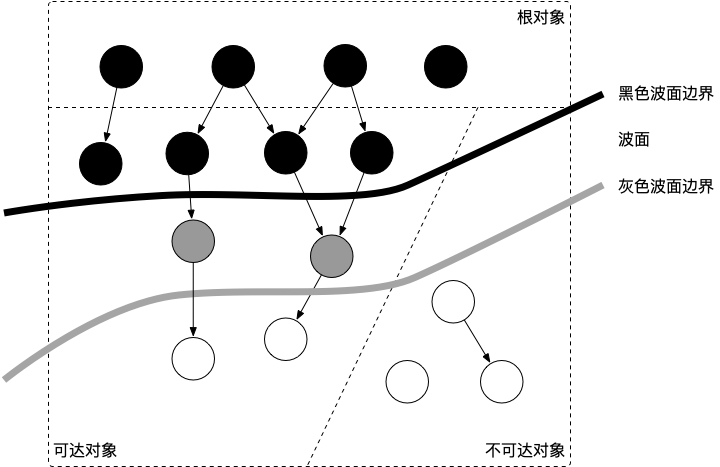
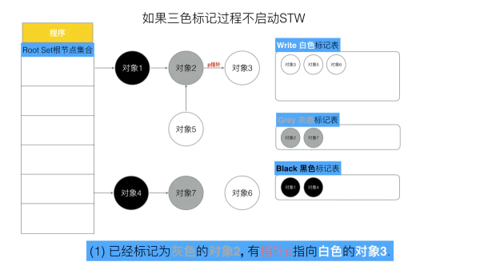
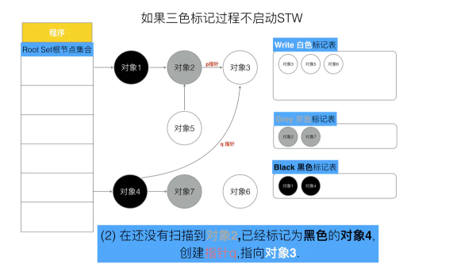
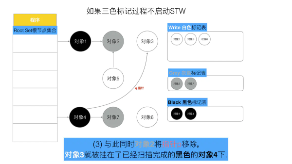
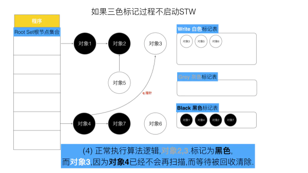
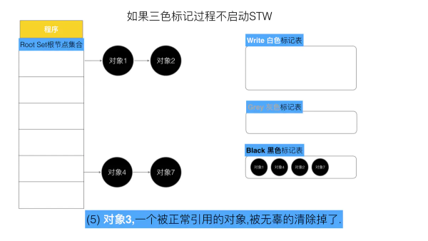
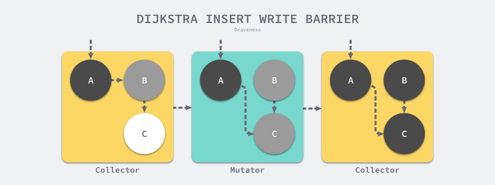
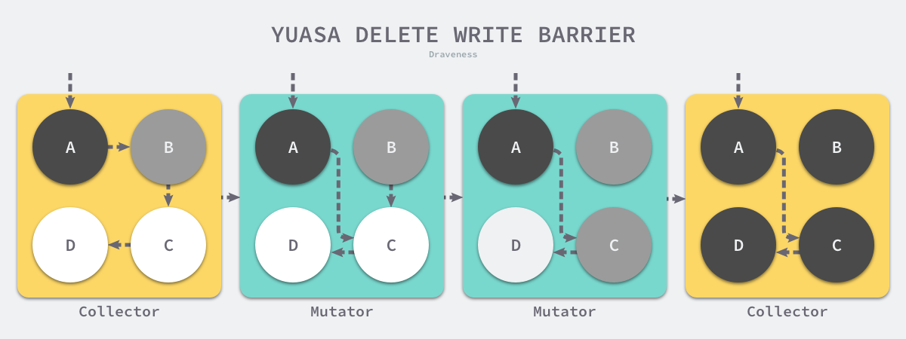

# gc垃圾回收

`垃圾回收`(Garbage Collection，简称GC)是编程语言中提供的自动的`内存管理机制`，自动释放不需要的对象，让出存储器资源，无需程序员手动执行。
`Golang`中的垃圾回收主要应用`三色标记法`，GC过程和其他用户goroutine可并发运行，但需要一定时间的STW(stop the world)，STW的过程中，CPU不执行用户代码，全部用于垃圾回收，这个过程的影响很大，Golang进行了多次的迭代优化来解决这个问题。

## 一、Go 历史各个版本在 GC 方面的改进

- Go 1：串行三色标记清扫
- Go 1.3：并行清扫，标记过程需要 STW，停顿时间在约几百毫秒
- Go 1.5：并发标记清扫，停顿时间在一百毫秒以内
- Go 1.6：使用 bitmap 来记录回收内存的位置，大幅优化垃圾回收器自身消耗的内存，停顿时间在十毫秒以内
- Go 1.7：停顿时间控制在两毫秒以内
- Go 1.8：混合写屏障，停顿时间在半个毫秒左右
- Go 1.9：彻底移除了栈的重扫描过程
- Go 1.12：整合了两个阶段的 Mark Termination，但引入了一个严重的 GC Bug 至今未修（见问题 20），尚无该 Bug 对 GC 性能影响的报告
- Go 1.13：着手解决向操作系统归还内存的，提出了新的 Scavenger
- Go 1.14：替代了仅存活了一个版本的 scavenger，全新的页分配器，优化分配内存过程的速率与现有的扩展性问题，并引入了异步抢占，解决了由于密集循环导致的 STW 时间过长的问题

## 二、常见的GC

### 1.引用计数-Python、Objective-C ，javascript，PHP等均为引用计数式 GC。

首先, 对对象的引用数量进行管理, 什么时候会更新呢?

创建对象: 新建一个对象(对这个新的对象引用数量+1)

更新指针: 将一个指向A对象的指针重新指向B对象(将A对象引用数量-1, B对象引用数量+1)

当引用计数归零时立即回收。 

### 2.标记清除 javascript，go

世界上首个值得纪念的GC算法是GC标记-清除算法（Mark Sweep GC）。

自其问世以来，一直到半个世纪后的今天，它依然是各种处理程序所用的伟大的算法。

由`标记阶段`和`清除阶段`组成。`标记阶段`是把所有活动对象都做上标记。`清除阶段`是把那些没有标记的对象，也就是非活动对象回收。通过这两个阶段，就可以令不能利用的空间重新得到利用。

### 3.分代收集

这种算法会根据对象存活周期的不同将内存划分为几块, 如JVM中的 新生代、老年代、永久代. 

这样就可以根据各年代特点分别采用最适当的GC算法:

在新生代: 每次垃圾收集都能发现大批对象已死, 只有少量存活. 因此选用复制算法, 只需要付出少量存活对象的复制成本就可以完成收集.

在老年代: 因为对象存活率高、没有额外空间对它进行分配担保,就必须采用“标记—清理”或“标记—整理”算法来进行回收,不必进行内存复制,且直接腾出空闲内存.

### 4.三色标记

 详情见下文。

 ## 三、三色标记

1.在垃圾收集器(GC)开始工作时，程序中不存在任何的黑色对象，均为白色对象，垃圾收集的根对象会被标记成灰色，垃圾收集器只会从灰色对象集合中取出对象开始扫描，当灰色集合中不存在任何对象时，标记阶段就会结束。

> 黑色（确认存活）:代表存活的对象  
> 灰色（波面）:代表存活的对象  
> 白色（确认死亡）:代表需要清理的对象

2.没有STW的三色标记

可以看出，有两个问题, 在三色标记法中,是不希望被发生的

● 条件1: 一个白色对象被黑色对象引用(`白色被挂在黑色下`)

● 条件2: 灰色对象与它之间的可达关系的白色对象遭到破坏(灰色同时丢了该白色)

当以上两个条件同时满足时, 就会出现对象丢失现象!

为了防止这种现象的发生，最简单的方式就是STW，直接禁止掉其他用户程序对对象引用关系的干扰，但是`STW的过程有明显的资源浪费，对所有的用户程序都有很大影响`，如何能在保证对象不丢失的情况下合理的尽可能的提高GC效率，减少STW时间呢, 那么我们只要使用一个机制,来破坏上面的两个条件就可以了.

## 四、屏障保护

内存屏障技术是一种屏障指令，它可以让 CPU 或者编译器在执行内存相关操作时遵循特定的约束。

  讲清楚写屏障，就需要理解三色标记清除算法中的`强弱不变性`以及`赋值器的颜色`，理解他们需要一定的抽象思维。写屏障是一个在并发垃圾回收器中才会出现的概念，垃圾回收器的正确性体现在：`不应出现对象的丢失，也不应错误的回收还不需要回收的对象`。

* 可以证明，当以下两个条件同时满足时会破坏垃圾回收器的正确性：

    * 条件 1: 赋值器修改对象图，导致某一黑色对象引用白色对象；

    * 条件 2: 从灰色对象出发，到达白色对象的、未经访问过的路径被赋值器破坏。

* 只要能够避免其中任何一个条件，则不会出现对象丢失的情况，因为：

    * 如果条件 1 被避免，则所有白色对象均被灰色对象引用，没有白色对象会被遗漏；

    * 如果条件 2 被避免，即便白色对象的指针被写入到黑色对象中，但从灰色对象出发，总存在一条没有访问过的路径，从而找到到达白色对象的路径，白色对象最终不会被遗漏。

* 我们不妨将三色不变性所定义的波面根据这两个条件进行削弱：

    * 当满足原有的三色不变性定义（或上面的两个条件都不满足时）的情况称为`强三色不变性`（strong tricolor invariant）

    * 当赋值器令黑色对象引用白色对象时（满足条件 1 时）的情况称为`弱三色不变性`（weak tricolor invariant）

### 1.插入写屏障

Dijkstra 在 1978 年提出了插入写屏障，通过如下所示的写屏障，用户程序和垃圾收集器可以在交替工作的情况下保证程序执行的正确性

假设我们在应用程序中使用 Dijkstra 提出的插入写屏障，在一个垃圾收集器和用户程序交替运行的场景中会出现如上图所示的标记过程：

垃圾收集器将根对象指向 A 对象标记成黑色并将 A 对象指向的对象 B 标记成灰色；

用户程序修改 A 对象的指针，将原本指向 B 对象的指针指向 C 对象，这时触发写屏障将 C 对象标记成灰色；

垃圾收集器依次遍历程序中的其他灰色对象，将它们分别标记成黑色；

Dijkstra 的插入写屏障是一种相对保守的屏障技术，它会将有存活可能的对象都标记成灰色以满足强三色不变性。在如上所示的垃圾收集过程中，实际上不再存活的 B 对象最后没有被回收；而如果我们在第二和第三步之间将指向 C 对象的指针改回指向 B，垃圾收集器仍然认为 C 对象是存活的，这些被错误标记的垃圾对象只有在下一个循环才会被回收。

插入式的 Dijkstra 写屏障虽然实现非常简单并且也能保证强三色不变性，但是它也有明显的缺点。因为栈上的对象在垃圾收集中也会被认为是根对象，不能引入写屏障，当成百上千个goroutine会大幅度增加写入指针的额外开销。所以写屏障只会针对堆进行限制。而栈则是扫描完成后，STW程序，进行栈上的三个标记。

### 2.删除写屏障

Yuasa 在 1990 年的论文 Real-time garbage collection on general-purpose machines 中提出了删除写屏障，因为一旦该写屏障开始工作，它会保证开启写屏障时堆上所有对象的可达，所以也被称作快照垃圾收集（Snapshot GC）

假设我们在应用程序中使用 Yuasa 提出的删除写屏障，在一个垃圾收集器和用户程序交替运行的场景中会出现如上图所示的标记过程：

垃圾收集器将根对象指向 A 对象标记成黑色并将 A 对象指向的对象 B 标记成灰色；

用户程序将 A 对象原本指向 B 的指针指向 C，触发删除写屏障，但是因为 B 对象已经是灰色的，所以不做改变；

用户程序将 B 对象原本指向 C 的指针删除，触发删除写屏障，白色的 C 对象被涂成灰色；

垃圾收集器依次遍历程序中的其他灰色对象，将它们分别标记成黑色；

Yuasa 删除写屏障通过对 C 对象的着色，保证了 C 对象和下游的 D 对象能够在这一次垃圾收集的循环中存活，避免发生悬挂指针以保证用户程序的正确性。

缺点是开始收集器时需要STW快照全局对象，赋值器引用时会传给收集器，收集器进行屏障操作，被删除的节点变灰，保证后续链路运行。

### 3.混合写屏障

操作流程

1、GC开始将栈上的对象全部扫描并标记为黑色(之后不再进行第二次重复扫描，无需STW)，

2、GC期间，任何在栈上创建的新对象，均为黑色。

3、被删除的对象标记为灰色。

4、被添加的对象标记为灰色。

`该写屏障会将被覆盖的对象标记成灰色并在当前栈没有扫描时将新对象也标记成灰色`了;移除栈的重扫描过程，除了引入混合写屏障之外，在垃圾收集的标记阶段，我们还需要将创建的所有新对象都标记成黑色，防止新分配的栈内存和堆内存中的对象被错误地回收，因为栈内存在标记阶段最终都会变为黑色，所以不再需要重新扫描栈空间。堆内存采用写屏障即可。

## 五、触发gc的机制

Go 语言中对 GC 的触发时机存在两种形式：

- 1.`主动触发`，通过调用 runtime.GC 来触发 GC，此调用阻塞式地等待当前 GC 运行完毕。 

- 2.`被动触发`，分为两种方式： 

    - 使用系统监控，当超过两分钟没有产生任何 GC 时，强制触发 GC。 

    - 使用步调（Pacing）算法，其核心思想是控制内存增长的比例。 

步调算法可以通过gogc传参设置量控制gc的时间。也是go中唯一对外开放的配置gc的参数。默认值为100，也就是达到百分百后触发gc机制

## 六、Golang GC的细节

* 增量垃圾收集 — 增量地标记和清除垃圾，降低应用程序暂停的最长时间；
* 并发垃圾收集 — 利用多核的计算资源，在用户程序执行时并发标记和清除垃圾；

### 1.增量

传统的垃圾收集算法会在垃圾收集的执行期间暂停应用程序，一旦触发垃圾收集，垃圾收集器会抢占 CPU 的使用权占据大量的计算资源以完成标记和清除工作，然而很多追求实时的应用程序无法接受长时间的 STW。增量式（Incremental）的垃圾收集是减少程序最长暂停时间的一种方案，它可以将原本时间较长的暂停时间切分成多个更小的 GC 时间片，虽然从垃圾收集开始到结束的时间更长了，但是这也减少了应用程序暂停的最大时间。

### 2.并发

并发（Concurrent）的垃圾收集不仅能够减少程序的最长暂停时间，还能减少整个垃圾收集阶段的时间，通过开启读写屏障、利用多核优势与用户程序并行执行，并发垃圾收集器确实能够减少垃圾收集对应用程序的影响。虽然并发收集器能够与用户程序一起运行，但是并不是所有阶段都可以与用户程序一起运行，部分阶段还是需要暂停用户程序的，不过与传统的算法相比，并发的垃圾收集可以将能够并发执行的工作尽量并发执行；当然，因为读写屏障的引入，并发的垃圾收集器也一定会带来额外开销，不仅会增加垃圾收集的总时间，还会影响用户程序，这是我们在设计垃圾收集策略时必须要注意的。

## 七、GC流程

当前版本的 Go 以 STW 为界限，可以将 GC 划分为五个阶段：

| 阶段	| 说明 |	赋值器状态 |
| :----------------------------------: | :-------------------------------: | :-------------------------------: |
|GCMark	| 标记准备阶段，为并发标记做准备工作，启动写屏障 |	STW
|GCMark |	扫描标记阶段，与赋值器并发执行，写屏障开启 |	并发
|GCMarkTermination |	标记终止阶段，保证一个周期内标记任务完成，停止写屏障 |	STW
|GCoff |	内存清扫阶段，将需要回收的内存归还到堆中，写屏障关闭 |	并发
|GCoff |	内存归还阶段，将过多的内存归还给操作系统，写屏障关闭 |	并发

## 八、GC问题及调优

### 1.避免大量goroutine的创建，提高CPU利用率

如果开启10000个goroutine。goroutine 的执行时间占其生命周期总时间非常短的一部分，但大部分时间都花费在调度器的等待上了（蓝色的部分）,说明同时创建大量 goroutine 对调度器产生的压力确实不小，我们不妨将这一产生速率减慢，一批一批地创建 goroutine

### 2.降低并复用已经申请的内存

sync.Pool 来复用频繁申请的对象。

尽量用append替代 `+` 运算符。`+` 运算符会随着字符串长度的增加而申请更多的内存，并将内容从原来的内存位置拷贝到新的内存位置，造成大量不必要的内存分配，先提前分配好足够的内存，再慢慢地填充，也是一种减少内存分配、复用内存形式的一种表现。减少GC压力

### 3.调整 GOGC

GC 的触发原则是由步调算法来控制的，其关键在于估计下一次需要触发 GC 时，堆的大小。可想而知，如果我们在遇到海量请求的时，为了避免 GC 频繁触发，是否可以通过将 GOGC 的值设置得更大，让 GC 触发的时间变得更晚，从而减少其触发频率，进而增加用户代码对机器的使用率呢？答案是肯定的。
