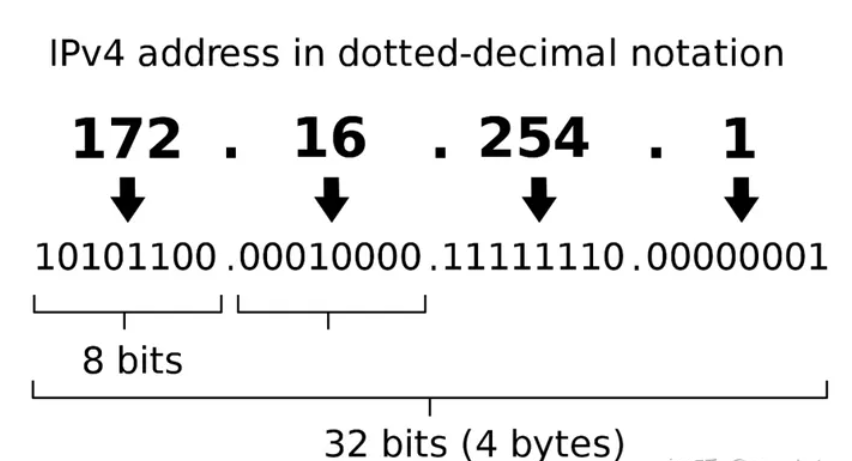
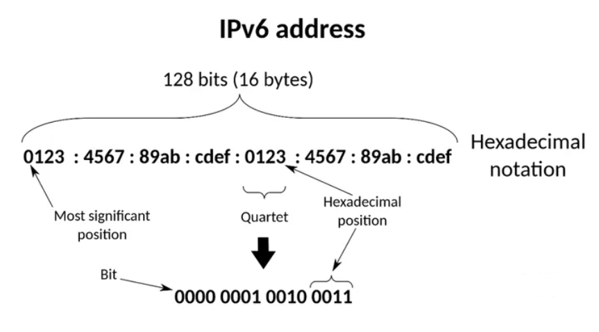
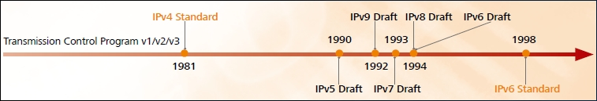
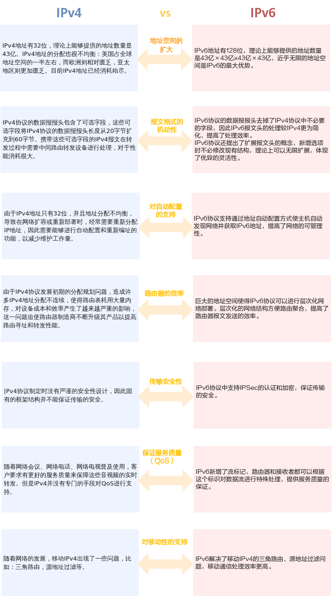

## 什么是IPv4和IPv6？

`IPv4`和`IPv6`是不同类型的`IP地址`。它们的主要用途相同，标记不同的用户，并且让用户能通过`IP`进行通信。主要区别在于`IPv6`是最新一代的`IP地址`。

## IPv4地址

`IPv4`地址的概念是在1980年代初期提出的。即使有新版本的IP地址，`IPv4`地址仍然是`Internet`用户使用最广泛的地址。通常，`IPv4`地址以`点`分隔`十进制`表示。每个部分代表一组构成`8位`地址方案的`8位`地址。

## IPv6地址

仔细观察，您会发现`IPv6`地址并不是一种全新的技术。它是`Internet`协议的最新版本，但它是在1998年开发的，旨在替换`IPv4`地址。`IPv6`地址使用以`冒号`分隔的`十六进制`数字。它分为`八`个`16位`块，构成一个`128位`地址方案。

### 为什么选择IPv6?

`IP（Internet Protocol）`是`TCP/IP协议`族中的网络层协议。（网络层协议主要工作是：借助路由表，负责处理IP数据报在网络中的传输。）`IPv4`协议是目前广泛部署的因特网协议。在因特网发展初期，`IPv4`以其协议简单、易于实现、互操作性好的优势而得到快速发展。但随着网络的迅猛发展，地址短缺问题的显现，`IETF`曾提出过`IPv6`、`IPv7`、`IPv8`、`IPv9`等四个草案，并希望其中的一种协议能够替代`IPv4`。经过充分的讨论，`IETF`最终选择`IPv6`并替代`IPv4`，而`IPv7`、`IPv8`、`IPv9`也就从此销声匿迹。

## IPv4 分类法

在互联网诞生之初，IP 地址就有一套标准的分类方法，因为当时互联网上的设备还很少，需要用到 IP 的企业和机构也没有那么多。谁知道后来互联网发展的如此迅猛，导致这种分类方式用起来不太合理。

这种分类方式是将 IP 地址分成 `A`、`B`、`C`、`D`、`E` 五类，每一类都有固定的前缀和应用场景。

一个 IP 地址占用 `32 bit` ，用`点`分`十进制`表示，例如 192.168.0.188，一个`点号`分隔一个 `8 bit`。

- IP 地址可分为 `A`、`B`、`C`、`D`、`E` 五类，`D`类是`广播地址`，`E`类是`保留地址`（未启用），所以重点关注 A、B、C类；
- `A、B、C` 类地址分为`网络地址`和`主机地址`，
  - `网络地址`表示`一个网络`
  - `主机地址`分给`具体的主机`
- 主机地址`全为 0` 和`全为 1` 的IP 有特殊用途，主机地址`全为 0` ，表示`网络号`，代表这个网络本身；主机地址`全为1`，表示`广播地址`，代表这个网络中的所有主机；
- 每个类别中（除了 D、E类），都有一些地址有特殊的用户，留作`私有地址`或者`回环地址`，例如`192.168`、`127.0.0.1`；
- 子网掩码全为1的位数就是网络地址的位数；

### A 类

A 类地址前 8 位为`网络地址`，后24位为`主机地址`。

`网络地址`中第一位`固定为0`，有从0~127共128个网络，每个网络可容纳$2^{24}-2$ =16,777,214台主机。但其实可用的 IP 地址从 [1.0.0.0]~[126.255.255.255]。

######  特殊网络地址：

但其中网络地址`全0`和`全1`的为`特殊地址`，不能使用，所以 `A` 类地址`可用的网络`数其实是 `126`个。

`127.0.0.1`，这个地址我们都非常熟悉，一般我们说这个是本地地址（`localhost`），其实这个地址准确的名称叫做「`回环地址`」，

可以理解为一个`虚拟网卡`，这个网卡只接收来自本机的数据包。

`0.0.0.0`，这个地址其实才代表本机，假设一台主机上有两个网卡，一个服务监听了` 0.0.0.0` 这个`IP` ，则发给这两个网卡的数据都会被监听到。

还有网络地址 `10 开头的地址`用作`内网地址`，从`10.0.0.0` ~ `10.255.255.255`。好多公司的内网 IP 都是10网段的。

###### 特殊主机地址：

每一个网络，主机地址全 0 和 全 1 的都是保留地址，所以每一个网络的主机数都是$2^n-2$ ，n 是主机地址的位数。

### B类

16位网络地址，16位主机地址。网络地址中前两位固定为 10，有$2^{14}$ =16384个网络，每个网络可容纳 $2^{16}-2$=65534台主机。

但其实可用的 IP 地址从`128.0.0.0`到`191.255.255.250`。

###### 特殊网络地址：

172.16.0.0~172.31.255.255是私有地址。

10101100.0001000.00000000.00000000 ~ 10101100.00011111.11111111.11111111

169.254.0.0到169.254.255.255是保留地址。

10101001.11111110.00000000.00000000 ~ 10101001.11111110.11111111.11111111

###### 特殊主机地址：

每一个网络，主机地址全 0 和 全 1 的都是保留地址，所以每一个网络的主机数都是 $2^n-2$ ，n 是主机号的位数。

### C类

24位网络地址，8位主机地址。网络地址中前三位固定为110，有 $2^{21}$ 个网络，每个网络可容纳 $2^{8}-2$ =254台主机。

但其实可用的 IP 地址从192.0.0.0~223.255.255.255。

###### 特殊网络地址：

192.168.0.0～192.168.255.255 留作私有地址使用。

### D类

D类地址以 `1110` 开始，并且不区分网络地址和主机地址，这类地址用作是广播地址，用来接收广播消息

### E类

E类地址以1111开始，保留地址，还未启用。

## IPv4 vs IPv6

由于网络迅速发展，`IPv4`的设计不足也日益明显，`IPv6`相比`IPv4`提供了一些新特性和改善措施：

