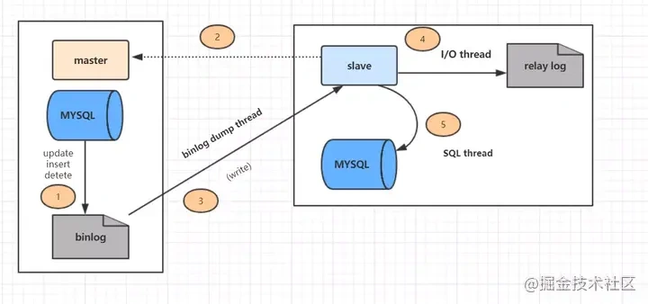
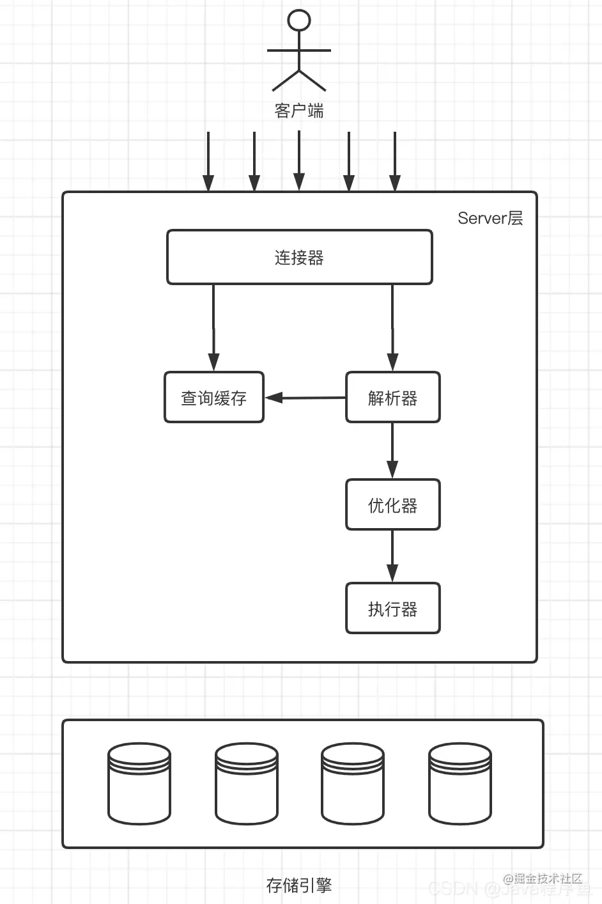
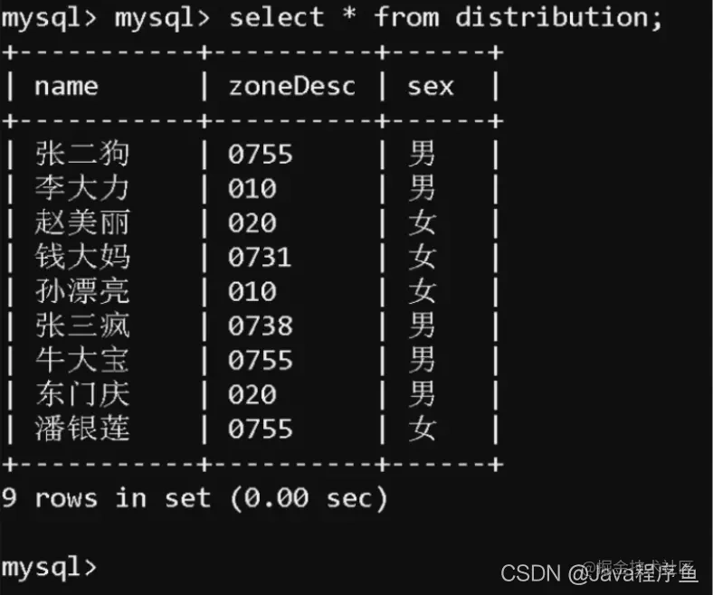
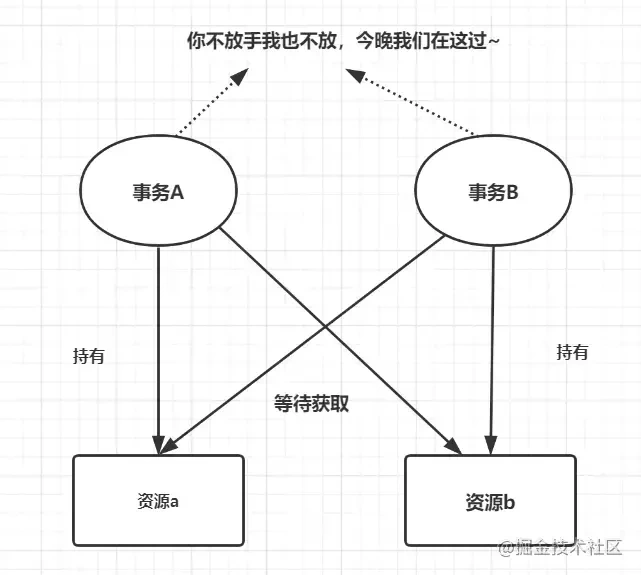
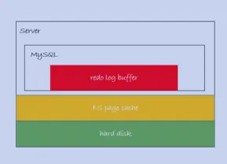
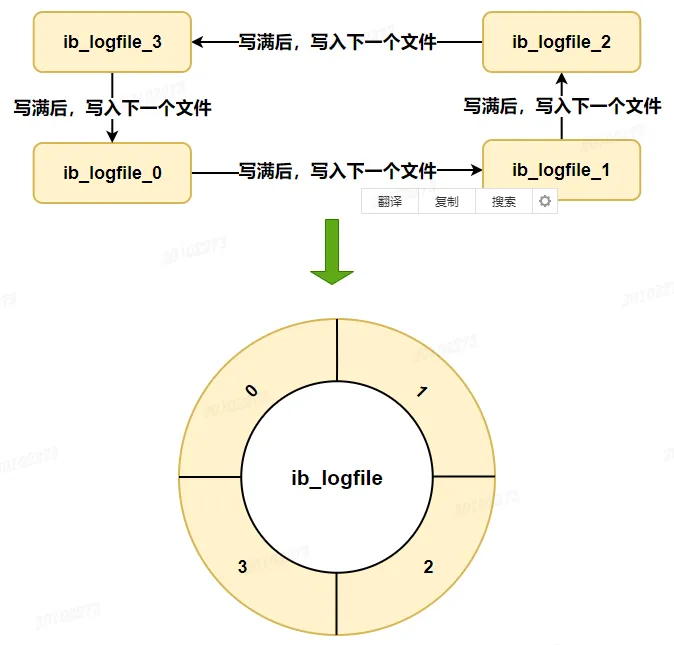
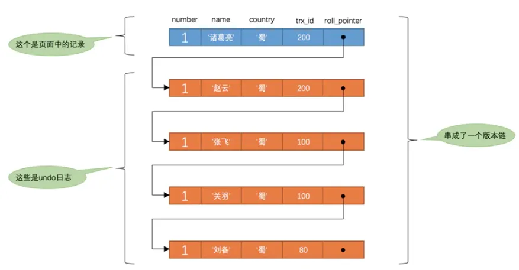
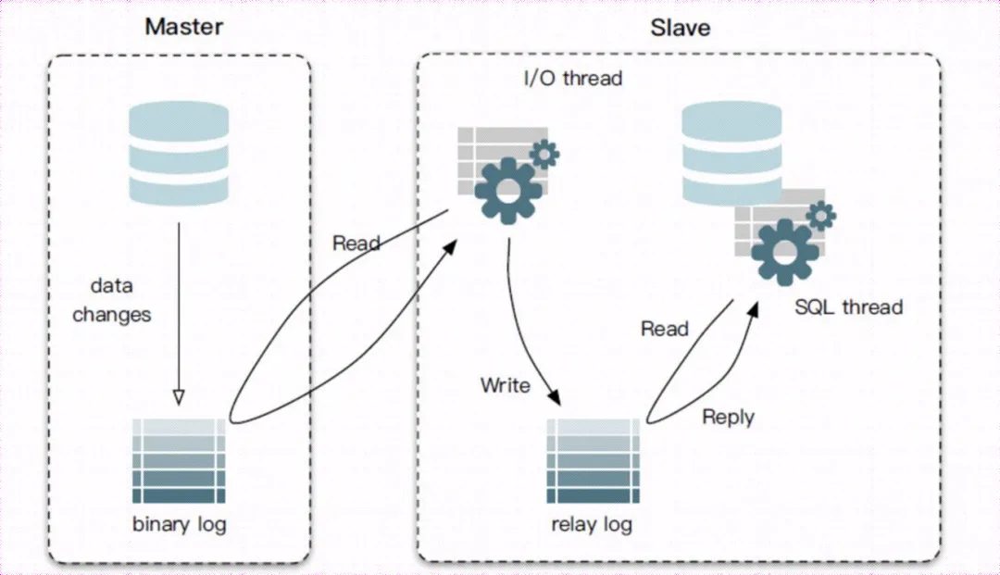

?> MYSQL

## 1\. MySQL 索引使用有哪些注意事项呢？

可以从两个维度回答这个问题：索引哪些情况会失效，索引不适合哪些场景

### 索引哪些情况会失效

-   查询条件包含`or`，会导致索引失效。
-   `隐式类型转换`，会导致索引失效，例如age字段类型是int，我们where age = "1"，这样就会触发隐式类型转换。
-   `like`通配符会导致索引失效，注意:"ABC%"不会失效，会走range索引，"%ABC"索引会失效
-   `联合索引`，查询时的条件列不是联合索引中的第一个列，索引失效。
-   对索引字段进行`函数运算`。
-   对`索引列运算`（如，+、-、*、/），索引失效。
-   索引字段上使用（`!=` 或者` < >`，`not in`）时，会导致索引失效。
-   索引字段上使用`is null`， `is not null`，可能导致索引失效。
-   相`join`的`两个表`的`字符编码不同`，不能命中索引，会导致笛卡尔积的循环计算
-   mysql估计使用全表扫描要比使用索引快,则不使用索引。

### 索引不适合哪些场景

-   数据量少的不适合加索引
-   更新比较频繁的也不适合加索引
-   离散性低的字段不适合加索引（如性别）

## 2\. MySQL 遇到过死锁问题吗，你是如何解决的？

排查死锁的步骤：

-   查看死锁日志`show engine innodb status`;
-   找出死锁Sql
-   分析sql加锁情况
-   模拟死锁案发
-   分析死锁日志
-   分析死锁结果

## 3\. 日常工作中你是怎么优化SQL的？

可以从这几个维度回答这个问题：

-   加索引
-   避免返回不必要的数据
-   适当分批量进行
-   优化sql结构
-   主从架构，提升读性能
-   分库分表

## 4\. 分库分表的设计

分库分表方案，分库分表中间件，分库分表可能遇到的问题

### 分库分表方案

-   `水平分库`：以字段为依据，按照一定策略（hash、range等），将一个库中的数据拆分到多个库中。
-   `水平分表`：以字段为依据，按照一定策略（hash、range等），将一个表中的数据拆分到多个表中。
-   `垂直分库`：以表为依据，按照业务归属不同，将不同的表拆分到不同的库中。
-   `垂直分表`：以字段为依据，按照字段的活跃性，将表中字段拆到不同的表（主表和扩展表）中。

### 常用的分库分表中间件

-   `Mycat`
-   sharding-jdbc

### 分库分表可能遇到的问题

-   事务问题：需要用`分布式事务`啦
-   `跨节点Join`的问题：解决这一问题可以`分两次查询`实现
-   跨节点的`count`,`order by`,`group by`以及聚合函数问题：`分别在各个节点上得到结果后在应用程序端进行合并`。
-   数据迁移，容量规划，扩容等问题
-   ID问题：数据库被切分后，不能再依赖数据库自身的主键生成机制啦，最简单可以考虑UUID
-   跨分片的排序分页问题（后台加大pagesize处理？）

## 5\. InnoDB与MyISAM的区别

-   `InnoDB支持事务`，MyISAM不支持事务
-  ` InnoDB支持外键`，MyISAM不支持外键
-   InnoDB 支持 MVCC(多版本并发控制)，MyISAM 不支持
-   select count(*) from table时，MyISAM更快，因为它有一个变量保存了整个表的总行数，可以直接读取，InnoDB就需要全表扫描。
-   Innodb不支持全文索引，而MyISAM支持全文索引（5.7以后的InnoDB也支持全文索引）
-   `InnoDB支持表、行级锁`，而MyISAM支持表级锁。
-   InnoDB表必须有主键，而MyISAM可以没有主键
-   Innodb表需要更多的内存和存储，而MyISAM可被压缩，存储空间较小，。
-   Innodb按主键大小有序插入，MyISAM记录插入顺序是，按记录插入顺序保存。
-   InnoDB 存储引擎提供了具有提交、回滚、崩溃恢复能力的事务安全，与 MyISAM 比 InnoDB 写的效率差一些，并且会占用更多的磁盘空间以保留数据和索引
-   InnoDB 属于索引组织表，使用共享表空间和多表空间储存数据。MyISAM用.frm、.MYD、.MTI来储存表定义，数据和索引。

## 6\. 数据库索引的原理，为什么要用 B+树，为什么不用二叉树？

可以从几个维度去看这个问题，查询是否够快，效率是否稳定，存储数据多少，以及查找磁盘次数，为什么不是二叉树，为什么不是平衡二叉树，为什么不是B树，而偏偏是B+树呢？

### 为什么不是一般二叉树？

- 1）当数据量大时，树的高度会比较高（`树的高度决定着它的IO操作次数，IO操作耗时大`），查询会比较慢。 
- 2）每个磁盘块（节点/页）保存的数据太小（`IO本来是耗时操作，每次IO只能读取到一个关键字，显然不合适`），没有很好的利用操作磁盘IO的数据交换特性，也没有利用好磁盘IO的预读能力（空间局部性原理），从而带来频繁的IO操作。

### 为什么不是平衡二叉树呢？

我们知道，在内存比在磁盘的数据，查询效率快得多。如果树这种数据结构作为索引，那我们每查找一次数据就需要从磁盘中读取一个节点，也就是我们说的一个磁盘块，但是平衡二叉树可是每个节点只存储一个键值和数据的，如果是B树，可以存储更多的节点数据，树的高度也会降低，因此读取磁盘的次数就降下来啦，查询效率就快啦。

### 那为什么不是B树而是B+树呢？

1）`B+Tree范围查找`，定位min与max之后，中间叶子节点，就是结果集，不用中序回溯 
2）`B+Tree磁盘读写能力更强`（叶子节点不保存真实数据，因此一个磁盘块能保存的关键字更多，因此每次加载的关键字越多） 
3）`B+Tree扫表和扫库能力更强`（B-Tree树需要扫描整颗树，B+Tree树只需要扫描叶子节点）

详细参考：[索引原理](https://link.juejin.cn?target=https%3A%2F%2Fblog.csdn.net%2Fqq_35620342%2Farticle%2Fdetails%2F119797039 "https://blog.csdn.net/qq_35620342/article/details/119797039")

## 7\. 聚集索引与非聚集索引的区别

-   一个表中只能拥有一个聚集索引，而非聚集索引一个表可以存在多个。
-   聚集索引，索引中键值的逻辑顺序决定了表中相应行的物理顺序；非聚集索引，索引中索引的逻辑顺序与磁盘上行的物理存储顺序不同。
-   索引是通过二叉树的数据结构来描述的，我们可以这么理解聚簇索引：索引的叶节点就是数据节点。而非聚簇索引的叶节点仍然是索引节点，只不过有一个指针指向对应的数据块。
-   聚集索引：物理存储按照索引排序；非聚集索引：物理存储不按照索引排序；

### 何时使用聚集索引或非聚集索引？


## 8\. limit 1000000 加载很慢的话，你是怎么解决的呢？

方案一：如果id是连续的，可以这样，返回上次查询的最大记录(偏移量)，再往下limit

```sql
select id，name from employee where id>1000000 limit 10.
```

方案二：在业务允许的情况下限制页数： 建议跟业务讨论，有没有必要查这么后的分页啦。因为绝大多数用户都不会往后翻太多页。

方案三：order by + 索引（id为索引）

```sql
select id，name from employee order by id  limit 1000000，10
SELECT a.* FROM employee a, (select id from employee where 条件 LIMIT 1000000,10 ) b where a.id=b.id
```

方案四：利用延迟关联或者子查询优化超多分页场景。（先快速定位需要获取的id段，然后再关联）

## 9\. 如何选择合适的分布式主键方案呢？

-   数据库自增长序列或字段。
-   UUID
-   雪花算法
-   Redis生成ID
-   利用zookeeper生成唯一ID

## 10\. 事务的隔离级别有哪些？MySQL的默认隔离级别是什么？

什么是事务的隔离性？

隔离性是指，多个用户的并发事务访问同一个数据库时，一个用户的事务不应该被其他用户的事务干扰，多个并发事务之间要相互隔离。

咱们举例子来说明：

建表语句：

```sql
CREATE TABLE `T`  (
  `id` int(11) NOT NULL,
  `name` varchar(255) NOT NULL,
  PRIMARY KEY (`id`)
) ENGINE = INNODB;
```

数据列表：

| id | name |
| --- | --- |
| 1 | xiaohong |
| 2 | zhangsan |
| 3 | lisi |

案例一：

事务A，先执行，处于未提交的状态：

```sql
insert into T values(4, wangwu); 
```

事务B，后执行，也未提交：

```sql
select * from T; 
```

如果事务B能够读取到(4, wangwu)这条记录，事务A就对事务B产生了影响，这个影响叫做“读脏”，读到了未提交事务操作的记录。

案例二：

事务A，先执行：

```sql
select * from T where id=1; 
```

结果集为：1, xiaohong

事务B，后执行，并且提交：

```sql
update T set name=hzy where id=1; 
```

commit;

事务A，再次执行相同的查询：

```sql
select * from T where id=1; 
```

结果集为：1, hzy

这次是已提交事务B对事务A产生的影响，这个影响叫做“不可重复读”，一个事务内相同的查询，得到了不同的结果。

案例三：

事务A，先执行：

```sql
select * from T where id>3; 
```

结果集为： NULL

事务B，后执行，并且提交：

```sql
insert into T values(4, wangwu); 
commit; 
```

事务A，首次查询了id>3的结果为NULL，于是想插入一条为4的记录：

```sql
insert into T values(4, hzy); 
```

结果集为： `Error : duplicate key!`

这次是已提交事务B对事务A产生的影响，这个影响叫做“幻读”。

可以看到，并发的事务可能导致其他事务：

-   脏读

-   不可重复读

-   幻读

InnoDB实现了四种不同事务的隔离级别：

-   读未提交(Read Uncommitted)
-   读提交(Read Committed, RC)
-   可重复读(Repeated Read, RR)
-   串行化(Serializable)

不同事务的隔离级别，实际上是一致性与并发性的一个权衡与折衷。

InnoDB的四种事务的隔离级别，分别是怎么实现的？

InnoDB使用不同的锁策略(Locking Strategy)来实现不同的隔离级别。

### 读未提交(Read Uncommitted)

这种事务隔离级别下，select语句不加锁。

此时，可能读取到不一致的数据，即“读脏”。这是并发最高，一致性最差的隔离级别。

### 串行化(Serializable)

这种事务的隔离级别下，所有select语句都会被隐式的转化为select ... in share mode.

这可能导致，如果有未提交的事务正在修改某些行，所有读取这些行的select都会被阻塞住。

这是一致性最好的，但并发性最差的隔离级别。 在互联网大数据量，高并发量的场景下，几乎不会使用上述两种隔离级别。

### 可重复读(Repeated Read, RR) 这是InnoDB默认的隔离级别，在RR下：

①普通的select使用快照读(snapshot read)，这是一种不加锁的一致性读(Consistent Nonlocking Read)，底层使用MVCC来实现；

②加锁的select(select ... in share mode / select ... for update), update, delete等语句，它们的锁，依赖于它们是否在唯一索引(unique index)上使用了唯一的查询条件(unique search condition)，或者范围查询条件(range-type search condition)：

-   在唯一索引上使用唯一的查询条件，会使用记录锁(record lock)，而不会封锁记录之间的间隔，即不会使用间隙锁(gap lock)与临键锁(next-key lock)
-   范围查询条件，会使用间隙锁与临键锁，锁住索引记录之间的范围，避免范围间插入记录，以避免产生幻影行记录，以及避免不可重复的读

### 读提交(Read Committed, RC) 这是互联网最常用的隔离级别，在RC下：

①普通读是快照读；

②加锁的select, update, delete等语句，除了在外键约束检查(foreign-key constraint checking)以及重复键检查(duplicate-key checking)时会封锁区间，其他时刻都只使用记录锁；

此时，其他事务的插入依然可以执行，就可能导致，读取到幻影记录。

## 11\. 在高并发情况下，如何做到安全的修改同一行数据？

要安全的修改同一行数据，就要保证一个线程在修改时其它线程无法更新这行记录。一般有`悲观锁`和`乐观锁`两种方案

### 使用悲观锁

悲观锁思想就是，当前线程要进来修改数据时，别的线程都得拒之门外~ 比如，可以使用`select…for update`

```sql
select * from User where name=‘jay’ for update
```

以上这条sql语句会锁定了User表中所有符合检索条件（name=‘jay’）的记录。本次事务提交之前，别的线程都无法修改这些记录。

### 使用乐观锁

乐观锁思想就是，有线程过来，先放过去修改，如果看到别的线程没修改过，就可以修改成功，如果别的线程修改过，就修改失败或者重试。实现方式：乐观锁一般会使用版本号机制或CAS算法实现。

## 12\. 数据库的乐观锁和悲观锁

### 悲观锁

悲观锁她专一且缺乏安全感了，她的心只属于当前事务，每时每刻都担心着它心爱的数据可能被别的事务修改，所以一个事务拥有（获得）悲观锁后，其他任何事务都不能对数据进行修改啦，只能等待锁被释放才可以执行。

### 乐观锁

乐观锁的“乐观情绪”体现在，它认为数据的变动不会太频繁。因此，它允许多个事务同时对数据进行变动。实现方式：乐观锁一般会使用版本号机制或CAS算法实现。

## 13\. SQL优化的一般步骤是什么，怎么看执行计划（explain），如何理解其中各个字段的含义？

-   `show status` 命令了解各种 sql 的执行频率
-   通过慢查询日志定位那些执行效率较低的 sql 语句
-   explain 分析低效 sql 的执行计划（这点非常重要，日常开发中用它分析Sql，会大大降低Sql导致的线上事故）

## 14\. select for update有什么含义，会锁表还是锁行还是其他？

select for update 含义

select查询语句是不会加锁的，但是select for update除了有查询的作用外，还会加锁呢，而且它是悲观锁哦。至于加了是行锁还是表锁，这就要看是不是用了索引/主键啦。 没用索引/主键的话就是表锁，否则就是是行锁。

## 15\. MySQL事务得四大特性以及实现原理

-   原子性： 事务作为一个整体被执行，包含在其中的对数据库的操作要么全部被执行，要么都不执行。
-   一致性： 指在事务开始之前和事务结束以后，数据不会被破坏，假如A账户给B账户转10块钱，不管成功与否，A和B的总金额是不变的。
-   隔离性： 多个事务并发访问时，事务之间是相互隔离的，即一个事务不影响其它事务运行效果。简言之，就是事务之间是进水不犯河水的。
-   持久性： 表示事务完成以后，该事务对数据库所作的操作更改，将持久地保存在数据库之中。

### 事务ACID特性的实现思想

-   原子性：是使用 undo log来实现的，如果事务执行过程中出错或者用户执行了rollback，系统通过undo log日志返回事务开始的状态。
-   持久性：使用 redo log来实现，只要redo log日志持久化了，当系统崩溃，即可通过redo log把数据恢复。
-   隔离性：通过锁以及MVCC,使事务相互隔离开。
-   一致性：通过回滚、恢复，以及并发情况下的隔离性，从而实现一致性。

## 16\. 如果某个表有近千万数据，CRUD比较慢，如何优化？

### 分库分表

某个表有近千万数据，可以考虑优化表结构，分表（水平分表，垂直分表），当然，你这样回答，需要准备好面试官问你的分库分表相关问题呀，如

-   分表方案（水平分表，垂直分表，切分规则hash等）
-   分库分表中间件（Mycat，sharding-jdbc等）
-   分库分表一些问题（事务问题？跨节点Join的问题）
-   解决方案（分布式事务等）

### 索引优化

除了分库分表，优化表结构，当然还有所以索引优化等方案~

## 17\. 如何写sql能够有效的使用到复合索引？

复合索引，也叫组合索引，用户可以在多个列上建立索引,这种索引叫做复合索引。

当我们创建一个组合索引的时候，如(k1,k2,k3)，相当于创建了（k1）、(k1,k2)和(k1,k2,k3)三个索引，这就是最左匹配原则。

```sql
select * from table where k1=A AND k2=B AND k3=D
```

有关于复合索引，我们需要关注查询Sql条件的顺序，确保最左匹配原则有效，同时可以删除不必要的冗余索引。

## 18\. mysql中in 和exists的区别

假设表A表示某企业的员工表，表B表示部门表，查询所有部门的所有员工，很容易有以下SQL:

```sql
select * from A where deptId in (select deptId from B);
```

这样写等价于：

先查询部门表B select deptId from B 再由部门deptId，查询A的员工 select * from A where A.deptId = B.deptId

可以抽象成这样的一个循环：

```java
List<> resultSet ;
    for(int i=0;i<B.length;i++) {
          for(int j=0;j<A.length;j++) {
          if(A[i].id==B[j].id) {
             resultSet.add(A[i]);
             break;
          }
       }
    }
```

显然，除了使用in，我们也可以用exists实现一样的查询功能，如下：

```sql
select * from A where exists (select 1 from B where A.deptId = B.deptId);
```

因为exists查询的理解就是，先执行主查询，获得数据后，再放到子查询中做条件验证，根据验证结果（true或者false），来决定主查询的数据结果是否得意保留。

那么，这样写就等价于：

select * from A,先从A表做循环 select * from B where A.deptId = B.deptId,再从B表做循环.

同理，可以抽象成这样一个循环：

```java
List<> resultSet ;
    for(int i=0;i<A.length;i++) {
          for(int j=0;j<B.length;j++) {
          if(A[i].deptId==B[j].deptId) {
             resultSet.add(A[i]);
             break;
          }
       }
    }
```

数据库最费劲的就是跟程序链接释放。假设链接了两次，每次做上百万次的数据集查询，查完就走，这样就只做了两次；相反建立了上百万次链接，申请链接释放反复重复，这样系统就受不了了。即mysql优化原则，就是小表驱动大表，小的数据集驱动大的数据集，从而让性能更优。 因此，我们要选择最外层循环小的，也就是，如果B的数据量小于A，适合使用in，如果B的数据量大于A，即适合选择exists，这就是in和exists的区别。

## 19\. 数据库自增主键可能遇到什么问题？

使用自增主键对数据库做分库分表，可能出现诸如主键重复等的问题。解决方案的话，简单点的话可以考虑使用UUID哈 自增主键会产生表锁，从而引发问题 自增主键可能用完问题。

## 20\. MVCC底层原理

我们聊下MySQL是如何实现Read Repeatable的吧，因为一般我们都不修改这个隔离级别，但是你得清楚是怎么回事儿，MySQL是通过MVCC机制来实现的，就是多版本并发控制，multi-version concurrency control。

innodb存储引擎，会在每行数据的最后加两个隐藏列，一个保存行的创建时间，一个保存行的删除时间，但是这儿存放的不是时间，而是事务id，事务id是mysql自己维护的自增的，全局唯一。

事务id，在mysql内部是全局唯一递增的，事务id=1，事务id=2，事务id=3

| id | name | 创建事务id | 删除事务id |
| --- | --- | --- | --- |
| 1 | 张三 | 120 | 空 |

事务ID=121的事务，查询ID=1的这一行数据，一定会找到创建事务ID<=当前事务ID的那一行，select * from table where id = 1，就可以查到上面那一行。

事务ID=122的事务，将ID=1的这一行删除了，此时就会将ID=1的行的删除事务ID设置成122

| id | name | 创建事务id | 删除事务id |
| --- | --- | --- | --- |
| 1 | 张三 | 120 | 122 |

事务ID=121的事务，再次查询ID=1的那一行，能查到，创建事务ID<=当前事务ID，当前事务ID < 删除事务ID

| id | name | 创建事务id | 删除事务id |
| --- | --- | --- | --- |
| 1 | 张三 | 120 | 122 |
| 2 | 李四 | 119 | 空 |

事务id=121的事务，查询id=2的那一行，查到name=李四

| id | name | 创建事务id | 删除事务id |
| --- | --- | --- | --- |
| 1 | 张三 | 120 | 122 |
| 2 | 李四 | 119 | 空 |
| 2 | 小李四 | 122 | 空 |

事务id=122的事务，将id=2的那一行的name修改成name=小李四

**Innodb存储引擎，对于同一个ID，不同的事务创建或修改，每个事务都有自己的快照**（会插入一条记录）

事务id=121的事务，查询id=2的那一行，答案是：李四，创建事务id <= 当前事务id，当前事务id < 删除事务id.

在一个事务内查询的时候，mysql只会查询创建事务id <= 当前事务id的行，这样可以确保这个行是在当前事务中创建，或者是之前创建的；同时一个行的删除事务id要么没有定义（就是没删除），要么是比当前事务id大（在事务开启之后才被删除）；满足这两个条件的数据都会被查出来。

那么如果某个事务执行期间，别的事务更新了一条数据呢？这个很关键的一个实现，其实就是在innodb中，是**插入了一行记录**，然后将新插入的记录的创建时间设置为新的事务的id，同时将这条记录之前的那个版本的删除时间设置为新的事务的id。

现在get到这个点了吧？这样的话，你的这个事务其实对某行记录的查询，始终都是查找的之前的那个快照，因为之前的那个快照的创建时间小于等于自己事务id，然后删除时间的事务id比自己事务id大，所以这个事务运行期间，会一直读取到这条数据的同一个版本。

## 21\. 数据库中间件了解过吗，sharding jdbc，mycat？

- sharding-jdbc目前是基于jdbc驱动，无需额外的proxy，因此也无需关注proxy本身的高可用。 
- `Mycat` 是基于 Proxy，它复写了 MySQL 协议，将 Mycat Server 伪装成一个 MySQL 数据库，而 Sharding-JDBC 是基于 JDBC 接口的扩展，是以 jar 包的形式提供轻量级服务的。

## 22\. MySQL的主从延迟，你怎么解决？



### 主从复制分了五个步骤进行：

-   步骤一：主库的更新事件(update、insert、delete)被写到binlog
-   步骤二：从库发起连接，连接到主库。
-   步骤三：此时主库创建一个binlog dump thread，把binlog的内容发送到从库。
-   步骤四：从库启动之后，创建一个I/O线程，读取主库传过来的binlog内容并写入到relay log
-   步骤五：还会创建一个SQL线程，从relay log里面读取内容，从Exec_Master_Log_Pos位置开始执行读取到的更新事件，将更新内容写入到slave的db

### 主从同步延迟的原因

一个服务器开放Ｎ个链接给客户端来连接的，这样有会有大并发的更新操作, 但是从服务器的里面读取binlog的线程仅有一个，当某个SQL在从服务器上执行的时间稍长 或者由于某个SQL要进行锁表就会导致，主服务器的SQL大量积压，未被同步到从服务器里。这就导致了主从不一致， 也就是主从延迟。

### 主从同步延迟的解决办法

可以参考沈剑老师的文章：[数据库主从不一致怎么解决？](https://link.juejin.cn?target=https%3A%2F%2Fmp.weixin.qq.com%2Fs%3F__biz%3DMjM5ODYxMDA5OQ%3D%3D%26mid%3D2651961330%26idx%3D1%26sn%3D4bdbada3b26d4fc2fc505f7a0f2ad7c4%26chksm%3Dbd2d022e8a5a8b38e59f0dfffba7ca407fe8711644b3794832572dd822c665205bb820cdddf7%26scene%3D21%23wechat_redirect "https://mp.weixin.qq.com/s?__biz=MjM5ODYxMDA5OQ==&mid=2651961330&idx=1&sn=4bdbada3b26d4fc2fc505f7a0f2ad7c4&chksm=bd2d022e8a5a8b38e59f0dfffba7ca407fe8711644b3794832572dd822c665205bb820cdddf7&scene=21#wechat_redirect")

## 23\. 说一下大表查询的优化方案

-   优化shema、sql语句+索引；
-   可以考虑加缓存，memcached, redis，或者JVM本地缓存；
-   主从复制，读写分离；
-   分库分表；

## 24\. 什么是数据库连接池?为什么需要数据库连接池呢?

连接池基本原理：

数据库连接池原理：在内部对象池中，维护一定数量的数据库连接，并对外暴露数据库连接的获取和返回方法。

### 应用程序和数据库建立连接的过程

-   通过TCP协议的三次握手和数据库服务器建立连接
-   发送数据库用户账号密码，等待数据库验证用户身份
-   完成身份验证后，系统可以提交SQL语句到数据库执行
-   把连接关闭，TCP四次挥手告别。

### 数据库连接池好处

-   资源重用 (连接复用)
-   更快的系统响应速度
-   新的资源分配手段 统一的连接管理，避免数据库连接泄漏

## 25\. 一条SQL语句在MySQL中如何执行的？

### MySQL逻辑架构图

MySQL分为Server层和存储引擎层两个部分，不同的存储引擎共用一个Server层。



Server层：大多数MySQL的核心服务功能都在这一层，包括连接处理、授权认证、查询解析、分析、优化、缓存以及所有的内置函数（例如，日期、时间、数学和加密函数），所有跨存储引擎的功能都在这一层实现，比如存储过程、触发器、视图等。

存储引擎层：存储引擎负责MySQL中数据的存储和提取。服务器通过API与存储引擎进行通信。这些接口屏蔽了不同存储引擎之间的差异，使得这些差异对上层的查询过程透明。

MySQL客户端与服务端的通信方式是“**半双工**”，客户端一旦开始发送消息另一端要接收完整这个消息才能响应，客户端一旦开始接收数据就没法停下来发送指令，一请求一响应。

### 连接器

第一步，先连接到数据库上，当客户端（应用）连接到MySQL服务器时，服务器需要对其进行认证，认证基于用户名、原始主机信息和密码，一旦客户端连接成功，服务器会继续验证客户端是否具有执行某个特定查询的权限（例如，是否允许客户端对某一数据库的某一表执行SELECT语句）

连接命令：

```terminal
mysql -h$ip -p$port -u$user -p
```

输完命令之后，需要在交互对话里面输入密码，密码不建议在-p后面直接输入，这样会导致密码泄露。

### 查询缓存

第二步，查询缓存，每次MySQL执行过的语句及其结果会以key-value形式缓存在内存中，key是查询语句，value是查询结果。如果查询能够在缓存中找到key，那么这个value就会被直接返回客户端。

但是大多数情况下我会建议不要使用缓存，因为查询缓存的失效非常频繁，只要对一个表的更新，即便是更新一些与缓存无关的字段，这个表所有的缓存都会被清空，因此很可能会费劲地把结果存起来，还没使用就被一个更新全部清空，对于更新压力的数据库来说，查询缓存的命中率会非常低，除非业务就一张静态表，很长时间才会更新一次。（例如系统配置表）

MySQL提供了按需使用的方式，可以将参数query_cache_type设置为DEMAND，这对于默认的SQL不使用查询缓存，而对于确定要使用查询缓存的语句，可以使用SQL_CACHE显示指定。（SELECT SQL_CACHE * FROM TAB）

通过查询语句做哈希算法得到一个哈希值，因此这里要想命中缓存，查询SQL和缓存SQL必须完全一致，每次检查缓存是否命中时都会对缓存加锁，对于一个读写频繁的系统使用查询缓存很有可能降低查询

注意：MySQL8.0版本直接将缓存的整个功能模块删掉了

### 分析器

第三步，分析器，如果没有命中缓存，就会执行SQL语句，首先让MySQL知道我们需要做什么，因此需要对SQL语句解析，MySQL从输入的“select”关键字识别出来，这是一条查询语句，把字符串“TAB”识别成表名TAB，检查查询中涉及的表和数据列是否存在或别名是否有歧义

解析器的工作：语法分析（生成句子），语义分析（确保这些句子讲得通），以及代码生成（为编译准备）

注意：分析器和解析器是一个东西，有些书叫分析器，有些书叫解析器，就是不同的叫法而已

### 优化器

第四步，优化器，经过分析器MySQL知道我们需要什么了，在开始执行前，还要经过优化器进行处理，优化器是在表里面有多个索引时，决定使用哪个索引，或者在一个语句有多表关联（join）时，决定各个表的连接顺序。

优化器会生成执行计划

### 执行器

第五步，执行器，MySQL通过分析器知道要做什么，通过优化器知道怎么做，开始执行前，要先判断一下是否有表TABLE查询权限，如果有打开表，根据表的引擎定义，去使用这个引擎提供的接口。

根据执行计划，调用存储引擎API来查询数据

## mysql8 为什么去掉查询缓冲层

- `锁的问题`： 查询缓存需要使用全局锁（query cache mutex）来保护缓存的查询结果，这会导致在高并发环境下出现性能瓶颈。在大型系统中，这种锁可能会成为影响整体性能的主要因素。
- `缓存失效问题`： MySQL 的查询缓存对于数据更新敏感度较低，因此在表数据更新频繁的情况下，查询缓存的效果会变得不尽人意。每次数据更新都可能导致相关查询缓存的失效，这会增加系统的复杂性并降低缓存命中率。
- `内存管理`： 查询缓存需要占用一定的内存空间来存储查询结果，而且这个空间是全局的。在大规模的系统中，需要维护的缓存数据可能会非常庞大，给内存管理带来挑战。
- `现代硬件和架构`： 在现代硬件和架构下，如多核处理器、大容量内存和快速存储设备的支持下，查询缓存的优势不再明显。通过使用更先进的技术，如索引、内存数据库等，可以更好地提升性能。

## 26\. InnoDB引擎中的索引策略，了解过吗？

只有当索引帮助存储引擎快速查找到记录带来的好处大于其带来的额外工作时，索引才是有效的。对于非常小的表，大部分情况下简单的全表扫描更高效，对于中到大型的表，索引就非常有效。

正确地创建和使用索引是实现高性能查询的基础。

### 独立的列

如果查询中的列不是独立的，则MySQL就不会使用索引，’独立的列’是指索引列不能是表达式的一部分，也不是函数的参数。

select actor_id from skill.actor where actor_id + 1 = 5,这个查询无法使用actor_id列的索引; select actor_id from skill.actor where to_days(current_date) - to_days(date_col) <= 10,这个也不会使用索引。

### 前缀索引和索引选择性

有时候需要索引很长的字符列，这会让索引变得大且慢，通常可以索引开始的部分字符，这样可以大大节约索引空间，从而提高索引效率，但这样也会降低索引的选择性，索引的选择性是指，不重复的索引值和数据表的记录总数（#T）的比值，范围从1/#T到1之间，索引的选择性越高则查询效率越高，因为选择性高的索引可以让MySQL在查找时过滤掉更多的行，唯一索引的选择性是1，这是最好的索引选择性，性能也是最好的。

一般情况下某个列前缀的选择性也是足够高的，足以满足查询性能，对于BLOB、TEXT或者很长的VARCHAR类型的列，必须使用前缀索引，因为MySQL不允许索引这些列的完整程度。

诀窍在于要选择足够长的前缀以保证较高的选择性，同时又不能太长（以便节约空间）。

如何选择合适的前缀？

①我们可以通过left函数

②计算完整列的选择性，并使前缀的选择性接近于完整列的选择性； select count(distinct city)/count(*) from skill.city_demo，选择性0.0312

select count(distinct left(city,6))/count(*) from skill.city_demo，选择性0.0309

select count(distinct left(city,7))/count(*) from skill.city_demo，选择性0.0310

前缀索引是一种能使索引更小、更快的有效方法，但另一方面也有其缺点：MySQL无法使用前缀索引做ORDER BY和GROUP BY，也无法使用前缀索引做覆盖扫描。

有时候后缀索引也有用途，MySQL原声不支持反向索引，但是可以把字符串反转后存储，并基于此建立前缀索引。

### 多列索引

一个常见的错误就是，为每个列创建一个独立的索引或者按照错误的顺序创建多列索引。

当出现服务器对多个索引做相交操作时（通常有多个AND条件），通常意味着需要一个包含所有相关列的多列索引，而不是多个独立的单列索引。

当服务器需要对多个索引做联合操作时（通常有多个OR条件），通常需要耗费大量CPU和内存资源在算法的缓存、排序合并操作上，特别是当其中有些索引的选择性不高，需要合并扫描返回的大量数据的时候，导致该执行计划还不如直接走全表扫描，这样做不但会消耗更多的CPU和内存资源，还可能会影响查询的并发性。

单列索引：节点中关键字【name】

联合索引：节点中关键字【name，phoneNum】

联合索引列选择原则：

①经常用的列优先【最左匹配原则】

②选择性（离散性）高的优先【离散度高原则】

③宽度小的列优先【最少空间原则】

优先级1>2>3

select * from t_user where name = ?

select * from t_user where name = ? and phoneNum = ?

create index index_name on t_user(name)

create index index_name_phoneNum on t_user(name,phoneNum)

这种做法是错误的，根据最左匹配原则，两条查询都可以走index_name_phoneNum索引，**index_name索引就是冗余索引**。

### 选择合适的索引列顺序

当不需要考虑排序和分组时，将选择性最高的列放在前面通常是很好的，这时索引的作用只是用于优化WHERE条件的查找，在这种情况下，这种设计的索引确实能够最快地过滤出需要的行，对于在WHERE字句中只使用了索引部分前缀列的查询来说选择性也更高，然而，性能不只是依赖于所有索引列的选择性，也和查询条件的具体值有关，也就是和值的分布有关，可能需要根据那些运行频率最高的查询来调整索引列的顺序，让这种情况下索引的选择性最高。

### 聚簇索引

聚簇索引**并不是一种单独的索引类型**，而**是一种数据存储方式**，具体的细节依赖于其实现方式，但InnoDB的聚簇索引实际上在同一个结构中保存了B+Tree索引和数据行。

当表有聚簇索引时，它的数据行实际上存放在索引的叶子页中，术语“聚簇”表示数据行和相邻的键值紧凑地存储在一起（这并非总成立），因为无法同时把数据行存在两个不同的地方，所以一个表只能有一个聚簇索引（不过，覆盖索引可以模拟多个聚簇索引的情况）。

因为是存储引擎负责实现索引，因此不是所有的存储引擎都支持聚簇索引，这里只关注InnoDB。

### 列的离散性

找出离散性好的列，离散性越高，可选择性就越好。

 例如：sex字段，只有男和女，离散性很差，因此选择性很差

## 27\. 数据库存储日期格式时，如何考虑时区转换问题？

-   `datetime`类型适合用来记录数据的原始的创建时间，修改记录中其他字段的值，datetime字段的值不会改变，除非手动修改它。
-  ` timestamp`类型适合用来记录数据的最后修改时间，只要修改了记录中其他字段的值，timestamp字段的值都会被自动更新。

## 28\. 一条sql执行过长的时间，你如何优化，从哪些方面入手？

-   查看是否涉及多表和子查询，优化Sql结构，如去除冗余字段，是否可拆表等
-   优化索引结构，看是否可以适当添加索引
-   数量大的表，可以考虑进行分离/分表（如交易流水表）
-   数据库主从分离，读写分离
-   explain分析sql语句，查看执行计划，优化sql
-   查看mysql执行日志，分析是否有其他方面的问题

## 29\. Blob和text有什么区别？

-   Blob用于存储二进制数据，而Text用于存储大字符串。
-   Blob值被视为二进制字符串（字节字符串）,它们没有字符集，并且排序和比较基于列值中的字节的数值。
-   text值被视为非二进制字符串（字符字符串）。它们有一个字符集，并根据字符集的排序规则对值进行排序和比较。

## 30\. MySQL里记录货币用什么字段类型比较好？

-   货币在数据库中MySQL常用Decimal和Numric类型表示，这两种类型被MySQL实现为同样的类型。他们被用于保存与金钱有关的数据。
-   salary DECIMAL(9,2)，9(precision)代表将被用于存储值的总的小数位数，而2(scale)代表将被用于存储小数点后的位数。存储在salary列中的值的范围是从-9999999.99到9999999.99。
-   DECIMAL和NUMERIC值作为字符串存储，而不是作为二进制浮点数，以便保存那些值的小数精度。

## 31\. InnoDB有哪几种锁？

如何使用普通锁保证一致性？

①操作数据前，加锁，实施互斥，不允许其他的并发任务操作；

②操作完成后，释放锁，让其他任务执行；如此这般，来保证一致性。

普通锁存在什么问题？

简单的锁住太过粗暴，连“读任务”也无法并行，任务执行过程本质上是串行的。

### 共享/排它锁(Shared and Exclusive Locks)

简单的锁住太过粗暴，连“读任务”也无法并行，任务执行过程本质上是串行的。于是出现了共享锁与排他锁：

-   共享锁（Share Locks，记为S锁），读取数据时加S锁

-   排他锁（eXclusive Locks，记为X锁），修改数据时加X锁

共享锁与排他锁：

-   共享锁之间不互斥，读读可以并行

-   排他锁与任何锁互斥，写读，写写不可以并行

可以看到，一旦写数据的任务没有完成，数据是不能被其他任务读取的，这对并发度有较大的影响。

有没有可能，进一步提高并发呢？

即使写任务没有完成，其他读任务也可能并发，MySQL通过多版本控制解决此问题。（快照读）

### 意向锁(Intention Locks)

InnoDB支持多粒度锁(multiple granularity locking)，它允许行级锁与表级锁共存，实际应用中，InnoDB使用的是意向锁。

意向锁是指，未来的某个时刻，事务可能要加共享/排它锁了，先提前声明一个意向。

意向锁的特点：

①首先，意向锁，是一个表级别的锁(table-level locking)；

②意向锁分为：

-   意向共享锁(intention shared lock, IS)，它预示着，事务有意向对表中的某些行加共享S锁

-   意向排它锁(intention exclusive lock, IX)，它预示着，事务有意向对表中的某些行加排它X锁

举个例子：

select ... lock in share mode，要设置IS锁；

select ... for update，要设置IX锁；

③意向锁协议(intention locking protocol)并不复杂：

事务要获得某些行的S锁，必须先获得表的IS锁

事务要获得某些行的X锁，必须先获得表的IX锁

④由于意向锁仅仅表明意向，它其实是比较弱的锁，意向锁之间并不相互互斥，而是可以并行，其兼容互斥表如下：

|  | IS | IX |
| --- | --- | --- |
| IS | 兼容 | 兼容 |
| IX | 兼容 | 兼容 |

⑤既然意向锁之间都相互兼容，那其意义在哪里呢？它会与共享锁/排它锁互斥，其兼容互斥表如下：

|  | S | X |
| --- | --- | --- |
| IS | 兼容 | 互斥 |
| IX | 互斥 | 互斥 |

补充：排它锁是很强的锁，不与其他类型的锁兼容。这也很好理解，修改和删除某一行的时候，必须获得强锁，禁止这一行上的其他并发，以保障数据的一致性。

意向锁解决什么问题？

事务 A 获取了某一行的排它锁，并未提交： select * from table where id = 6 from update

事务 B 想要获取 table 表的表锁： LOCK TABLES table READ;

因为共享锁与排它锁互斥，所以事务 B 在视图对 table 表加共享锁的时候，必须保证：

①当前没有其他事务持有 table 表的排它锁。

②当前没有其他事务持有 table 表中任意一行的排它锁 。

为了检测是否满足第二个条件，事务 B 必须在确保 table表不存在任何排它锁的前提下，去检测表中的每一行是否存在排它锁。很明显这是一个效率很差的做法，但是有了意向锁之后，事务A持有了table表的意向排它锁，就可得知事务A必然持有该表中某些数据行的排它锁，而**无需去检测表中每一行是否存在排它锁**

意向锁之间为什么互相兼容？

事务 A 先获取了某一行的排他锁，并未提交： select * from users where id = 6 for update

①事务 A 获取了 users 表上的意向排他锁。

②事务 A 获取了 id 为 6 的数据行上的排他锁。

之后事务 B 想要获取 users 表的共享锁： LOCK TABLES users READ;

事务 B 检测到事务 A 持有 users 表的意向排他锁。 事务 B 对 users 表的加锁请求被阻塞（排斥）。

最后事务 C 也想获取 users 表中某一行的排他锁： select * from users where id = 5 for update;

①事务 C 申请 users 表的意向排他锁。

②事务 C 检测到事务 A 持有 users 表的意向排他锁。

③因为意向锁之间并不互斥，所以事务 C 获取到了 users 表的意向排他锁。

④因为id 为 5 的数据行上不存在任何排他锁，最终事务 C 成功获取到了该数据行上的排他锁。

**如果意向锁之间互斥，行级锁的意义将会失去**

### 记录锁(Record Locks)

记录锁，它封锁索引记录，例如：

select * from t where id=1 for update; 它会在id=1的索引记录上加锁，以阻止其他事务插入，更新，删除id=1的这一行。

需要说明的是： select * from t where id=1; 则是快照读(SnapShot Read)，它并不加锁，具体在《17.什么是快照读？》中做了详细阐述。

### 间隙锁(Gap Locks)

间隙锁，它封锁索引记录中的间隔，或者第一条索引记录之前的范围，又或者最后一条索引记录之后的范围。

存储引擎：InnoDB

隔离级别：可重复读隔离级别

建表语句：

```sql
mysql> CREATE TABLE `T`  (
  `id` int(11) NOT NULL,
  `name` varchar(255) NOT NULL,
  PRIMARY KEY (`id`)
) ENGINE = INNODB;
```

数据列表：

| id | name |
| --- | --- |
| 1 | xiaohong |
| 3 | zhangsan |
| 5 | lisi |
| 9 | wangwu |

这个SQL语句 select * from T where id between 8 and 15 for update; 会封锁区间，以阻止其他事务id=10的记录插入。

为什么要阻止id=10的记录插入？ 如果能够插入成功，头一个事务执行相同的SQL语句，会发现结果集多出了一条记录，即幻影数据。

间隙锁的主要目的，就是**为了防止其他事务在间隔中插入数据**，以导致“不可重复读”。

如果把事务的隔离级别降级为读提交(Read Committed, RC)，间隙锁则会自动失效。

### 临键锁(Next-key Locks)

临键锁，是记录锁与间隙锁的组合，它的封锁范围，既包含索引记录，又包含索引区间。

更具体的，临键锁会封锁索引记录本身，以及索引记录之前的区间。

如果一个会话占有了索引记录R的共享/排他锁，其他会话不能立刻在R之前的区间插入新的索引记录。

存储引擎：InnoDB

隔离级别：可重复读隔离级别

建表语句：

```sql
mysql> CREATE TABLE `T`  (
  `id` int(11) NOT NULL,
  `name` varchar(255) NOT NULL,
  PRIMARY KEY (`id`)
) ENGINE = INNODB;
```

数据列表：

| id | name |
| --- | --- |
| 1 | xiaohong |
| 3 | zhangsan |
| 5 | lisi |
| 9 | wangwu |

PK上潜在的临键锁为：

(-infinity, 1]

(1, 3]

(3, 5]

(5, 9]

(9, +infinity]

临键锁的主要目的，也是 **为了避免幻读(Phantom Read)** 。如果把事务的隔离级别降级为RC，临键锁则也会失效。

### 插入意向锁(Insert Intention Locks)

对已有数据行的修改与删除，必须加强互斥锁X锁，那对于数据的插入，是否还需要加这么强的锁，来实施互斥呢？插入意向锁，孕育而生。

插入意向锁，是间隙锁(Gap Locks)的一种（所以，也是实施在索引上的），它是专门针对insert操作的。

多个事务，在同一个索引，同一个范围区间插入记录时，如果插入的位置不冲突，不会阻塞彼此。

存储引擎：InnoDB

隔离级别：可重复读隔离级别

建表语句：

```sql
mysql> CREATE TABLE `T`  (
  `id` int(11) NOT NULL,
  `name` varchar(255) NOT NULL,
  PRIMARY KEY (`id`)
) ENGINE = INNODB;
```

数据列表：

| id | Name |
| --- | --- |
| 10 | xiaohong |
| 20 | zhangsan |
| 30 | lisi |

事务A先执行，在10与20两条记录中插入了一行，还未提交：

insert into t values(11, xxx);

事务B后执行，也在10与20两条记录中插入了一行：

insert into t values(12, ooo);

会使用什么锁？事务B会不会被阻塞呢？ 回答：虽然事务隔离级别是RR，虽然是同一个索引，虽然是同一个区间，但插入的记录并不冲突，故这里： 使用的是插入意向锁，并不会阻塞事务B

### 自增锁(Auto-inc Locks)

案例说明：

存储引擎：InnoDB

隔离级别：可重复读隔离级别

建表语句：

```sql
mysql> CREATE TABLE `T`  (
  `id` int(11) NOT NULL,
  `name` varchar(255) NOT NULL,
  PRIMARY KEY (`id`)
) ENGINE = INNODB;
```

数据列表：

| id | name |
| --- | --- |
| 1 | xiaohong |
| 2 | zhangsan |
| 3 | lisi |

事务A先执行，还未提交： insert into t(name) values(xxx);

事务B后执行： insert into t(name) values(ooo);

事务B会不会被阻塞？

案例分析：

InnoDB在RR隔离级别下，能解决幻读问题，上面这个案例中：

①事务A先执行insert，会得到一条(4, xxx)的记录，由于是自增列，故不用显示指定id为4，InnoDB会自动增长，注意此时事务并未提交；

②事务B后执行insert，假设不会被阻塞，那会得到一条(5, ooo)的记录；

此时，并未有什么不妥，但如果，

③事务A继续insert：

insert into t(name) values(xxoo);

会得到一条(6, xxoo)的记录。

④事务A再select：

select * from t where id>3;

得到的结果是：

4, xxx

6, xxoo

补充：不可能查询到5的记录，再RR的隔离级别下，不可能读取到还未提交事务生成的数据。

这对于事务A来说，就很奇怪了，对于AUTO_INCREMENT的列，连续插入了两条记录，一条是4，接下来一条变成了6，就像莫名其妙的幻影。

自增锁是一种特殊的表级别锁（table-level lock），专门针对事务插入AUTO_INCREMENT类型的列。最简单的情况，如果一个事务正在往表中插入记录，所有其他事务的插入必须等待，以便第一个事务插入的行，是连续的主键值。

与此同时，InnoDB提供了innodb_autoinc_lock_mode配置，可以调节与改变该锁的模式与行为。

## 32\. Hash索引和B+树区别是什么？你在设计索引是怎么抉择的？

-   B+树可以进行范围查询，Hash索引不能。
-   B+树支持联合索引的最左侧原则，Hash索引不支持。
-   B+树支持order by排序，Hash索引不支持。
-   Hash索引在等值查询上比B+树效率更高。
-   B+树使用like 进行模糊查询的时候，like后面（比如%开头）的话可以起到优化的作用，Hash索引根本无法进行模糊查询。

## 33\. mysql 的内连接、左连接、右连接有什么区别？

-   Inner join 内连接，在两张表进行连接查询时，只保留两张表中完全匹配的结果集
-   left join 在两张表进行连接查询时，会返回左表所有的行，即使在右表中没有匹配的记录。
-   right join 在两张表进行连接查询时，会返回右表所有的行，即使在左表中没有匹配的记录。

## 34\. 什么是内连接、外连接、交叉连接、笛卡尔积呢？

-   内连接（inner join）：取得两张表中满足存在连接匹配关系的记录。
-   外连接（outer join）：取得两张表中满足存在连接匹配关系的记录，以及某张表（或两张表）中不满足匹配关系的记录。
-   交叉连接（cross join）：显示两张表所有记录一一对应，没有匹配关系进行筛选，也被称为：笛卡尔积。

## 35\. 说一下数据库的三大范式

-   第一范式：数据表中的每一列（每个字段）都不可以再拆分。
-   第二范式：在第一范式的基础上，分主键列完全依赖于主键，而不能是依赖于主键的一部分。
-   第三范式：在满足第二范式的基础上，表中的非主键只依赖于主键，而不依赖于其他非主键。

## 36\. mysql有关权限的表有哪几个呢？

MySQL服务器通过权限表来控制用户对数据库的访问，权限表存放在mysql数据库里，由mysql_install_db脚本初始化。这些权限表分别user，db，table_priv，columns_priv和host。

-   `use`r权限表：记录允许连接到服务器的用户帐号信息，里面的权限是全局级的。
-   `db`权限表：记录各个帐号在各个数据库上的操作权限。
-   `table_priv`权限表：记录数据表级的操作权限。
-   `columns_priv`权限表：记录数据列级的操作权限。
-   `host`权限表：配合db权限表对给定主机上数据库级操作权限作更细致的控制。这个权限表不受GRANT和REVOKE语句的影响。

### 主从复制binlog格式有哪几种？有什么区别？

①`STATEMENT`，基于语句的日志记录，把所有写操作的sql语句写入 binlog （默认） 例如update xxx set update_time = now() where pk_id = 1，这时，主从的 update_time 不一致 优点： 成熟的技术。 更少的数据写入日志文件。当更新或删除影响许多行时，这将导致 日志文件所需的存储空间大大减少。这也意味着从备份中获取和还原可以更快地完成。 日志文件包含所有进行了任何更改的语句，因此它们可用于审核数据库。

缺点： 有很多函数不能复制，例如now()、random()、uuid()等

②`ROW`，基于行的日志记录，把每一行的改变写入binlog，假设一条sql语句影响100万行，从节点需要执行100万次，效率低。 优点：可以复制所有更改，这是最安全的复制形式 缺点：如果该SQL语句更改了许多行，则基于行的复制可能会向二进制日志中写入更多的数据。即使对于回滚的语句也是如此。这也意味着制作和还原备份可能需要更多时间。此外，二进制日志被锁定更长的时间以写入数据，这可能会导致并发问题。

③`MIXED`，混合模式，如果 sql 里有函数，自动切换到 ROW 模式，如果 sql 里没有会造成主从复制不一致的函数，那么就使用STATEMENT模式。（存在问题：解决不了系统变量问题，例如@@host name，主从的主机名不一致）

## 38\. Mysql主从复制方式？有什么区别？

①异步复制 网络或机器故障时，会造成数据不一致

数据不一致缓解方案：半同步，插入主库时，不会及时返回给我们的web端，他会进行等待，等待从库的I/OThread从主节点Binary log读取二进制文件并拷贝到从节点的relaybinlog之后，在进行返回。（不是等待所有，一个从节点复制过去就行了）

数据强一致性了但是性能低：可以设置超时时间（多个Slave，或者Slave非常卡，会导致响应非常慢？不会，有保护机制，超过时间就直接返回，一般情况下设置1秒）

注意：不是等待所有从节点同步从主节点Binary log读取二进制文件并拷贝到从节点的relaybinlog之后才返回，而是只要有一个节点拷贝成功就返回

根据业务场景选择同步和半同步

注意：半同步只会缓解数据不一致问题，并不能完全解决

②半同步复制（MySQL 8.0还支持通过插件实现的半同步复制接口）

默认情况下，MySQL复制是异步的。Master将事件写入其二进制日志，Slave将在事件就绪时请求它们。Master不知道Slave是否或何时检索和处理了事务，并且不能保证任何事件都会到达Slave。使用异步复制，如果Master崩溃，则它提交的事务可能不会传输到任何Slave。在这种情况下，从Master到Slave的故障转移可能会导致故障转移到缺少相对于Master的事务的服务器。

在完全同步复制的情况下，当Master提交事务时，所有Slave也都已提交事务，然后Master才返回执行该事务的会话。完全同步复制意味着可以随时从Master故障转移到任何Slave。完全同步复制的缺点是完成事务可能会有很多延迟。

半同步复制介于异步复制和完全同步复制之间。Master等待直到至少一个Slave接收并记录了事件（所需数量的Slave是可配置的），然后提交事务。Master不等待所有Slave都确认收到，它仅需要Slave的确认，而不是事件已在Slave端完全执行并提交。因此，半同步复制可确保如果Master崩溃，则它已提交的所有事务都已传输到至少一个Slave。

与异步复制相比，半同步复制提供了改进的数据完整性，因为众所周知，当提交成功返回时，数据至少存在两个位置。在半同步Master收到所需数量的Slave的确认之前，该事务处于暂挂状态且未提交。

与完全同步复制相比，半同步复制更快，因为半同步复制可以配置为平衡对数据完整性（确认已收到事务的Slave数）与提交速度的需求，提交速度较慢，因为需要等待Slave。

与异步复制相比，半同步复制对性能的影响是增加数据完整性的权衡。减慢量至少是将提交发送到Slave并等待Slave确认接收的TCP / IP往返时间。这意味着半同步复制最适合通过快速网络通信的关闭服务器，而最不适合通过慢速网络通信的远程服务器。半同步复制还通过限制二进制日志事件从Master发送到Slave的速度，对繁忙的会话设置了速率限制。当一个用户太忙时，这会减慢速度，这在某些部署情况下很有用。

Master及其Slave之间的半同步复制操作如下： Slave表示连接到Master时是否具有半同步功能。 如果在Master端启用了半同步复制，并且至少有一个半同步Slave，则在Master块上执行事务提交的线程将等待直到至少一个半同步Slave确认已接收到该事务的所有事件，或者直到发生超时。 仅在事件已被写入其中继日志并刷新到磁盘之后，Slave才确认接收到事务事件。 如果在没有任何Slave确认事务的情况下发生超时，则Master将恢复为异步复制。赶上至少一个半同步Slave时，Master将返回到半同步复制。 必须在Master端和Slave端都启用半同步复制。如果在Master上禁用了半同步复制，或者在Master上启用了半同步复制但没有任何Slave，则Master使用异步复制。

③延迟复制 MySQL 8.0还支持延迟复制，以使副本故意在源之后至少指定的时间量

## 39\. InnoDB内存结构包含四大核心组件

-   缓冲池(Buffer Pool)，可以参考沈健老师文章[缓冲池(buffer pool)，这次彻底懂了！！！

]([mp.weixin.qq.com/s?__biz=MjM…](https://link.juejin.cn?target=https%3A%2F%2Fmp.weixin.qq.com%2Fs%3F__biz%3DMjM5ODYxMDA5OQ%3D%3D%26mid%3D2651962450%26idx%3D1%26sn%3Dce17c4da8d20ce275f75d0f2ef5e40c9%26chksm%3Dbd2d098e8a5a809834aaa07da0d7546555385543fb6d687a7cf94d183ab061cd301a76547411%26scene%3D21%23wechat_redirect "https://mp.weixin.qq.com/s?__biz=MjM5ODYxMDA5OQ==&mid=2651962450&idx=1&sn=ce17c4da8d20ce275f75d0f2ef5e40c9&chksm=bd2d098e8a5a809834aaa07da0d7546555385543fb6d687a7cf94d183ab061cd301a76547411&scene=21#wechat_redirect"))

-   写缓冲(Change Buffer)，可以参考沈健老师文章[写缓冲(change buffer)，这次彻底懂了！！！

]([mp.weixin.qq.com/s?__biz=MjM…](https://link.juejin.cn?target=https%3A%2F%2Fmp.weixin.qq.com%2Fs%3F__biz%3DMjM5ODYxMDA5OQ%3D%3D%26mid%3D2651962467%26idx%3D1%26sn%3D899ea157b0fc6f849ec80a4d055a309b%26chksm%3Dbd2d09bf8a5a80a972a2e16a190ed7dffe03f89015ead707bdfcc5aeb8388fb278f397c125f1%26scene%3D21%23wechat_redirect "https://mp.weixin.qq.com/s?__biz=MjM5ODYxMDA5OQ==&mid=2651962467&idx=1&sn=899ea157b0fc6f849ec80a4d055a309b&chksm=bd2d09bf8a5a80a972a2e16a190ed7dffe03f89015ead707bdfcc5aeb8388fb278f397c125f1&scene=21#wechat_redirect"))

-   自适应哈希索引(Adaptive Hash Index)，可以参考沈健老师文章[自适应哈希索引](https://link.juejin.cn?target=https%3A%2F%2Fmp.weixin.qq.com%2Fs%3F__biz%3DMjM5ODYxMDA5OQ%3D%3D%26mid%3D2651962875%26idx%3D1%26sn%3Dc6b3e7dc8a41609cfe070026bd27b71d%26chksm%3Dbd2d08278a5a813108b1f4116341ff31170574b9098e2708cbc212b008a1fac8dfd1ffeabc6b%26scene%3D21%23wechat_redirect "https://mp.weixin.qq.com/s?__biz=MjM5ODYxMDA5OQ==&mid=2651962875&idx=1&sn=c6b3e7dc8a41609cfe070026bd27b71d&chksm=bd2d08278a5a813108b1f4116341ff31170574b9098e2708cbc212b008a1fac8dfd1ffeabc6b&scene=21#wechat_redirect")
-   日志缓冲(Log Buffer)，可以参考沈健老师文章[事务已提交，数据却丢了，赶紧检查下这个配置！！！ | 数据库系列

]([mp.weixin.qq.com/s?__biz=MjM…](https://link.juejin.cn?target=https%3A%2F%2Fmp.weixin.qq.com%2Fs%3F__biz%3DMjM5ODYxMDA5OQ%3D%3D%26mid%3D2651962887%26idx%3D1%26sn%3D4806f481448b1c3ddfbbd53e732a7bb5%26chksm%3Dbd2d0bdb8a5a82cd50bc155ed2ba57f105bfd76ff78992823ed85214b5c767eef17e691a2255%26scene%3D21%23wechat_redirect "https://mp.weixin.qq.com/s?__biz=MjM5ODYxMDA5OQ==&mid=2651962887&idx=1&sn=4806f481448b1c3ddfbbd53e732a7bb5&chksm=bd2d0bdb8a5a82cd50bc155ed2ba57f105bfd76ff78992823ed85214b5c767eef17e691a2255&scene=21#wechat_redirect"))

## 40\. 索引有哪些优缺点？

### 优点

-   唯一索引可以保证数据库表中每一行的数据的唯一性
-   索引可以加快数据查询速度，减少查询时间

### 缺点

-   创建索引和维护索引要耗费时间
-   索引需要占物理空间，除了数据表占用数据空间之外，每一个索引还要占用一定的物理空间
-   以表中的数据进行增、删、改的时候，索引也要动态的维护。

## 41\. 索引有哪几种类型？

-   主键索引: 数据列不允许重复，不允许为NULL，一个表只能有一个主键。
-   唯一索引: 数据列不允许重复，允许为NULL值，一个表允许多个列创建唯一索引。
-   普通索引: 基本的索引类型，没有唯一性的限制，允许为NULL值。
-   全文索引：是目前搜索引擎使用的一种关键技术，对文本的内容进行分词、搜索。
-   覆盖索引：查询列要被所建的索引覆盖，不必读取数据行
-   组合索引：多列值组成一个索引，用于组合搜索，效率大于索引合并

## 42\. 创建索引的三种方式

### 在执行CREATE TABLE时创建索引

```sql
CREATE TABLE `employee` (
  `id` int(11) NOT NULL,
  `name` varchar(255) DEFAULT NULL,
  `age` int(11) DEFAULT NULL,
  `date` datetime DEFAULT NULL,
  `sex` int(1) DEFAULT NULL,
  PRIMARY KEY (`id`),
  KEY `idx_name` (`name`) USING BTREE
) ENGINE=InnoDB DEFAULT CHARSET=utf8;

```

### 使用ALTER TABLE命令添加索引

```sql
ALTER TABLE table_name ADD INDEX index_name (column);

```

### 使用CREATE INDEX命令创建

```sql
CREATE INDEX index_name ON table_name (column);

```

## 43\. 百万级别或以上的数据，你是如何删除的？

-   我们想要删除百万数据的时候可以先删除索引
-   然后批量删除其中无用数据
-   删除完成后重新创建索引。

## 44\. 覆盖索引、回表等这些，了解过吗？

-   `覆盖索引`： 查询列要被所建的索引覆盖，不必从数据表中读取，换句话说查询列要被所使用的索引覆盖。
-   `回表`：二级索引无法直接查询所有列的数据，所以通过二级索引查询到聚簇索引后，再查询到想要的数据，这种通过二级索引查询出来的过程，就叫做回表。

## 45\. B+树在满足聚簇索引和覆盖索引的时候不需要回表查询数据？

-   在B+树的索引中，叶子节点可能存储了当前的key值，也可能存储了当前的key值以及整行的数据，这就是聚簇索引和非聚簇索引。 在InnoDB中，只有主键索引是聚簇索引，如果没有主键，则挑选一个唯一键建立聚簇索引。如果没有唯一键，则隐式的生成一个键来建立聚簇索引。
-   当查询使用聚簇索引时，在对应的叶子节点，可以获取到整行数据，因此不用再次进行回表查询。

## 46\. 何时使用聚簇索引与非聚簇索引


## 47\. 非聚簇索引一定会回表查询吗？

不一定，如果查询语句的字段全部命中了索引，那么就不必再进行回表查询（哈哈，覆盖索引就是这么回事）。

举个简单的例子，假设我们在学生表的上建立了索引，那么当进行select age from student where age < 20的查询时，在索引的叶子节点上，已经包含了age信息，不会再次进行回表查询。

## 48\. 组合索引是什么？为什么需要注意组合索引中的顺序？

组合索引，用户可以在多个列上建立索引,这种索引叫做组合索引。 因为InnoDB引擎中的索引策略的最左原则，所以需要注意组合索引中的顺序。

## 49\. 什么是死锁？怎么解决？

死锁是指两个或多个事务在同一资源上相互占用，并请求锁定对方的资源，从而导致恶性循环的现象。看图形象一点，如下： 

死锁有四个必要条件：互斥条件，请求和保持条件，环路等待条件，不剥夺条件。 解决死锁思路，一般就是切断环路，尽量避免并发形成环路。

-   如果不同程序会并发存取多个表，尽量约定以相同的顺序访问表，可以大大降低死锁机会。
-   在同一个事务中，尽可能做到一次锁定所需要的所有资源，减少死锁产生概率；
-   对于非常容易产生死锁的业务部分，可以尝试使用升级锁定颗粒度，通过表级锁定来减少死锁产生的概率；
-   如果业务处理不好可以用分布式事务锁或者使用乐观锁
-   死锁与索引密不可分，解决索引问题，需要合理优化你的索引，

## 50\. 你是如何监控你们的数据库的？你们的慢日志都是怎么查询的？

监控的工具有很多，例如zabbix，lepus，我这里用的是lepus

## 51. redo log 了解吗?

`redo log（重做日志）`是InnoDB存储引擎独有的，它让MySQL拥有了`崩溃恢复能力`。

比如 MySQL 实例挂了或宕机了，重启时，InnoDB存储引擎会使用`redo log`恢复数据，保证数据的持久性与完整性。

更新表数据的时候，如果发现 `Buffer Pool` 里存在要更新的数据，就直接在 `Buffer Pool` 里更新。然后会把“在某个数据页上做了什么修改”记录到重做日志缓存（`redo log buffer`）里，接着刷盘到 `redo log` 文件里。

## 52. redo log 的刷盘时机



- 红色部分为 redo log buffer 属于内存
- 黄色部分为 page cache ，此时已经写入磁盘了，但是未进行持久化
- 绿色部分是硬盘，已经完成持久化

InnoDB 存储引擎为 redo log 的刷盘策略提供了 `innodb_flush_log_at_trx_commit` 参数，它支持三种策略

- 设置为`0`的时候，表示每次事务提交时`不进行刷盘操作`，只是保留在 `redo log buffer`中，mysql 崩溃会丢失1s的数据；
- 设置为`1`的时候，表示每次事务提交时`都将进行刷盘操作`（默认值），持久化到磁盘；
- 设置为`2`的时候，表示每次事务提交时都只把`redo log buffer`内容写入`page cache`，OS宕机会丢失1s的数据，因为未进行持久化；


`innodb_flush_log_at_trx_commit` 参数默认为 `1` ，也就是说当事务提交时会调用 `fsync(同步操作)` 对 `redo log `进行刷盘。

另外 InnoDB 存储引擎有一个后台线程，每隔1秒，就会把` redo log buffer` 中的内容写到文件系统缓存（`page cache`），然后调用 `fsync` 刷盘。

redo log buffer占用的空间即将达到 `innodb_log_buffer_size `一半的时候，后台线程会主动刷盘。

## 53. redo log 是怎么记录日志的

硬盘上存储的 redo log 日志文件不只一个，而是以一个日志文件组的形式出现的，每个的redo日志文件大小都是一样的。

比如可以配置为一组4个文件，每个文件的大小是 1GB，整个 redo log 日志文件组可以记录4G的内容。

它采用的是`环形数组`形式，`从头开始写，写到末尾又回到头循环写`，如下图所示。



所以，如果数据写满了但是还没有来得及将数据真正的刷入磁盘当中，那么就会发生「`内存抖动`」现象，从肉眼的角度来观察会发现 mysql 会宕机一会儿，此时就是正在刷盘了。


## 54. 什么是 binlog

`binlog` 是归档日志，属于 `Server` 层的日志，是一个`二进制格式的文件`，记录内容是`语句的原始逻辑`，类似于“给 ID=2 这一行的 c 字段加 1”。

不管用什么存储引擎，只要发生了表数据更新，都会产生 `binlog` 日志。它的主要作用就是`数据备份`、`主从复制`。

`binlog`会记录所有涉及更新数据的逻辑操作，属于逻辑日志，并且是`顺序写`。

## 55. binlog 记录格式

inlog 日志有三种格式，可以通过`binlog_format`参数指定。

- `statement` ：记录的内容是SQL语句原文，存在数据一致性问题；
- `row`：记录包含操作的具体数据，能保证同步数据的一致性；
- `mixed`：记录的内容是前两者的混合，MySQL会判断这条SQL语句是否可能引起数据不一致：如果是，就用row格式，否则就用statement格式。

## 56. binlog 写入机制

事务执行过程中，先把日志写到`binlog cache`，事务提交的时候，再把`binlog cache`写到`binlog`文件中。

因为一个事务的`binlog`不能被拆开，无论这个事务多大，也要确保一次性写入，所以系统会给每个线程分配一个块内存作为`binlog cache`。

我们可以通过`binlog_cache_size`参数控制单个线程 `binlog cache` 大小，如果存储内容超过了这个参数，就要暂存到`磁盘`（Swap）。

``binlog`` 也提供了 `sync_binlog` 参数来控制写入 `page cache` 和磁盘的时机：

- `0`：每次提交事务都只写入到文件系统的 page cache，由系统自行判断什么时候执行fsync，机器宕机，`page cache里面的 binlog 会丢失`。
- `1`：每次提交事务都会执行fsync，就如同 redo log 日志刷盘流程 一样。
- `N(N>1)`：每次提交事务都写入到文件系统的 page cache，但累积N个事务后才fsync。如果机器宕机，会`丢失最近N个事务的binlog日志`。

## 57. redolog 和 binlog 的区别是什么

- `redolog 是 Innodb 独有的日志`，而` binlog 是 server 层的`，所有的存储引擎都有使用到；
- `redolog 记录了具体的数值`，对某个页做了什么修改，`binlog 记录的操作内容`；
- `binlog 大小达到上限或者 flush log 会生成一个新的文件`，而 `redolog 有固定大小只能循环利用`；
- binlog 日志没有 crash-safe 的能力，只能用于归档，而 redo log 有 crash-safe 能力；
- redo log 在事务执行过程中可以不断写入（刷盘设置为1，后台线程1s执行一次或者 redo log buffer 占用的空间即将达到 innodb_log_buffer_size 一半的时候），而 binlog 只有在提交事务时才写入文件缓存系统；

## 58. 两阶段提交

假设执行 sql 过程中写完 redo log 日志后，binlog 日志写期间发生了异常，会出现什么情况呢？

由于 binlog 没写完就异常，这时候 binlog 里面没有对应的修改记录。因此，之后用 binlog 日志恢复数据时，就会少这一次更新，最终数据不一致。

为了解决两份日志之间的逻辑一致问题，InnoDB 存储引擎使用两阶段提交方案。

将 redo log 的写入拆成了两个步骤 prepare 和 commit，这就是两阶段提交。使用两阶段提交后，写入 binlog 时发生异常也不会有影响，因为 MySQL 根据 redo log日志恢复数据时，发现 redo log 还处于 prepare 阶段，并且没有对应 binlog 日志，就会回滚该事务。

再看一个场景，redo log 设置 commit 阶段发生异常，那会不会回滚事务呢？

并不会回滚事务，虽然 redo log 是处于 prepare 阶段，但是能通过事务id找到对应的 binlog 日志，所以 MySQL 认为是完整的，就会提交事务恢复数据。

## 59. 什么是 undo log.

我们知道如果想要`保证事务的原子性`，就需要在异常发生时，对已经执行的操作（INSERT、DELETE、UPDATE）进行回滚，在 MySQL 中，恢复机制是通过`回滚日志（undo log）` 实现的，所有事务进行的修改都会先记录到这个回滚日志中，然后再执行相关的操作。

每次对记录进行改动都会记录一条 `undo log`，每条 undo log 也都有一个`DB_ROLL_PTR`属性，可以将这些 undo log 都连起来，串成一个链表，形成版本链。

版本链的头节点就是当前记录最新的值。




## 60. 什么是 relaylog

relaylog 是中继日志，在`主从同步`的时候使用到，它是一个中介临时的日志文件，用于存储从 master 节点同步过来的 binlog 日志内容。



master 主节点的 binlog 传到 slave 从节点后，被写入 relay log 里，从节点的 slave sql 线程从 relaylog 里读取日志然后应用到 slave 从节点本地。

从服务器 I/O 线程将主服务器的二进制日志读取过来记录到从服务器本地文件，然后 SQL 线程会读取 relay-log 日志的内容并应用到从服务器，从而使从服务器和主服务器的数据保持一致。